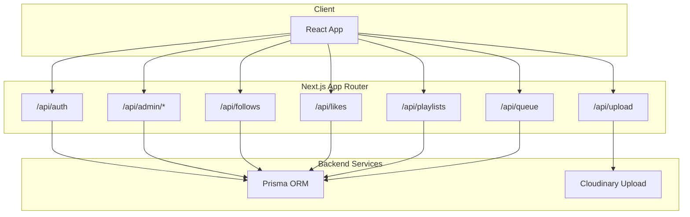
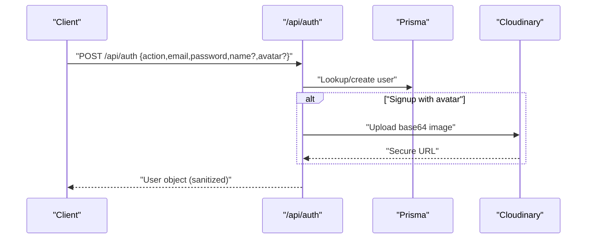
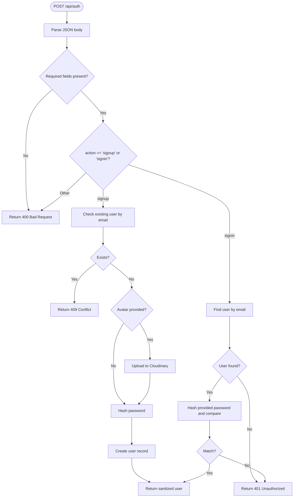
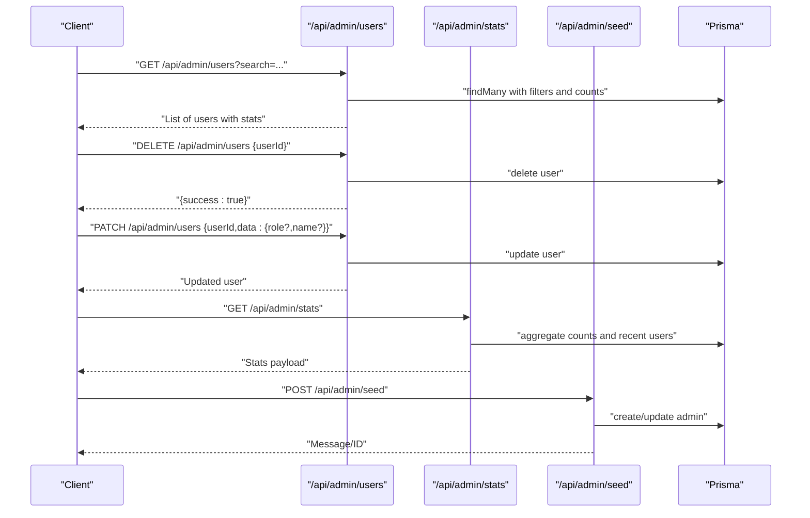
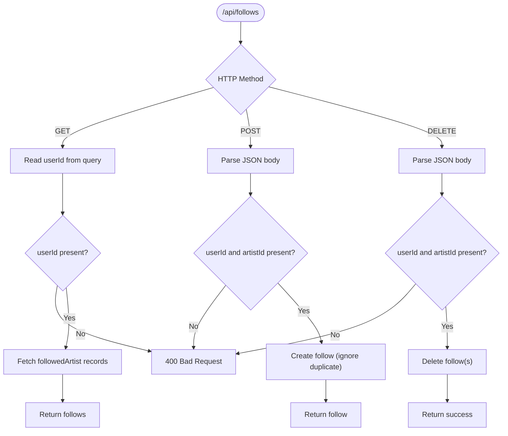
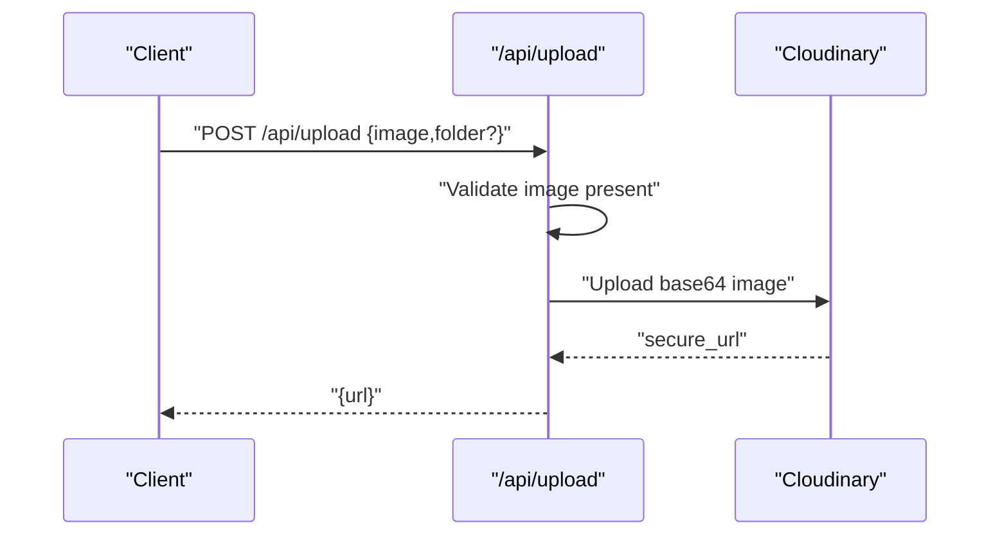
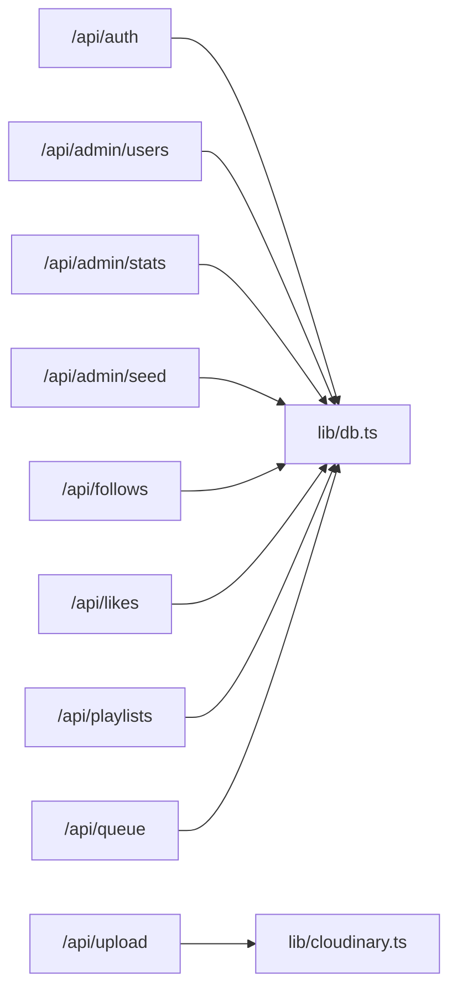

# API Security

<cite>
**Referenced Files in This Document**
- [route.ts](file://app/api/auth/route.ts)
- [route.ts](file://app/api/admin/users/route.ts)
- [route.ts](file://app/api/admin/stats/route.ts)
- [route.ts](file://app/api/admin/seed/route.ts)
- [route.ts](file://app/api/follows/route.ts)
- [route.ts](file://app/api/likes/route.ts)
- [route.ts](file://app/api/playlists/route.ts)
- [route.ts](file://app/api/queue/route.ts)
- [route.ts](file://app/api/upload/route.ts)
- [db.ts](file://lib/db.ts)
- [cloudinary.ts](file://lib/cloudinary.ts)
- [useAuthGuard.ts](file://hooks/useAuthGuard.ts)
- [next.config.ts](file://next.config.ts)
- [package.json](file://package.json)
</cite>

## Table of Contents
1. [Introduction](#introduction)
2. [Project Structure](#project-structure)
3. [Core Components](#core-components)
4. [Architecture Overview](#architecture-overview)
5. [Detailed Component Analysis](#detailed-component-analysis)
6. [Dependency Analysis](#dependency-analysis)
7. [Performance Considerations](#performance-considerations)
8. [Troubleshooting Guide](#troubleshooting-guide)
9. [Conclusion](#conclusion)
10. [Appendices](#appendices)

## Introduction
This document provides a comprehensive API security analysis for SonicStream’s REST endpoints. It covers authentication requirements, request validation patterns, response sanitization, rate limiting, abuse prevention, CORS configuration, request size limits, content-type validation, security headers, HTTPS enforcement, API key management, error handling to prevent information leakage, input sanitization, brute-force protections, API versioning security, endpoint access control, audit logging, security testing, vulnerability assessments, and monitoring strategies for API security incidents.

## Project Structure
SonicStream exposes REST endpoints under the Next.js App Router at app/api/<route>/route.ts. Authentication and administrative endpoints are grouped under app/api/auth, app/api/admin, and feature-specific endpoints under app/api/follows, app/api/likes, app/api/playlists, app/api/queue, and app/api/upload. Data access is performed via Prisma ORM (lib/db.ts), and media uploads leverage Cloudinary (lib/cloudinary.ts). Frontend authentication gating is handled by a React hook (hooks/useAuthGuard.ts). Next.js configuration controls image remote patterns and build output.

**Diagram sources**
- [route.ts](file://app/api/auth/route.ts)
- [route.ts](file://app/api/admin/users/route.ts)
- [route.ts](file://app/api/follows/route.ts)
- [route.ts](file://app/api/likes/route.ts)
- [route.ts](file://app/api/playlists/route.ts)
- [route.ts](file://app/api/queue/route.ts)
- [route.ts](file://app/api/upload/route.ts)
- [db.ts](file://lib/db.ts)
- [cloudinary.ts](file://lib/cloudinary.ts)

**Section sources**
- [route.ts](file://app/api/auth/route.ts)
- [route.ts](file://app/api/admin/users/route.ts)
- [route.ts](file://app/api/admin/stats/route.ts)
- [route.ts](file://app/api/admin/seed/route.ts)
- [route.ts](file://app/api/follows/route.ts)
- [route.ts](file://app/api/likes/route.ts)
- [route.ts](file://app/api/playlists/route.ts)
- [route.ts](file://app/api/queue/route.ts)
- [route.ts](file://app/api/upload/route.ts)
- [db.ts](file://lib/db.ts)
- [cloudinary.ts](file://lib/cloudinary.ts)
- [useAuthGuard.ts](file://hooks/useAuthGuard.ts)
- [next.config.ts](file://next.config.ts)

## Core Components
- Authentication endpoint: Validates presence of email and password; supports signup and signin actions; performs basic password hashing; returns sanitized user fields.
- Administrative endpoints: Provide listing, updating, and deleting users; expose statistics; include seeding functionality for admin creation.
- Feature endpoints: Manage follows, likes, playlists, and queue operations with strict parameter validation.
- Upload endpoint: Accepts base64 image payload and uploads to Cloudinary with transformations.
- Data access: Prisma client initialized globally; used across endpoints for database operations.
- Media upload: Cloudinary SDK configured via environment variables; uploads transformed assets.

Security posture summary:
- Authentication: Basic hashing without salt/pepper; no session tokens or JWT; frontend gating via a hook.
- Authorization: No explicit role checks observed in endpoints; admin endpoints rely on seed-created roles.
- Validation: Parameter validation present; Prisma constraint violations are handled.
- Sanitization: Minimal response sanitization; user-facing fields returned without redaction.
- Rate limiting: Not implemented at runtime.
- CORS: Not configured in code; defaults apply.
- Headers: Not enforced in code; defaults apply.
- HTTPS: Not enforced in code; depends on deployment.
- API keys: Not implemented.
- Audit logging: Not implemented.

**Section sources**
- [route.ts](file://app/api/auth/route.ts)
- [route.ts](file://app/api/admin/users/route.ts)
- [route.ts](file://app/api/admin/stats/route.ts)
- [route.ts](file://app/api/admin/seed/route.ts)
- [route.ts](file://app/api/follows/route.ts)
- [route.ts](file://app/api/likes/route.ts)
- [route.ts](file://app/api/playlists/route.ts)
- [route.ts](file://app/api/queue/route.ts)
- [route.ts](file://app/api/upload/route.ts)
- [db.ts](file://lib/db.ts)
- [cloudinary.ts](file://lib/cloudinary.ts)
- [useAuthGuard.ts](file://hooks/useAuthGuard.ts)

## Architecture Overview
The API surface is organized by feature and administrative domains. Requests flow from the client through Next.js routes to Prisma for persistence or Cloudinary for media. Authentication is handled by a dedicated route that returns user data without tokens, relying on frontend session management.

**Diagram sources**
- [route.ts](file://app/api/auth/route.ts)
- [db.ts](file://lib/db.ts)
- [cloudinary.ts](file://lib/cloudinary.ts)

## Detailed Component Analysis

### Authentication Endpoint (/api/auth)
- Authentication requirements:
  - Requires email and password for both actions.
  - Supports signup and signin actions.
  - On signup, optional name and avatar are accepted; avatar uploaded to Cloudinary if provided.
  - On signin, validates stored password hash.
- Request validation:
  - Presence checks for required fields.
  - Action validation; invalid action returns error.
- Response sanitization:
  - Returns user fields excluding sensitive data (e.g., password hash).
- Error handling:
  - Returns structured JSON errors with appropriate HTTP status codes.
  - Catches exceptions and logs internally; returns generic internal server error.
- Security considerations:
  - Password hashing lacks salt/pepper; consider bcrypt with random salt and pepper.
  - No rate limiting; susceptible to brute-force attacks.
  - No CSRF protection; no cookies or sessions used.
  - No HTTPS enforcement in code; deploy behind TLS termination.
  - No API key management; relies on client-side session gating.

**Diagram sources**
- [route.ts](file://app/api/auth/route.ts)

**Section sources**
- [route.ts](file://app/api/auth/route.ts)

### Administrative Endpoints (/api/admin)
- Users endpoint (/api/admin/users):
  - GET: Lists users with counts; supports search via query parameter.
  - DELETE: Deletes a user by ID; requires JSON payload with userId.
  - PATCH: Updates user fields (role/name); requires JSON payload with userId and data.
- Stats endpoint (/api/admin/stats):
  - GET: Aggregates counts and recent users.
- Seed endpoint (/api/admin/seed):
  - POST: Creates default admin user or updates role if exists.

Access control and validation:
- No explicit role checks observed in these endpoints; rely on seed-created ADMIN role.
- Validation includes presence checks for required fields; Prisma errors mapped to JSON responses.

**Diagram sources**
- [route.ts](file://app/api/admin/users/route.ts)
- [route.ts](file://app/api/admin/stats/route.ts)
- [route.ts](file://app/api/admin/seed/route.ts)
- [db.ts](file://lib/db.ts)

**Section sources**
- [route.ts](file://app/api/admin/users/route.ts)
- [route.ts](file://app/api/admin/stats/route.ts)
- [route.ts](file://app/api/admin/seed/route.ts)

### Feature Endpoints
- Follows (/api/follows):
  - GET: Requires userId; returns followed artists.
  - POST: Requires userId and artistId; handles duplicate follow gracefully.
  - DELETE: Requires userId and artistId; removes follow(s).
- Likes (/api/likes):
  - GET: Requires userId; returns liked song IDs.
  - POST: Requires userId and songId; handles duplicate like gracefully.
  - DELETE: Requires userId and songId; removes like(s).
- Playlists (/api/playlists):
  - GET: Requires userId; returns playlists with included songs ordered by position.
  - POST: action-based routing supporting create, addSong, removeSong; validates required fields per action.
  - DELETE: Requires playlistId; deletes playlist.
- Queue (/api/queue):
  - GET: Requires userId; returns queue items ordered by position.
  - POST: action-based routing supporting add and clear; validates required fields per action.
  - DELETE: Requires either id or userId+songId; removes queue item(s).

Validation and error handling:
- Strict parameter checks for required fields.
- Graceful handling of Prisma constraint violations (e.g., duplicates) returning success with messages.
- Generic catch-all for unexpected errors returning 500.

**Diagram sources**
- [route.ts](file://app/api/follows/route.ts)

**Section sources**
- [route.ts](file://app/api/follows/route.ts)
- [route.ts](file://app/api/likes/route.ts)
- [route.ts](file://app/api/playlists/route.ts)
- [route.ts](file://app/api/queue/route.ts)

### Upload Endpoint (/api/upload)
- Accepts base64 image payload and optional folder; uploads to Cloudinary with transformations; returns secure URL.
- Validation: Requires image field; otherwise returns 400.
- Error handling: Catches exceptions and returns 500.

**Diagram sources**
- [route.ts](file://app/api/upload/route.ts)
- [cloudinary.ts](file://lib/cloudinary.ts)

**Section sources**
- [route.ts](file://app/api/upload/route.ts)
- [cloudinary.ts](file://lib/cloudinary.ts)

## Dependency Analysis
- Data access: All feature endpoints depend on Prisma client initialization in lib/db.ts.
- Media upload: Upload endpoints depend on Cloudinary SDK configured via environment variables.
- Frontend authentication gating: useAuthGuard.ts provides client-side auth gating but does not enforce backend authorization.

**Diagram sources**
- [route.ts](file://app/api/auth/route.ts)
- [route.ts](file://app/api/admin/users/route.ts)
- [route.ts](file://app/api/admin/stats/route.ts)
- [route.ts](file://app/api/admin/seed/route.ts)
- [route.ts](file://app/api/follows/route.ts)
- [route.ts](file://app/api/likes/route.ts)
- [route.ts](file://app/api/playlists/route.ts)
- [route.ts](file://app/api/queue/route.ts)
- [route.ts](file://app/api/upload/route.ts)
- [db.ts](file://lib/db.ts)
- [cloudinary.ts](file://lib/cloudinary.ts)

**Section sources**
- [db.ts](file://lib/db.ts)
- [cloudinary.ts](file://lib/cloudinary.ts)
- [useAuthGuard.ts](file://hooks/useAuthGuard.ts)

## Performance Considerations
- Database queries: Several endpoints perform multiple count queries or joins; consider batching and pagination for large datasets.
- Media uploads: Base64 uploads increase payload size; consider binary uploads or streaming for large files.
- Rate limiting: Not implemented; consider adding rate limiting per IP or per user to mitigate abuse.

## Troubleshooting Guide
Common issues and mitigations:
- Authentication failures:
  - Ensure email and password are provided; verify user exists for signin.
  - Check password hashing correctness and environment configuration.
- Duplicate operations:
  - Follows/Likes handle duplicates gracefully; clients should handle success with message.
- Upload failures:
  - Validate base64 format and Cloudinary credentials; check network connectivity.
- Database errors:
  - Inspect Prisma error codes and adjust client expectations accordingly.

**Section sources**
- [route.ts](file://app/api/auth/route.ts)
- [route.ts](file://app/api/follows/route.ts)
- [route.ts](file://app/api/likes/route.ts)
- [route.ts](file://app/api/upload/route.ts)

## Conclusion
SonicStream’s API provides functional endpoints for authentication, administration, and music-related operations. Current security measures are basic: parameter validation, minimal response sanitization, and Cloudinary uploads. Critical gaps include robust authentication tokens, rate limiting, CORS configuration, security headers, HTTPS enforcement, API key management, authorization checks, and audit logging. Immediate improvements should focus on strong cryptographic hashing, session/JWT management, rate limiting, CORS and header policies, and comprehensive authorization and logging.

## Appendices

### API Security Controls Checklist
- Authentication
  - Use strong password hashing with salt/pepper; consider bcrypt.
  - Implement session tokens or JWT with secure, HttpOnly, SameSite cookies.
  - Enforce HTTPS/TLS termination at the edge/proxy.
- Authorization
  - Implement role-based access control (RBAC) for admin endpoints.
  - Validate user ownership for user-specific operations.
- Input Validation and Sanitization
  - Apply strict schema validation (e.g., Zod) for all request bodies and query params.
  - Sanitize and whitelist response fields; avoid exposing sensitive attributes.
- Rate Limiting and Abuse Prevention
  - Deploy rate limiting per IP and per user; track burst windows.
  - Implement circuit breakers and timeouts for upstream dependencies.
- CORS and Content Security
  - Configure CORS origins, methods, and headers explicitly.
  - Enforce Content-Type validation for JSON payloads.
- Security Headers
  - Add security headers (e.g., X-Content-Type-Options, X-Frame-Options, Referrer-Policy).
- API Keys and Secrets
  - Store secrets in environment variables; rotate regularly.
  - Avoid embedding secrets in client code.
- Error Handling
  - Return generic error messages; log structured errors internally.
  - Avoid stack traces or internal details in responses.
- Monitoring and Auditing
  - Log all API requests with correlation IDs and user context.
  - Monitor anomalies (4xx/5xx spikes, unusual request patterns).
- Testing and Assessments
  - Perform OWASP Top 10 assessments, SAST/DAST scans, and penetration tests.
  - Validate CORS, rate limiting, and authorization boundaries.