# Authentication and Authorization

<cite>
**Referenced Files in This Document**
- [app/api/auth/route.ts](file://app/api/auth/route.ts)
- [components/AuthModal.tsx](file://components/AuthModal.tsx)
- [hooks/useAuthGuard.ts](file://hooks/useAuthGuard.ts)
- [store/usePlayerStore.ts](file://store/usePlayerStore.ts)
- [lib/db.ts](file://lib/db.ts)
- [prisma/schema.prisma](file://prisma/schema.prisma)
- [app/api/auth/forgot/route.ts](file://app/api/auth/forgot/route.ts)
- [app/api/auth/reset/route.ts](file://app/api/auth/reset/route.ts)
- [app/admin/page.tsx](file://app/admin/page.tsx)
- [app/admin/login/page.tsx](file://app/admin/login/page.tsx)
- [app/api/admin/users/route.ts](file://app/api/admin/users/route.ts)
- [app/api/admin/stats/route.ts](file://app/api/admin/stats/route.ts)
- [app/api/admin/seed/route.ts](file://app/api/admin/seed/route.ts)
</cite>

## Table of Contents
1. [Introduction](#introduction)
2. [Project Structure](#project-structure)
3. [Core Components](#core-components)
4. [Architecture Overview](#architecture-overview)
5. [Detailed Component Analysis](#detailed-component-analysis)
6. [Dependency Analysis](#dependency-analysis)
7. [Performance Considerations](#performance-considerations)
8. [Troubleshooting Guide](#troubleshooting-guide)
9. [Conclusion](#conclusion)
10. [Appendices](#appendices)

## Introduction
This document explains the authentication and authorization implementation in SonicStream. It covers the custom password hashing approach, user registration and login flows, session management, role-based access control (USER/ADMIN), the AuthModal component, authentication guards, protected route handling, user model structure, password security measures, and email validation. It also outlines production security considerations, API authentication patterns, error handling for authentication failures, and best practices for managing user credentials.

## Project Structure
Authentication and authorization spans several layers:
- Frontend UI components (AuthModal, admin pages)
- Client-side state management (Zustand store)
- Client-side guards (useAuthGuard hook)
- Backend API routes (auth, forgot/reset, admin)
- Database schema (Prisma models and enums)
- Database client (Prisma)

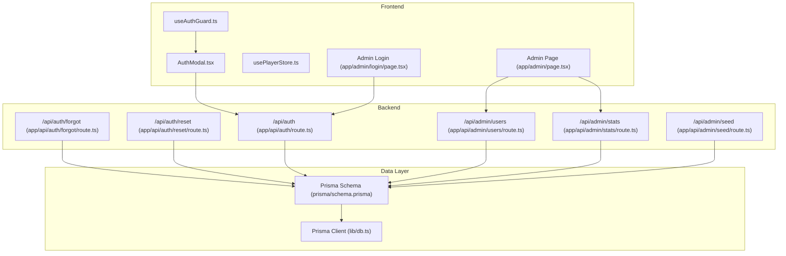

**Diagram sources**
- [components/AuthModal.tsx:1-149](file://components/AuthModal.tsx#L1-L149)
- [hooks/useAuthGuard.ts:1-29](file://hooks/useAuthGuard.ts#L1-L29)
- [store/usePlayerStore.ts:1-128](file://store/usePlayerStore.ts#L1-L128)
- [app/admin/page.tsx:1-212](file://app/admin/page.tsx#L1-L212)
- [app/admin/login/page.tsx:1-67](file://app/admin/login/page.tsx#L1-L67)
- [app/api/auth/route.ts:1-73](file://app/api/auth/route.ts#L1-L73)
- [app/api/auth/forgot/route.ts:1-68](file://app/api/auth/forgot/route.ts#L1-L68)
- [app/api/auth/reset/route.ts:1-48](file://app/api/auth/reset/route.ts#L1-L48)
- [app/api/admin/users/route.ts:1-75](file://app/api/admin/users/route.ts#L1-L75)
- [app/api/admin/stats/route.ts:1-28](file://app/api/admin/stats/route.ts#L1-L28)
- [app/api/admin/seed/route.ts:1-40](file://app/api/admin/seed/route.ts#L1-L40)
- [prisma/schema.prisma:1-111](file://prisma/schema.prisma#L1-L111)
- [lib/db.ts:1-10](file://lib/db.ts#L1-L10)

**Section sources**
- [components/AuthModal.tsx:1-149](file://components/AuthModal.tsx#L1-L149)
- [hooks/useAuthGuard.ts:1-29](file://hooks/useAuthGuard.ts#L1-L29)
- [store/usePlayerStore.ts:1-128](file://store/usePlayerStore.ts#L1-L128)
- [app/admin/page.tsx:1-212](file://app/admin/page.tsx#L1-L212)
- [app/admin/login/page.tsx:1-67](file://app/admin/login/page.tsx#L1-L67)
- [app/api/auth/route.ts:1-73](file://app/api/auth/route.ts#L1-L73)
- [app/api/auth/forgot/route.ts:1-68](file://app/api/auth/forgot/route.ts#L1-L68)
- [app/api/auth/reset/route.ts:1-48](file://app/api/auth/reset/route.ts#L1-L48)
- [app/api/admin/users/route.ts:1-75](file://app/api/admin/users/route.ts#L1-L75)
- [app/api/admin/stats/route.ts:1-28](file://app/api/admin/stats/route.ts#L1-L28)
- [app/api/admin/seed/route.ts:1-40](file://app/api/admin/seed/route.ts#L1-L40)
- [prisma/schema.prisma:1-111](file://prisma/schema.prisma#L1-L111)
- [lib/db.ts:1-10](file://lib/db.ts#L1-L10)

## Core Components
- AuthModal: A client-side modal that handles sign-up/sign-in via a single API endpoint and supports password reset initiation.
- useAuthGuard: A client-side guard that either executes an action immediately if the user is authenticated or opens the AuthModal.
- usePlayerStore: A Zustand store that holds user data and persists it locally; used to gate actions and maintain session state.
- Backend Auth API: Implements registration, login, and password reset initiation and completion.
- Admin Pages: Separate admin login and dashboard pages with local admin session storage and role checks.
- Prisma Schema: Defines the User model, Role enum, and related relations.

**Section sources**
- [components/AuthModal.tsx:14-50](file://components/AuthModal.tsx#L14-L50)
- [hooks/useAuthGuard.ts:12-28](file://hooks/useAuthGuard.ts#L12-L28)
- [store/usePlayerStore.ts:39-41](file://store/usePlayerStore.ts#L39-L41)
- [app/api/auth/route.ts:15-72](file://app/api/auth/route.ts#L15-L72)
- [app/admin/login/page.tsx:15-38](file://app/admin/login/page.tsx#L15-L38)
- [prisma/schema.prisma:11-32](file://prisma/schema.prisma#L11-L32)

## Architecture Overview
The authentication architecture combines client-side UI and state with backend APIs and database persistence. The AuthModal triggers requests to the unified auth endpoint (/api/auth) for sign-up and sign-in. Password resets are handled by separate endpoints. Admin access is controlled via a dedicated login flow with role enforcement and local session storage.

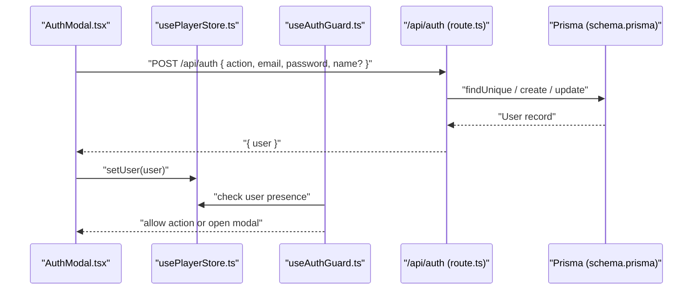

**Diagram sources**
- [components/AuthModal.tsx:26-50](file://components/AuthModal.tsx#L26-L50)
- [store/usePlayerStore.ts:114](file://store/usePlayerStore.ts#L114)
- [hooks/useAuthGuard.ts:16-25](file://hooks/useAuthGuard.ts#L16-L25)
- [app/api/auth/route.ts:16-67](file://app/api/auth/route.ts#L16-L67)
- [prisma/schema.prisma:16-32](file://prisma/schema.prisma#L16-L32)

## Detailed Component Analysis

### AuthModal Component
AuthModal is a client-side modal that:
- Toggles between sign-in and sign-up modes
- Collects email, password, and optional name
- Submits to /api/auth with action 'signin' or 'signup'
- On success, stores the user in the Zustand store and closes the modal
- Supports password reset initiation via /api/auth/forgot

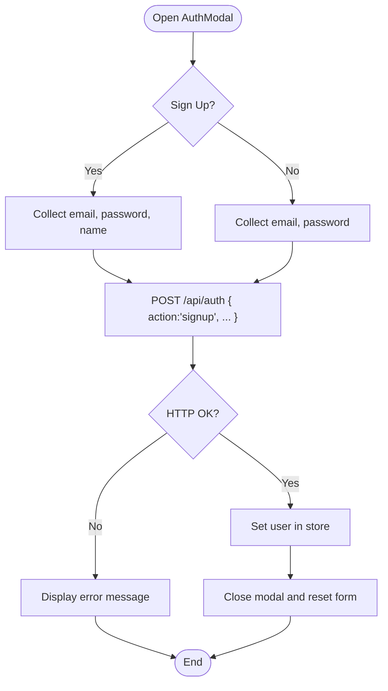

**Diagram sources**
- [components/AuthModal.tsx:14-50](file://components/AuthModal.tsx#L14-L50)
- [app/api/auth/route.ts:16-67](file://app/api/auth/route.ts#L16-L67)
- [store/usePlayerStore.ts:114](file://store/usePlayerStore.ts#L114)

**Section sources**
- [components/AuthModal.tsx:14-50](file://components/AuthModal.tsx#L14-L50)
- [app/api/auth/route.ts:16-67](file://app/api/auth/route.ts#L16-L67)
- [store/usePlayerStore.ts:114](file://store/usePlayerStore.ts#L114)

### Authentication Guards and Protected Routes
- useAuthGuard checks if a user exists in the store; if not, it sets a flag to show the AuthModal instead of executing the action.
- Protected actions are gated by invoking requireAuth around the desired operation.

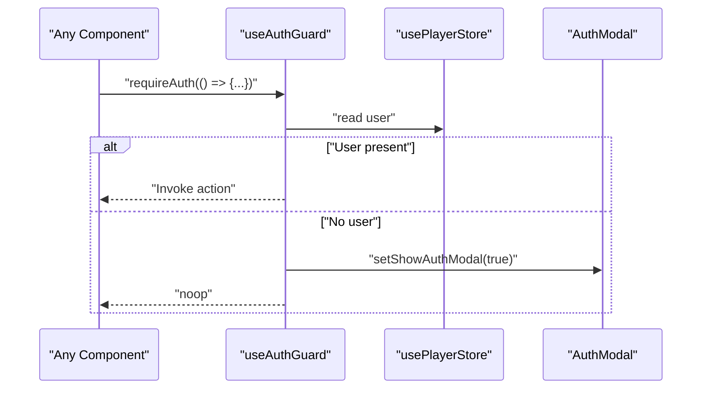

**Diagram sources**
- [hooks/useAuthGuard.ts:16-25](file://hooks/useAuthGuard.ts#L16-L25)
- [store/usePlayerStore.ts:13](file://store/usePlayerStore.ts#L13)
- [components/AuthModal.tsx:14](file://components/AuthModal.tsx#L14)

**Section sources**
- [hooks/useAuthGuard.ts:12-28](file://hooks/useAuthGuard.ts#L12-L28)
- [store/usePlayerStore.ts:13](file://store/usePlayerStore.ts#L13)

### User Registration and Login Flow
- Registration:
  - Validates presence of email and password
  - Checks uniqueness of email
  - Optionally uploads avatar image
  - Hashes password using SHA-256 with a fixed salt
  - Creates user with default role USER
- Login:
  - Finds user by email
  - Hashes provided password with the same salt
  - Compares hashes and returns user if match

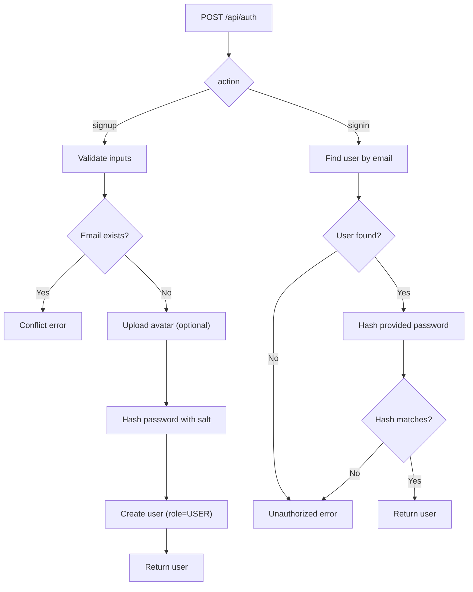

**Diagram sources**
- [app/api/auth/route.ts:16-67](file://app/api/auth/route.ts#L16-L67)

**Section sources**
- [app/api/auth/route.ts:16-67](file://app/api/auth/route.ts#L16-L67)

### Password Security Measures
- Password hashing uses SHA-256 with a fixed salt appended to the plaintext password.
- The implementation includes a note recommending bcrypt for production.
- Password reset tokens are generated with crypto.randomBytes and expire in 1 hour.

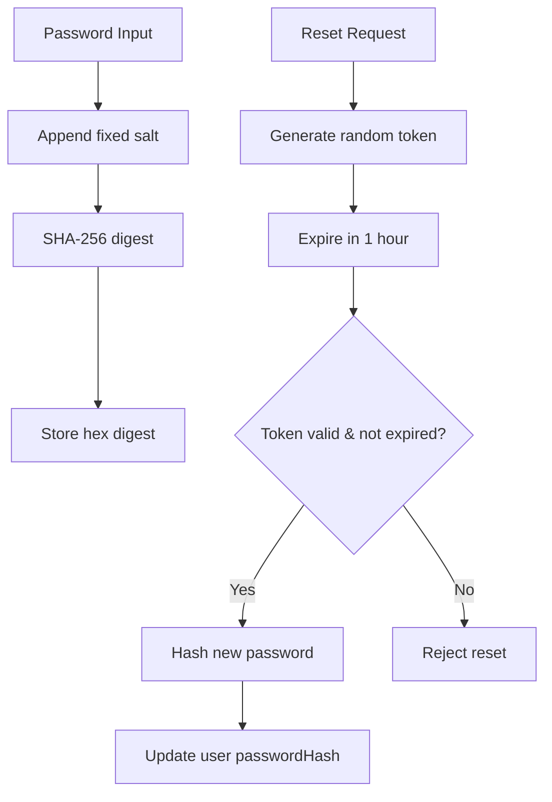

**Diagram sources**
- [app/api/auth/route.ts:5-13](file://app/api/auth/route.ts#L5-L13)
- [app/api/auth/reset/route.ts:4-11](file://app/api/auth/reset/route.ts#L4-L11)
- [app/api/auth/forgot/route.ts:21-26](file://app/api/auth/forgot/route.ts#L21-L26)

**Section sources**
- [app/api/auth/route.ts:5-13](file://app/api/auth/route.ts#L5-L13)
- [app/api/auth/reset/route.ts:4-11](file://app/api/auth/reset/route.ts#L4-L11)
- [app/api/auth/forgot/route.ts:21-26](file://app/api/auth/forgot/route.ts#L21-L26)

### Role-Based Access Control (USER/ADMIN)
- Role enum is defined in the Prisma schema with USER and ADMIN values.
- Default role is USER for new registrations.
- Admin login enforces role check and stores a local admin session.
- Admin dashboard exposes administrative actions (list users, update roles, delete users) and statistics.

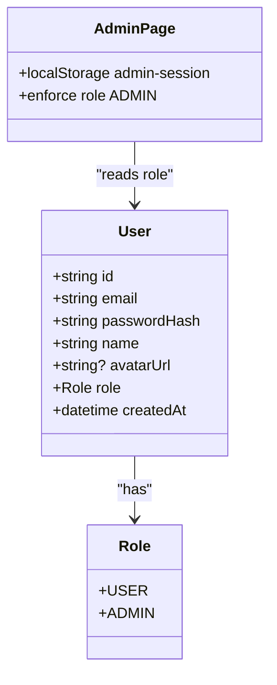

**Diagram sources**
- [prisma/schema.prisma:11-22](file://prisma/schema.prisma#L11-L22)
- [prisma/schema.prisma:16-32](file://prisma/schema.prisma#L16-L32)
- [app/admin/page.tsx:25-31](file://app/admin/page.tsx#L25-L31)
- [app/admin/login/page.tsx:26-29](file://app/admin/login/page.tsx#L26-L29)

**Section sources**
- [prisma/schema.prisma:11-22](file://prisma/schema.prisma#L11-L22)
- [prisma/schema.prisma:16-32](file://prisma/schema.prisma#L16-L32)
- [app/admin/page.tsx:25-31](file://app/admin/page.tsx#L25-L31)
- [app/admin/login/page.tsx:26-29](file://app/admin/login/page.tsx#L26-L29)

### Session Management
- Client-side session:
  - Authenticated user is stored in Zustand store and persisted locally.
  - AuthModal sets user upon successful login/signup.
- Admin session:
  - Admin login writes a JSON object to localStorage under 'admin-session'.
  - Admin dashboard reads and validates the session and role on mount.

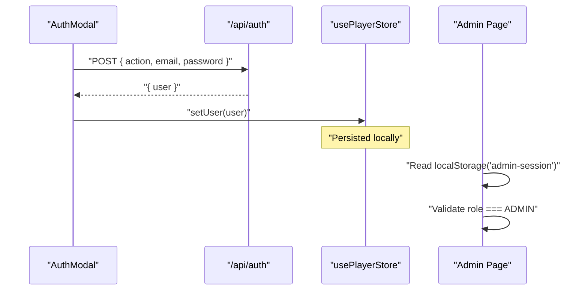

**Diagram sources**
- [components/AuthModal.tsx:41-44](file://components/AuthModal.tsx#L41-L44)
- [store/usePlayerStore.ts:114](file://store/usePlayerStore.ts#L114)
- [app/admin/page.tsx:26-31](file://app/admin/page.tsx#L26-L31)
- [app/admin/login/page.tsx:30](file://app/admin/login/page.tsx#L30)

**Section sources**
- [components/AuthModal.tsx:41-44](file://components/AuthModal.tsx#L41-L44)
- [store/usePlayerStore.ts:114](file://store/usePlayerStore.ts#L114)
- [app/admin/page.tsx:26-31](file://app/admin/page.tsx#L26-L31)
- [app/admin/login/page.tsx:30](file://app/admin/login/page.tsx#L30)

### Password Reset Flow
- Initiation:
  - Validates email, finds user, cleans old tokens, generates new token, stores it with expiry, attempts to send email.
- Completion:
  - Validates token existence and non-expiry, hashes new password, updates user, deletes all reset tokens for the user.

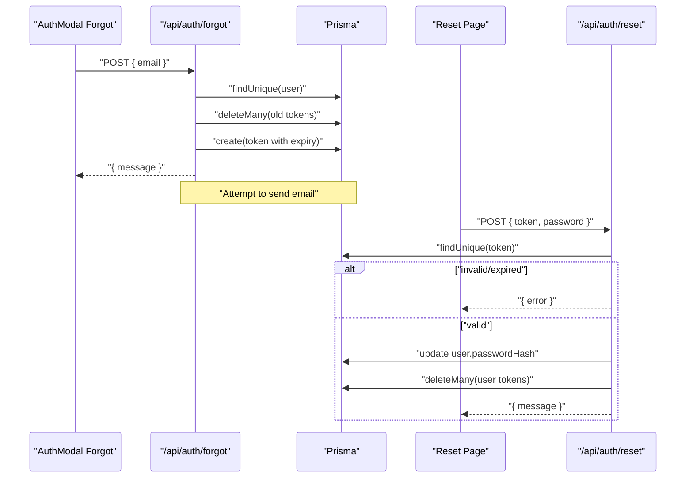

**Diagram sources**
- [app/api/auth/forgot/route.ts:6-62](file://app/api/auth/forgot/route.ts#L6-L62)
- [app/api/auth/reset/route.ts:14-42](file://app/api/auth/reset/route.ts#L14-L42)

**Section sources**
- [app/api/auth/forgot/route.ts:6-62](file://app/api/auth/forgot/route.ts#L6-L62)
- [app/api/auth/reset/route.ts:14-42](file://app/api/auth/reset/route.ts#L14-L42)

### Admin Dashboard and Management
- Admin login enforces ADMIN role and stores session.
- Admin dashboard:
  - Fetches statistics from /api/admin/stats
  - Lists users with counts from /api/admin/users
  - Allows toggling roles and deleting users
  - Provides seeding of default admin user via /api/admin/seed

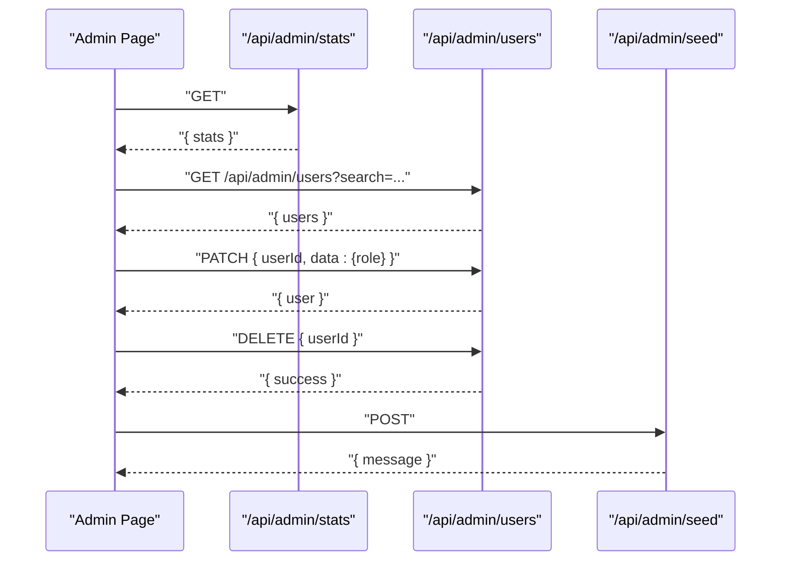

**Diagram sources**
- [app/admin/page.tsx:33-79](file://app/admin/page.tsx#L33-L79)
- [app/api/admin/stats/route.ts:5-27](file://app/api/admin/stats/route.ts#L5-L27)
- [app/api/admin/users/route.ts:5-74](file://app/api/admin/users/route.ts#L5-L74)
- [app/api/admin/seed/route.ts:14-35](file://app/api/admin/seed/route.ts#L14-L35)

**Section sources**
- [app/admin/page.tsx:33-79](file://app/admin/page.tsx#L33-L79)
- [app/api/admin/stats/route.ts:5-27](file://app/api/admin/stats/route.ts#L5-L27)
- [app/api/admin/users/route.ts:5-74](file://app/api/admin/users/route.ts#L5-L74)
- [app/api/admin/seed/route.ts:14-35](file://app/api/admin/seed/route.ts#L14-L35)

## Dependency Analysis
- AuthModal depends on:
  - /api/auth for authentication
  - /api/auth/forgot for password reset initiation
  - usePlayerStore for state management
- useAuthGuard depends on usePlayerStore to determine authentication state.
- Admin pages depend on:
  - /api/auth for admin login
  - /api/admin/stats for metrics
  - /api/admin/users for user management
  - /api/admin/seed for default admin creation
- Backend APIs depend on Prisma models and database client.

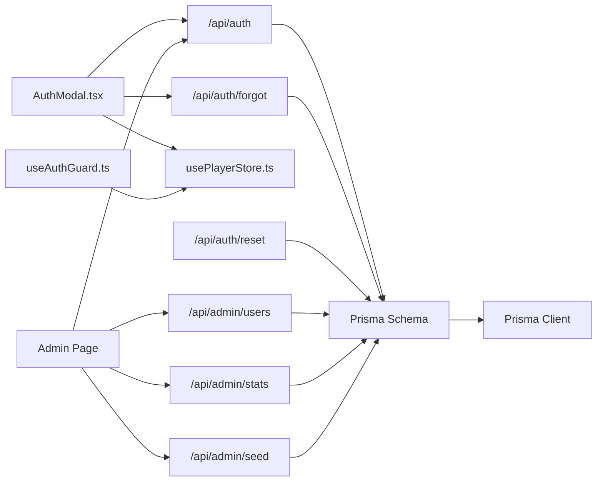

**Diagram sources**
- [components/AuthModal.tsx:30-61](file://components/AuthModal.tsx#L30-L61)
- [hooks/useAuthGuard.ts:13](file://hooks/useAuthGuard.ts#L13)
- [store/usePlayerStore.ts:13](file://store/usePlayerStore.ts#L13)
- [app/admin/page.tsx:33-79](file://app/admin/page.tsx#L33-L79)
- [app/api/auth/route.ts:16-67](file://app/api/auth/route.ts#L16-L67)
- [app/api/auth/forgot/route.ts:6-62](file://app/api/auth/forgot/route.ts#L6-L62)
- [app/api/auth/reset/route.ts:14-42](file://app/api/auth/reset/route.ts#L14-L42)
- [app/api/admin/stats/route.ts:5-27](file://app/api/admin/stats/route.ts#L5-L27)
- [app/api/admin/users/route.ts:5-74](file://app/api/admin/users/route.ts#L5-L74)
- [app/api/admin/seed/route.ts:14-35](file://app/api/admin/seed/route.ts#L14-L35)
- [prisma/schema.prisma:16-32](file://prisma/schema.prisma#L16-L32)
- [lib/db.ts:1-10](file://lib/db.ts#L1-L10)

**Section sources**
- [components/AuthModal.tsx:30-61](file://components/AuthModal.tsx#L30-L61)
- [hooks/useAuthGuard.ts:13](file://hooks/useAuthGuard.ts#L13)
- [store/usePlayerStore.ts:13](file://store/usePlayerStore.ts#L13)
- [app/admin/page.tsx:33-79](file://app/admin/page.tsx#L33-L79)
- [app/api/auth/route.ts:16-67](file://app/api/auth/route.ts#L16-L67)
- [app/api/auth/forgot/route.ts:6-62](file://app/api/auth/forgot/route.ts#L6-L62)
- [app/api/auth/reset/route.ts:14-42](file://app/api/auth/reset/route.ts#L14-L42)
- [app/api/admin/stats/route.ts:5-27](file://app/api/admin/stats/route.ts#L5-L27)
- [app/api/admin/users/route.ts:5-74](file://app/api/admin/users/route.ts#L5-L74)
- [app/api/admin/seed/route.ts:14-35](file://app/api/admin/seed/route.ts#L14-L35)
- [prisma/schema.prisma:16-32](file://prisma/schema.prisma#L16-L32)
- [lib/db.ts:1-10](file://lib/db.ts#L1-L10)

## Performance Considerations
- Password hashing is performed synchronously on the server; SHA-256 with a salt is fast but not ideal for production due to lack of cost factors and slow-hash characteristics.
- Consider migrating to bcrypt or Argon2 for stronger resistance against brute-force attacks.
- Email sending during password reset is attempted asynchronously; network failures should not block token creation.
- Local storage usage for admin sessions avoids server-side session management overhead but requires careful expiration and rotation strategies.

[No sources needed since this section provides general guidance]

## Troubleshooting Guide
Common authentication errors and handling:
- Missing or invalid credentials:
  - Registration fails if email or password is missing; login fails if user not found or password hash mismatch.
- Duplicate email:
  - Registration returns conflict when email already exists.
- Invalid action:
  - Non-'signup' or 'signin' actions are rejected.
- Password reset:
  - Invalid or expired token leads to rejection; ensure token is fresh and user is authenticated before allowing reset.
- Admin access denied:
  - Non-admin users attempting admin login receive an access denied error.

**Section sources**
- [app/api/auth/route.ts:21-29](file://app/api/auth/route.ts#L21-L29)
- [app/api/auth/route.ts:53-60](file://app/api/auth/route.ts#L53-L60)
- [app/api/auth/forgot/route.ts:9-15](file://app/api/auth/forgot/route.ts#L9-L15)
- [app/api/auth/reset/route.ts:17-31](file://app/api/auth/reset/route.ts#L17-L31)
- [app/admin/login/page.tsx:26-29](file://app/admin/login/page.tsx#L26-L29)

## Conclusion
SonicStream implements a straightforward authentication system with a unified auth endpoint, client-side state management, and admin-specific controls. While the current hashing approach is demonstrative, the system provides a clear foundation for adding robust security measures such as bcrypt, JWT-based sessions, and improved session storage. The AuthModal and useAuthGuard offer practical mechanisms for gating actions, while the admin dashboard centralizes user and role management.

[No sources needed since this section summarizes without analyzing specific files]

## Appendices

### User Model Structure
- Fields:
  - id: unique identifier
  - email: unique email address
  - passwordHash: hashed password
  - name: user's display name
  - avatarUrl: optional avatar URL
  - role: enum USER or ADMIN
  - createdAt: timestamp

**Section sources**
- [prisma/schema.prisma:16-32](file://prisma/schema.prisma#L16-L32)

### Production Security Recommendations
- Replace SHA-256 hashing with bcrypt or Argon2 to introduce computational cost and mitigate brute-force attacks.
- Implement JWT-based session tokens with secure, HttpOnly cookies and short-lived access tokens plus refresh tokens.
- Enforce HTTPS and secure cookie attributes (SameSite, Secure, HttpOnly).
- Add rate limiting for authentication endpoints and CAPTCHA for high-risk operations.
- Validate and sanitize all inputs; enforce strong password policies.
- Rotate secrets regularly and monitor for suspicious activity.

[No sources needed since this section provides general guidance]