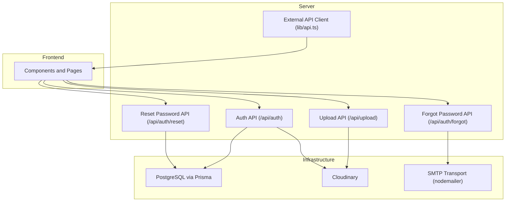
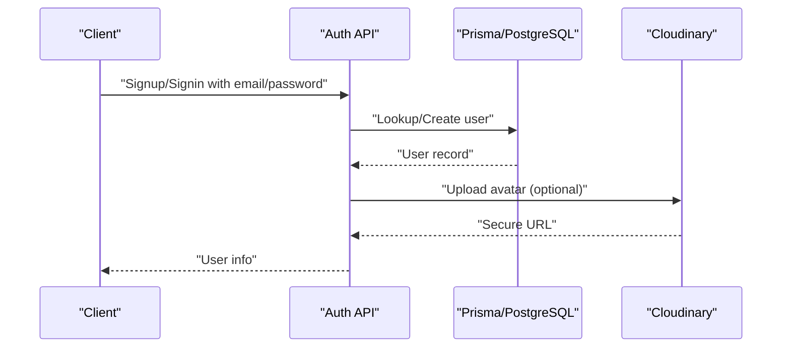
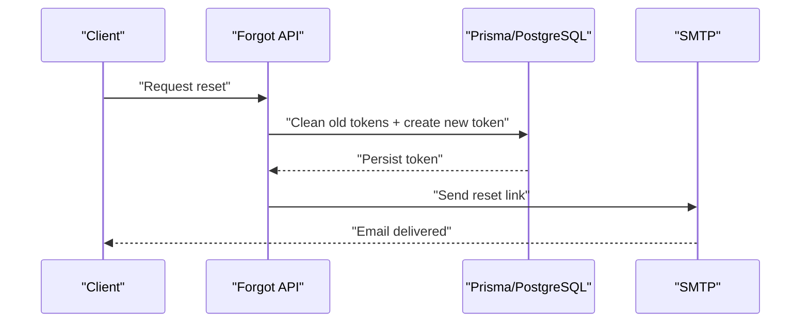
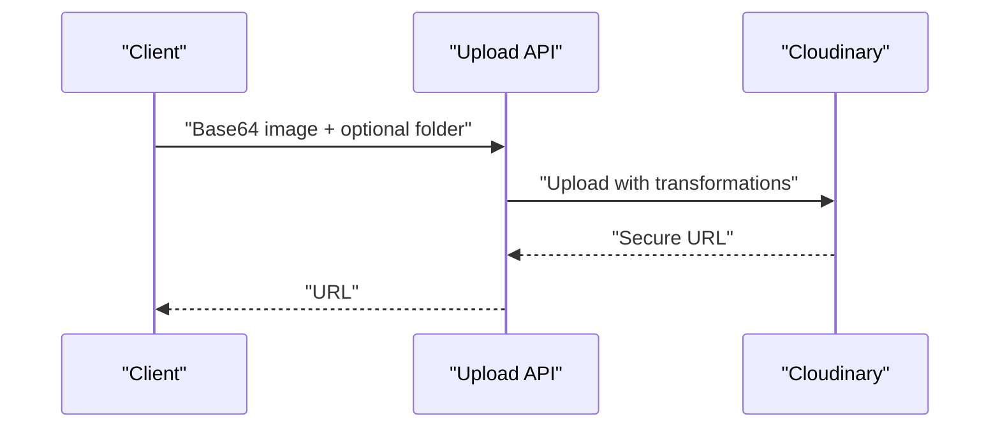
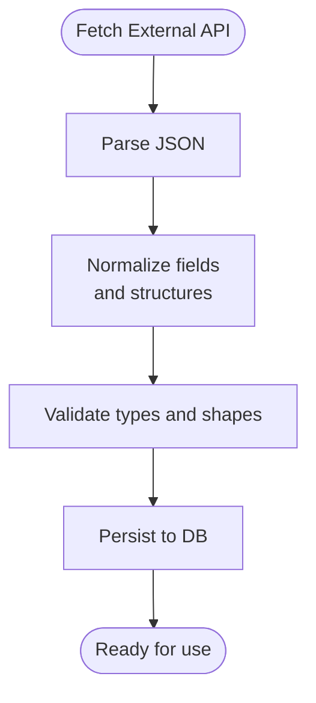
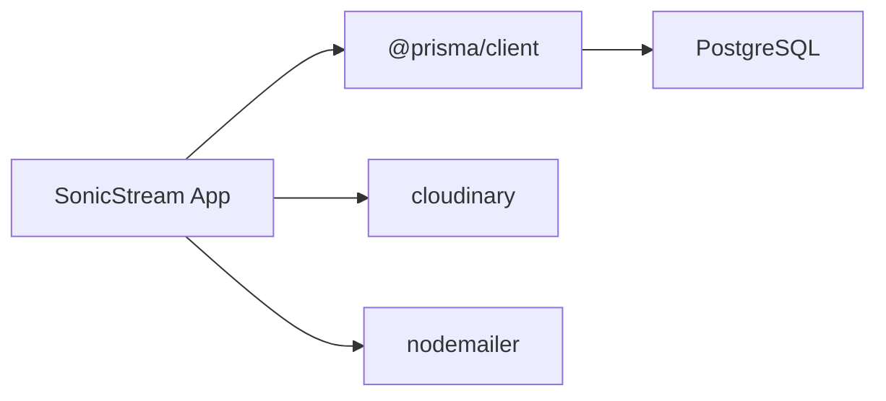

# Data Protection

<cite>
**Referenced Files in This Document**
- [prisma/schema.prisma](file://prisma/schema.prisma)
- [lib/db.ts](file://lib/db.ts)
- [lib/cloudinary.ts](file://lib/cloudinary.ts)
- [lib/api.ts](file://lib/api.ts)
- [app/api/auth/route.ts](file://app/api/auth/route.ts)
- [app/api/auth/forgot/route.ts](file://app/api/auth/forgot/route.ts)
- [app/api/auth/reset/route.ts](file://app/api/auth/reset/route.ts)
- [app/api/upload/route.ts](file://app/api/upload/route.ts)
- [hooks/useAuthGuard.ts](file://hooks/useAuthGuard.ts)
- [next.config.ts](file://next.config.ts)
- [package.json](file://package.json)
</cite>

## Table of Contents
1. [Introduction](#introduction)
2. [Project Structure](#project-structure)
3. [Core Components](#core-components)
4. [Architecture Overview](#architecture-overview)
5. [Detailed Component Analysis](#detailed-component-analysis)
6. [Dependency Analysis](#dependency-analysis)
7. [Performance Considerations](#performance-considerations)
8. [Troubleshooting Guide](#troubleshooting-guide)
9. [Conclusion](#conclusion)
10. [Appendices](#appendices)

## Introduction
This document provides comprehensive data protection guidance for SonicStream. It focuses on encryption at rest for sensitive data, secure database connections, data access patterns, Cloudinary integration security, data validation and sanitization across the pipeline, privacy compliance considerations, data retention and deletion, secure file uploads and image processing, backup and disaster recovery, and incident response. The goal is to help operators implement robust data protection aligned with industry best practices while leveraging the current codebase.

## Project Structure
SonicStream’s data protection surface spans:
- Database modeling and connection via Prisma
- Authentication and password handling
- Secure image upload and transformation via Cloudinary
- External API consumption and normalization
- Frontend image loading and remote pattern configuration
- Environment-driven secrets and transport security

**Diagram sources**
- [lib/db.ts:1-10](file://lib/db.ts#L1-L10)
- [lib/cloudinary.ts:1-21](file://lib/cloudinary.ts#L1-L21)
- [lib/api.ts:1-153](file://lib/api.ts#L1-L153)
- [app/api/auth/route.ts:1-73](file://app/api/auth/route.ts#L1-L73)
- [app/api/upload/route.ts:1-20](file://app/api/upload/route.ts#L1-L20)
- [app/api/auth/forgot/route.ts:1-41](file://app/api/auth/forgot/route.ts#L1-L41)
- [app/api/auth/reset/route.ts:1-47](file://app/api/auth/reset/route.ts#L1-L47)

**Section sources**
- [lib/db.ts:1-10](file://lib/db.ts#L1-L10)
- [lib/cloudinary.ts:1-21](file://lib/cloudinary.ts#L1-L21)
- [lib/api.ts:1-153](file://lib/api.ts#L1-L153)
- [app/api/auth/route.ts:1-73](file://app/api/auth/route.ts#L1-L73)
- [app/api/upload/route.ts:1-20](file://app/api/upload/route.ts#L1-L20)
- [app/api/auth/forgot/route.ts:1-41](file://app/api/auth/forgot/route.ts#L1-L41)
- [app/api/auth/reset/route.ts:1-47](file://app/api/auth/reset/route.ts#L1-L47)
- [next.config.ts:1-67](file://next.config.ts#L1-L67)
- [package.json:1-50](file://package.json#L1-L50)

## Core Components
- Database layer: PostgreSQL via Prisma with environment-driven URLs and strict model definitions.
- Authentication: Local password hashing and sessionless flows; password reset via time-limited tokens.
- Media storage: Cloudinary uploads with transformations; secure delivery via HTTPS.
- External API: Normalization and validation of third-party responses before downstream use.
- Frontend image policy: Remote patterns configured for approved hosts.

Security-relevant highlights:
- Encryption at rest: Not implemented in the current codebase; see recommendations for remediation.
- Secrets management: Environment variables for database, Cloudinary, and SMTP; ensure secret rotation and least privilege.
- Transport security: HTTPS enforced by Cloudinary and SMTP configuration; ensure TLS for all external communications.
- Access control: Basic user isolation via relations; no explicit RBAC or row-level security observed.

**Section sources**
- [prisma/schema.prisma:1-111](file://prisma/schema.prisma#L1-L111)
- [lib/db.ts:1-10](file://lib/db.ts#L1-L10)
- [app/api/auth/route.ts:1-73](file://app/api/auth/route.ts#L1-L73)
- [app/api/auth/forgot/route.ts:1-41](file://app/api/auth/forgot/route.ts#L1-L41)
- [app/api/auth/reset/route.ts:1-47](file://app/api/auth/reset/route.ts#L1-L47)
- [lib/cloudinary.ts:1-21](file://lib/cloudinary.ts#L1-L21)
- [lib/api.ts:1-153](file://lib/api.ts#L1-L153)
- [next.config.ts:11-51](file://next.config.ts#L11-L51)

## Architecture Overview
The data protection architecture centers on three pillars:
- Secrets and connectivity: DATABASE_URL/DIRECT_URL, Cloudinary credentials, SMTP credentials.
- Data plane: External API ingestion, normalization, and persistence; media ingestion and transformation.
- Control plane: Authentication, password reset, and access gating.

**Diagram sources**
- [app/api/auth/route.ts:15-72](file://app/api/auth/route.ts#L15-L72)
- [lib/db.ts:1-10](file://lib/db.ts#L1-L10)
- [lib/cloudinary.ts:9-18](file://lib/cloudinary.ts#L9-L18)

## Detailed Component Analysis

### Database Security and Encryption at Rest
- Connectivity: PostgreSQL datasource configured via DATABASE_URL and DIRECT_URL environment variables. Ensure these URLs use encrypted connections and restrict network access to the database.
- Encryption at rest: No explicit encryption-at-rest configuration is present in the schema or Prisma configuration. Implement Transparent Data Encryption (TDE) at the database level and consider application-level encryption for highly sensitive fields (e.g., PII).
- Data access patterns: Relations enforce referential integrity; ensure queries are parameterized and avoid dynamic SQL. Apply principle of least privilege for database accounts.

Recommendations:
- Enable TDE on the database provider.
- Encrypt sensitive columns at the application layer using deterministic or randomized encryption depending on query needs.
- Audit and log DDL/DML operations for compliance.

**Section sources**
- [prisma/schema.prisma:5-9](file://prisma/schema.prisma#L5-L9)
- [lib/db.ts:1-10](file://lib/db.ts#L1-L10)

### Authentication and Password Handling
- Password hashing: Uses SHA-256 with a salt; consider upgrading to bcrypt or Argon2 for stronger resistance against brute-force attacks.
- Session management: No persistent sessions; rely on client-side state. Ensure secure cookie policies if introducing sessions later.
- Rate limiting: Not implemented; apply rate limits on auth endpoints to mitigate brute force and credential stuffing.

**Diagram sources**
- [app/api/auth/forgot/route.ts:1-41](file://app/api/auth/forgot/route.ts#L1-L41)
- [prisma/schema.prisma:100-110](file://prisma/schema.prisma#L100-L110)

**Section sources**
- [app/api/auth/route.ts:5-13](file://app/api/auth/route.ts#L5-L13)
- [app/api/auth/forgot/route.ts:1-41](file://app/api/auth/forgot/route.ts#L1-L41)
- [app/api/auth/reset/route.ts:1-47](file://app/api/auth/reset/route.ts#L1-L47)
- [prisma/schema.prisma:100-110](file://prisma/schema.prisma#L100-L110)

### Secure Database Connections
- Environment-driven URLs: DATABASE_URL and DIRECT_URL are loaded from environment variables. Ensure these URLs include SSL/TLS parameters appropriate for the provider.
- Network security: Restrict database ingress to trusted networks and use private subnets where applicable.
- Credential rotation: Rotate API keys and passwords regularly; manage via secret managers.

**Section sources**
- [prisma/schema.prisma:5-9](file://prisma/schema.prisma#L5-L9)

### Cloudinary Integration Security
- Configuration: Credentials are loaded from environment variables. Store these securely and rotate periodically.
- Uploads: Base64 images are uploaded with transformations applied server-side. Ensure folders are scoped and access is restricted.
- Delivery: Secure URLs are returned; ensure HTTPS is enforced end-to-end.

**Diagram sources**
- [app/api/upload/route.ts:4-19](file://app/api/upload/route.ts#L4-L19)
- [lib/cloudinary.ts:9-18](file://lib/cloudinary.ts#L9-L18)

**Section sources**
- [lib/cloudinary.ts:1-21](file://lib/cloudinary.ts#L1-L21)
- [app/api/upload/route.ts:1-20](file://app/api/upload/route.ts#L1-L20)

### Data Validation and Sanitization Pipeline
- External API responses: The external API client normalizes inconsistent field names and structures, ensuring downstream consumers receive consistent shapes. Consider adding stricter schema validation (e.g., Zod) to enforce types and guardrails.
- Frontend image loading: Remote patterns permit only approved hosts, reducing exposure to untrusted origins.

**Diagram sources**
- [lib/api.ts:39-43](file://lib/api.ts#L39-L43)
- [lib/api.ts:92-152](file://lib/api.ts#L92-L152)
- [next.config.ts:11-51](file://next.config.ts#L11-L51)

**Section sources**
- [lib/api.ts:1-153](file://lib/api.ts#L1-L153)
- [next.config.ts:11-51](file://next.config.ts#L11-L51)

### Privacy Compliance and Data Retention
- Data minimization: Only persist necessary fields per schema. Avoid storing sensitive data longer than required.
- Retention: Define and enforce retention policies for logs, temporary tokens, and user data. Automatically purge expired records (e.g., password reset tokens).
- Deletion: Implement user-initiated deletion flows and administrative deletion with cascading removal of associated records.

Recommendations:
- Add retention policies to the schema comments and CI/CD checks.
- Automate cleanup jobs for expired tokens and logs.
- Provide data portability and erasure capabilities per applicable regulations.

**Section sources**
- [prisma/schema.prisma:100-110](file://prisma/schema.prisma#L100-L110)

### Access Control and User Data Deletion Procedures
- Access control: Users are isolated via foreign keys; ensure all write operations are scoped to the authenticated user ID.
- Deletion: Implement cascading deletes for user records and provide administrative controls for data removal.

Recommendations:
- Enforce RBAC and audit access logs.
- Implement soft deletes with recovery windows where appropriate.

**Section sources**
- [prisma/schema.prisma:16-32](file://prisma/schema.prisma#L16-L32)
- [prisma/schema.prisma:46-58](file://prisma/schema.prisma#L46-L58)

### Secure File Upload Handling and Media Content Protection
- Upload handling: Base64 images are uploaded to Cloudinary with transformations. Validate image dimensions and MIME types before upload.
- Content protection: Use signed URLs or private presets for sensitive assets; configure Cloudinary to restrict hotlinking and enforce HTTPS.

Recommendations:
- Validate file size and type server-side.
- Use Cloudinary private delivery mode for sensitive content.
- Implement virus scanning and content moderation hooks.

**Section sources**
- [app/api/upload/route.ts:1-20](file://app/api/upload/route.ts#L1-L20)
- [lib/cloudinary.ts:9-18](file://lib/cloudinary.ts#L9-L18)

### Backup Security, Disaster Recovery, and Breach Response
- Backups: Schedule encrypted backups of the database and store offsite. Protect backup keys separately from operational keys.
- DR: Test restoration procedures regularly; maintain immutable snapshots.
- Breach response: Define escalation paths, containment, notification timelines, and remediation steps. Monitor for anomalies and log access.

[No sources needed since this section provides general guidance]

### Guidelines for User-Generated Content, Moderation, and Copyright
- UGC handling: Validate and sanitize all user-provided content; apply content moderation filters.
- Copyright: Implement takedown procedures and DMCA-compliant workflows; watermark or flag potentially infringing content.

[No sources needed since this section provides general guidance]

## Dependency Analysis
The system relies on several external dependencies for data protection:

**Diagram sources**
- [package.json:12-32](file://package.json#L12-L32)

**Section sources**
- [package.json:12-32](file://package.json#L12-L32)

## Performance Considerations
- Database: Use connection pooling and limit concurrent writes; index frequently queried columns.
- CDN: Offload media delivery to Cloudinary; leverage caching headers.
- API: Normalize and cache external API responses to reduce latency and load.

[No sources needed since this section provides general guidance]

## Troubleshooting Guide
Common issues and mitigations:
- Authentication failures: Verify environment variables for secrets and hashing logic.
- Upload errors: Confirm Cloudinary credentials and folder permissions.
- Email delivery: Check SMTP host/port/authentication and firewall rules.
- CORS/remote images: Ensure remote patterns allow only trusted domains.

**Section sources**
- [app/api/auth/route.ts:68-72](file://app/api/auth/route.ts#L68-L72)
- [app/api/upload/route.ts:15-19](file://app/api/upload/route.ts#L15-L19)
- [app/api/auth/forgot/route.ts:29-41](file://app/api/auth/forgot/route.ts#L29-L41)
- [next.config.ts:11-51](file://next.config.ts#L11-L51)

## Conclusion
SonicStream currently implements basic authentication and media handling with environment-driven secrets. To achieve robust data protection, prioritize encryption at rest, strengthen password hashing, enforce strict input validation, and harden Cloudinary access controls. Establish clear privacy policies, retention schedules, and deletion procedures. Implement monitoring, backups, and incident response plans. These steps will significantly improve data protection posture while maintaining system performance and user experience.

## Appendices
- Best practices checklist:
  - Enable TDE and application-level encryption for sensitive fields
  - Migrate to bcrypt/Argon2 for password hashing
  - Add schema validation and input sanitization
  - Configure Cloudinary private delivery and signed URLs
  - Enforce HTTPS and TLS for all external services
  - Implement RBAC and audit logging
  - Define and automate retention/deletion policies
  - Establish backup, DR, and breach response procedures

[No sources needed since this section provides general guidance]