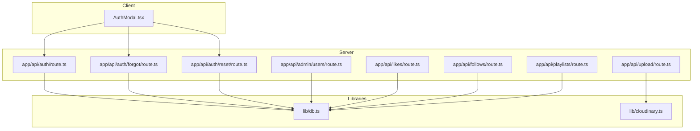
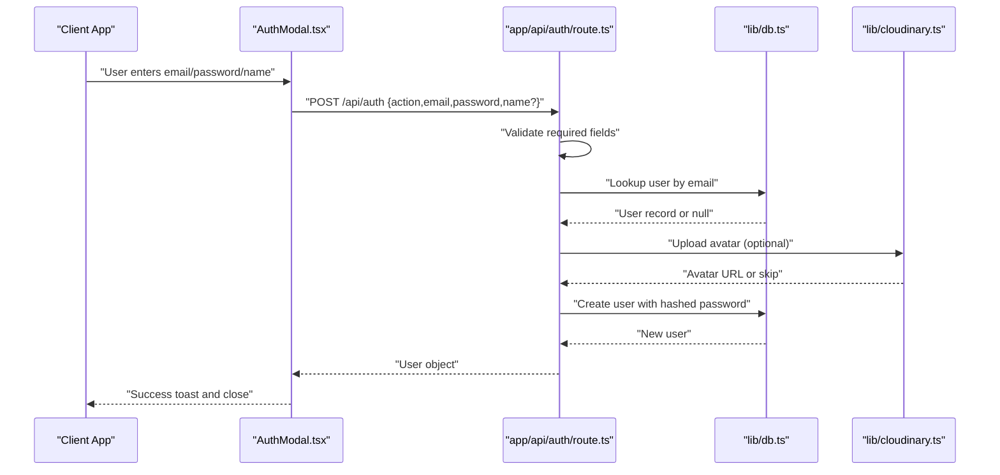
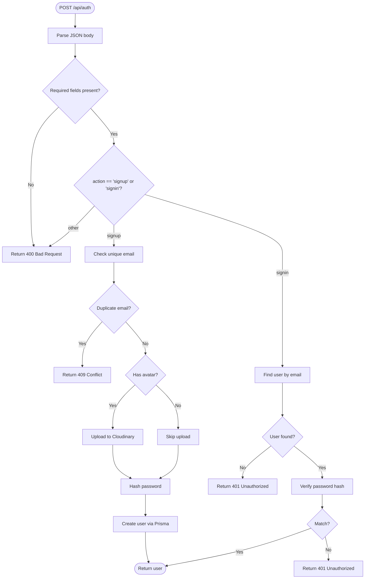
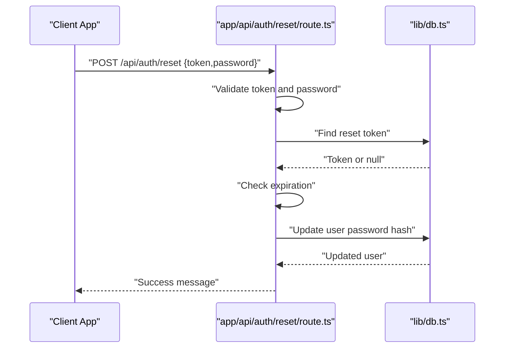
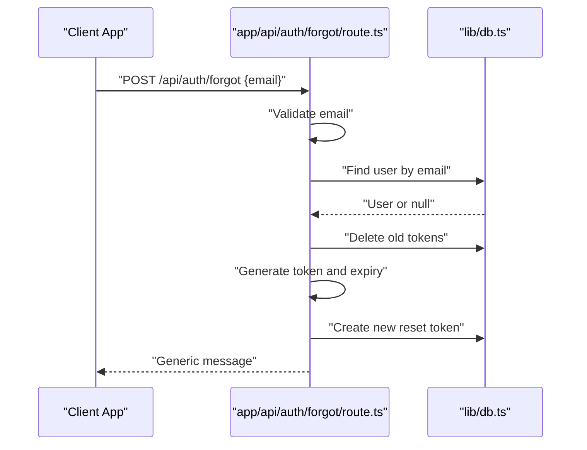
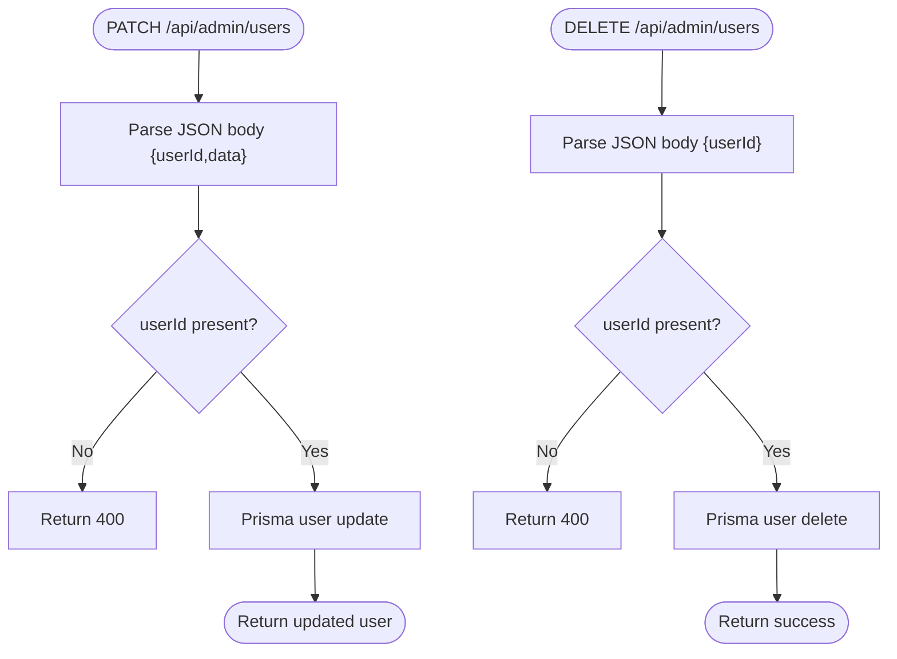
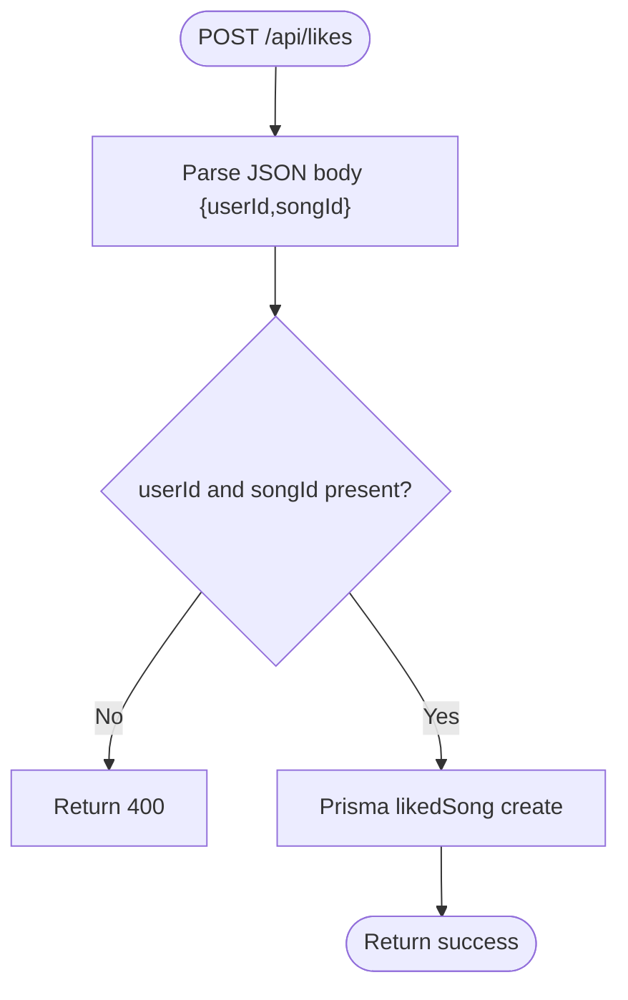
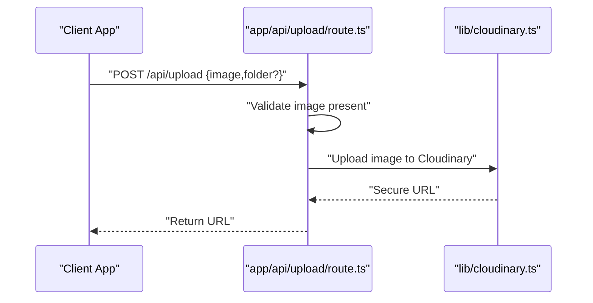
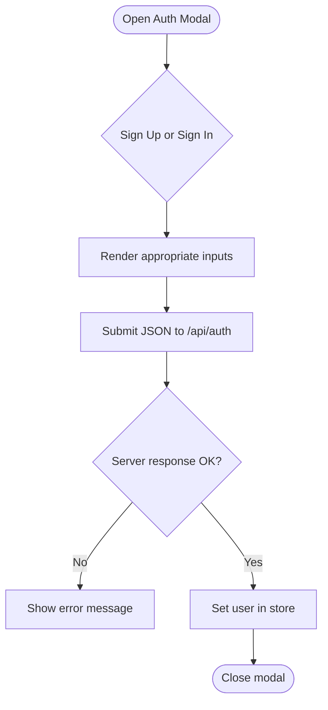
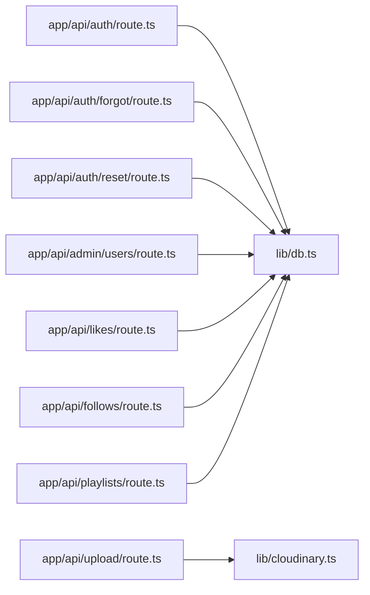

# Input Validation and Sanitization

<cite>
**Referenced Files in This Document**
- [app/api/auth/route.ts](file://app/api/auth/route.ts)
- [app/api/auth/forgot/route.ts](file://app/api/auth/forgot/route.ts)
- [app/api/auth/reset/route.ts](file://app/api/auth/reset/route.ts)
- [app/api/admin/users/route.ts](file://app/api/admin/users/route.ts)
- [app/api/follows/route.ts](file://app/api/follows/route.ts)
- [app/api/likes/route.ts](file://app/api/likes/route.ts)
- [app/api/playlists/route.ts](file://app/api/playlists/route.ts)
- [app/api/upload/route.ts](file://app/api/upload/route.ts)
- [components/AuthModal.tsx](file://components/AuthModal.tsx)
- [lib/db.ts](file://lib/db.ts)
- [lib/cloudinary.ts](file://lib/cloudinary.ts)
- [store/usePlayerStore.ts](file://store/usePlayerStore.ts)
</cite>

## Table of Contents
1. [Introduction](#introduction)
2. [Project Structure](#project-structure)
3. [Core Components](#core-components)
4. [Architecture Overview](#architecture-overview)
5. [Detailed Component Analysis](#detailed-component-analysis)
6. [Dependency Analysis](#dependency-analysis)
7. [Performance Considerations](#performance-considerations)
8. [Troubleshooting Guide](#troubleshooting-guide)
9. [Conclusion](#conclusion)

## Introduction
This document provides comprehensive input validation and sanitization guidance for SonicStream. It covers form validation patterns, data sanitization techniques, and protections against common injection attacks. The focus areas include user registration, login, and profile-related operations, along with request body validation, parameter sanitization, and database query safety. Guidance also includes examples of proper input handling in API routes, client-side validation patterns, server-side sanitization, external API data processing, file upload validation, and content filtering. Finally, it documents security libraries and middleware usage, error handling for invalid inputs, and logging of validation failures.

## Project Structure
SonicStream’s validation and sanitization surface is primarily implemented in:
- API routes under app/api/* for authentication, playlists, likes, follows, uploads, and administrative user actions
- Client components under components/* for user-facing forms and modals
- Utility modules under lib/* for database connections and Cloudinary image uploads
- Global state under store/* for user session data

**Diagram sources**
- [components/AuthModal.tsx:1-149](file://components/AuthModal.tsx#L1-L149)
- [app/api/auth/route.ts:1-73](file://app/api/auth/route.ts#L1-L73)
- [app/api/auth/forgot/route.ts:1-68](file://app/api/auth/forgot/route.ts#L1-L68)
- [app/api/auth/reset/route.ts:1-48](file://app/api/auth/reset/route.ts#L1-L48)
- [app/api/admin/users/route.ts:1-75](file://app/api/admin/users/route.ts#L1-L75)
- [app/api/likes/route.ts:1-55](file://app/api/likes/route.ts#L1-L55)
- [app/api/follows/route.ts:1-55](file://app/api/follows/route.ts#L1-L55)
- [app/api/playlists/route.ts:1-90](file://app/api/playlists/route.ts#L1-L90)
- [app/api/upload/route.ts:1-20](file://app/api/upload/route.ts#L1-L20)
- [lib/db.ts:1-10](file://lib/db.ts#L1-L10)
- [lib/cloudinary.ts:1-21](file://lib/cloudinary.ts#L1-L21)

**Section sources**
- [components/AuthModal.tsx:1-149](file://components/AuthModal.tsx#L1-L149)
- [app/api/auth/route.ts:1-73](file://app/api/auth/route.ts#L1-L73)
- [app/api/auth/forgot/route.ts:1-68](file://app/api/auth/forgot/route.ts#L1-L68)
- [app/api/auth/reset/route.ts:1-48](file://app/api/auth/reset/route.ts#L1-L48)
- [app/api/admin/users/route.ts:1-75](file://app/api/admin/users/route.ts#L1-L75)
- [app/api/likes/route.ts:1-55](file://app/api/likes/route.ts#L1-L55)
- [app/api/follows/route.ts:1-55](file://app/api/follows/route.ts#L1-L55)
- [app/api/playlists/route.ts:1-90](file://app/api/playlists/route.ts#L1-L90)
- [app/api/upload/route.ts:1-20](file://app/api/upload/route.ts#L1-L20)
- [lib/db.ts:1-10](file://lib/db.ts#L1-L10)
- [lib/cloudinary.ts:1-21](file://lib/cloudinary.ts#L1-L21)

## Core Components
This section outlines the primary validation and sanitization mechanisms across the application.

- Authentication API
  - Validates presence of required fields and enforces basic constraints (e.g., password length during reset).
  - Uses database queries safely via Prisma with parameterized operations.
  - Hashes passwords using a deterministic approach; consider stronger hashing in production.

- Administrative User Management
  - Validates presence of identifiers before performing updates/deletes.
  - Uses Prisma’s query builder to avoid raw SQL injection.

- Playlists, Likes, and Follows
  - Validates presence of required identifiers (userId, songId, playlistId, artistId).
  - Uses Prisma operations to prevent SQL injection.

- Uploads
  - Validates presence of image payload before invoking Cloudinary.
  - Delegates image transformation and storage to Cloudinary.

- Client-Side Forms
  - Provides controlled inputs for email, password, and optional name.
  - Submits JSON payloads to server endpoints with minimal client-side sanitization.

**Section sources**
- [app/api/auth/route.ts:15-72](file://app/api/auth/route.ts#L15-L72)
- [app/api/auth/reset/route.ts:14-47](file://app/api/auth/reset/route.ts#L14-L47)
- [app/api/admin/users/route.ts:42-74](file://app/api/admin/users/route.ts#L42-L74)
- [app/api/playlists/route.ts:18-89](file://app/api/playlists/route.ts#L18-L89)
- [app/api/likes/route.ts:17-54](file://app/api/likes/route.ts#L17-L54)
- [app/api/follows/route.ts:17-54](file://app/api/follows/route.ts#L17-L54)
- [app/api/upload/route.ts:4-19](file://app/api/upload/route.ts#L4-L19)
- [components/AuthModal.tsx:26-50](file://components/AuthModal.tsx#L26-L50)

## Architecture Overview
The validation and sanitization pipeline follows a layered approach:
- Client-side form controls capture user input and submit structured JSON.
- Server-side API routes parse and validate request bodies and URL parameters.
- Database interactions are performed through Prisma, which enforces parameterized queries.
- External integrations (Cloudinary) receive validated payloads and apply transformations.

**Diagram sources**
- [components/AuthModal.tsx:26-50](file://components/AuthModal.tsx#L26-L50)
- [app/api/auth/route.ts:16-48](file://app/api/auth/route.ts#L16-L48)
- [lib/db.ts:1-10](file://lib/db.ts#L1-L10)
- [lib/cloudinary.ts:9-18](file://lib/cloudinary.ts#L9-L18)

## Detailed Component Analysis

### Authentication Routes
- Request Body Validation
  - Ensures required fields are present before proceeding.
  - Enforces minimum password length during reset.
- Parameter Validation
  - Uses Prisma queries with filters and unique lookups.
- Database Protection
  - Relies on Prisma’s parameterized queries to prevent SQL injection.
- Password Handling
  - Current hashing approach is deterministic; consider migrating to a strong cryptographic hash with salt and pepper in production.
- Error Handling
  - Returns explicit HTTP status codes for validation failures and logs internal errors.

**Diagram sources**
- [app/api/auth/route.ts:16-67](file://app/api/auth/route.ts#L16-L67)

**Section sources**
- [app/api/auth/route.ts:15-72](file://app/api/auth/route.ts#L15-L72)

### Password Reset Route
- Validates presence of token and password.
- Enforces minimum password length.
- Uses Prisma to retrieve and expire tokens, then updates user password after hashing.

**Diagram sources**
- [app/api/auth/reset/route.ts:14-42](file://app/api/auth/reset/route.ts#L14-L42)
- [lib/db.ts:1-10](file://lib/db.ts#L1-L10)

**Section sources**
- [app/api/auth/reset/route.ts:13-47](file://app/api/auth/reset/route.ts#L13-L47)

### Forgot Password Route
- Validates presence of email.
- Prevents enumeration by not revealing whether an email exists.
- Generates a secure random token, stores it with an expiration, and attempts to send an email.

**Diagram sources**
- [app/api/auth/forgot/route.ts:6-62](file://app/api/auth/forgot/route.ts#L6-L62)
- [lib/db.ts:1-10](file://lib/db.ts#L1-L10)

**Section sources**
- [app/api/auth/forgot/route.ts:5-67](file://app/api/auth/forgot/route.ts#L5-L67)

### Administrative User Management
- Validates presence of identifiers before update/delete operations.
- Uses Prisma’s update and delete operations to maintain referential integrity.

**Diagram sources**
- [app/api/admin/users/route.ts:54-74](file://app/api/admin/users/route.ts#L54-L74)

**Section sources**
- [app/api/admin/users/route.ts:41-74](file://app/api/admin/users/route.ts#L41-L74)

### Playlists, Likes, and Follows
- Validates presence of required identifiers (userId, songId, playlistId, artistId).
- Uses Prisma operations to enforce uniqueness and prevent duplicates.

**Diagram sources**
- [app/api/likes/route.ts:17-35](file://app/api/likes/route.ts#L17-L35)

**Section sources**
- [app/api/likes/route.ts:4-54](file://app/api/likes/route.ts#L4-L54)
- [app/api/follows/route.ts:17-36](file://app/api/follows/route.ts#L17-L36)
- [app/api/playlists/route.ts:18-74](file://app/api/playlists/route.ts#L18-L74)

### Upload Route
- Validates presence of image payload.
- Delegates upload and transformation to Cloudinary.

**Diagram sources**
- [app/api/upload/route.ts:4-19](file://app/api/upload/route.ts#L4-L19)
- [lib/cloudinary.ts:9-18](file://lib/cloudinary.ts#L9-L18)

**Section sources**
- [app/api/upload/route.ts:1-20](file://app/api/upload/route.ts#L1-L20)
- [lib/cloudinary.ts:1-21](file://lib/cloudinary.ts#L1-L21)

### Client-Side Form Validation Patterns
- Controlled inputs for email, password, and optional name.
- Submits structured JSON to server endpoints.
- Displays server-provided error messages and success feedback.

**Diagram sources**
- [components/AuthModal.tsx:26-50](file://components/AuthModal.tsx#L26-L50)
- [store/usePlayerStore.ts:114-114](file://store/usePlayerStore.ts#L114-L114)

**Section sources**
- [components/AuthModal.tsx:14-149](file://components/AuthModal.tsx#L14-L149)
- [store/usePlayerStore.ts:1-128](file://store/usePlayerStore.ts#L1-L128)

## Dependency Analysis
- Database Layer
  - Prisma is used across all API routes to perform safe, parameterized queries.
- External Integrations
  - Cloudinary handles image uploads and transformations.
- Client-State Integration
  - User data is persisted in the client store after successful authentication.

**Diagram sources**
- [app/api/auth/route.ts:1-73](file://app/api/auth/route.ts#L1-L73)
- [app/api/auth/forgot/route.ts:1-68](file://app/api/auth/forgot/route.ts#L1-L68)
- [app/api/auth/reset/route.ts:1-48](file://app/api/auth/reset/route.ts#L1-L48)
- [app/api/admin/users/route.ts:1-75](file://app/api/admin/users/route.ts#L1-L75)
- [app/api/likes/route.ts:1-55](file://app/api/likes/route.ts#L1-L55)
- [app/api/follows/route.ts:1-55](file://app/api/follows/route.ts#L1-L55)
- [app/api/playlists/route.ts:1-90](file://app/api/playlists/route.ts#L1-L90)
- [app/api/upload/route.ts:1-20](file://app/api/upload/route.ts#L1-L20)
- [lib/db.ts:1-10](file://lib/db.ts#L1-L10)
- [lib/cloudinary.ts:1-21](file://lib/cloudinary.ts#L1-L21)

**Section sources**
- [lib/db.ts:1-10](file://lib/db.ts#L1-L10)
- [lib/cloudinary.ts:1-21](file://lib/cloudinary.ts#L1-L21)

## Performance Considerations
- Prefer early validation to reduce unnecessary database calls.
- Use Prisma’s built-in constraints and indexes to optimize lookups.
- Offload heavy transformations to Cloudinary to minimize server CPU usage.
- Consider rate limiting for sensitive endpoints (e.g., authentication) to mitigate abuse.

## Troubleshooting Guide
- Common Validation Failures
  - Missing required fields: Ensure client sends complete JSON payloads.
  - Invalid credentials: Confirm email exists and password matches stored hash.
  - Duplicate entries: Prisma constraints may cause specific error codes; handle gracefully.
- Logging and Monitoring
  - Log validation failures and internal errors for diagnostics.
  - Monitor repeated failures on authentication endpoints for potential abuse.
- Error Responses
  - Use explicit HTTP status codes for client-side handling (e.g., 400, 401, 409, 500).

**Section sources**
- [app/api/auth/route.ts:68-71](file://app/api/auth/route.ts#L68-L71)
- [app/api/auth/reset/route.ts:43-46](file://app/api/auth/reset/route.ts#L43-L46)
- [app/api/auth/forgot/route.ts:63-66](file://app/api/auth/forgot/route.ts#L63-L66)
- [app/api/admin/users/route.ts:49-51](file://app/api/admin/users/route.ts#L49-L51)
- [app/api/likes/route.ts:30-34](file://app/api/likes/route.ts#L30-L34)
- [app/api/follows/route.ts:31-35](file://app/api/follows/route.ts#L31-L35)
- [app/api/playlists/route.ts:69-73](file://app/api/playlists/route.ts#L69-L73)
- [app/api/upload/route.ts:15-18](file://app/api/upload/route.ts#L15-L18)

## Conclusion
SonicStream implements a robust, layered approach to input validation and sanitization:
- Client-side forms provide controlled input submission.
- Server-side routes validate request bodies and parameters, returning clear error responses.
- Prisma ensures database query safety through parameterized operations.
- External integrations (Cloudinary) receive validated payloads and apply transformations.
To further strengthen security, consider adopting standardized validation libraries, migrating to stronger password hashing, implementing rate limiting, and adding comprehensive input sanitization for untrusted data.