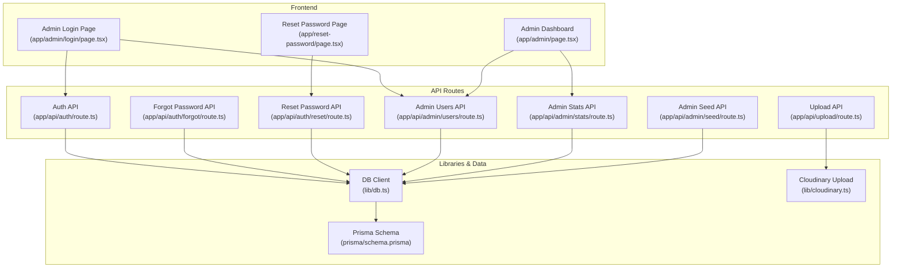
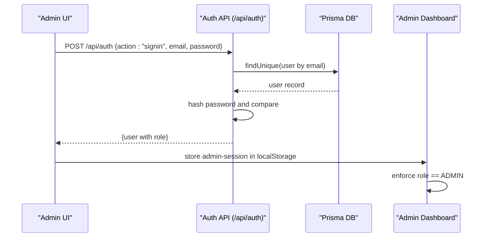
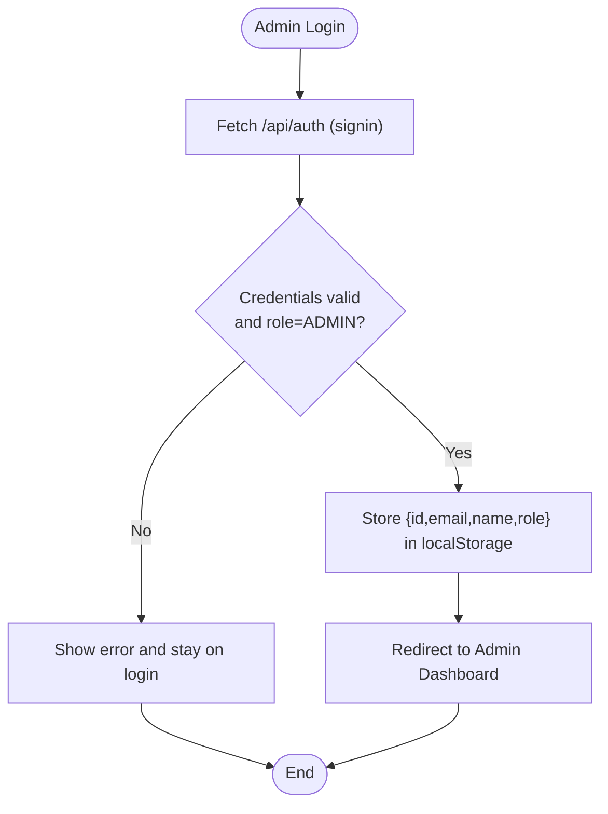
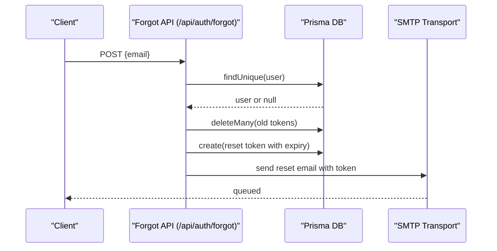
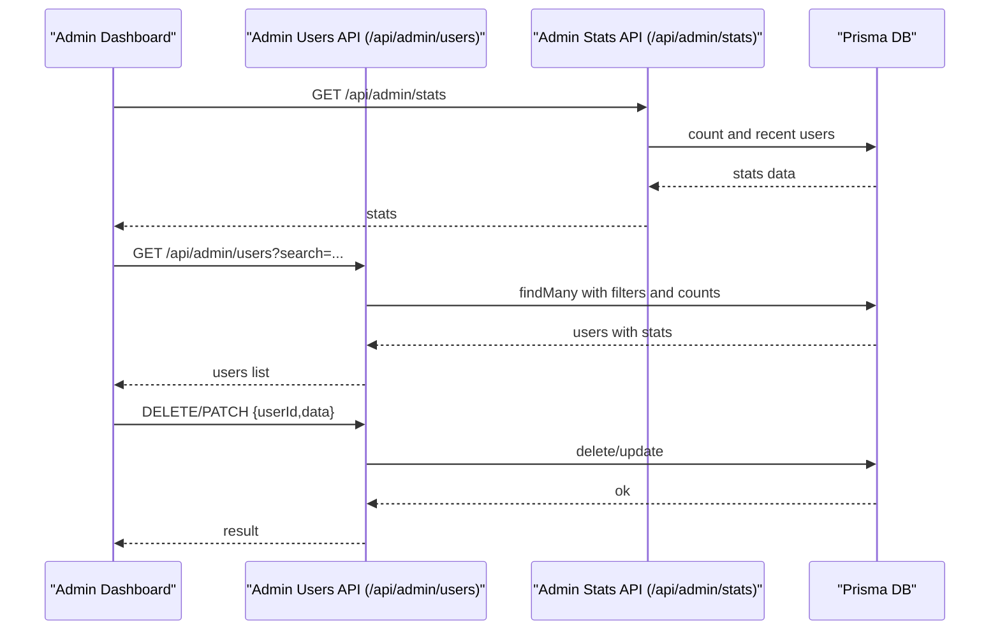
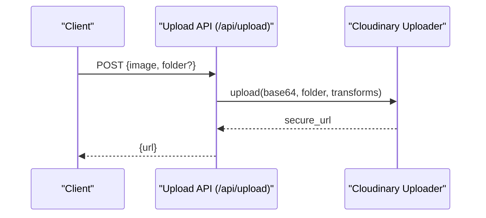
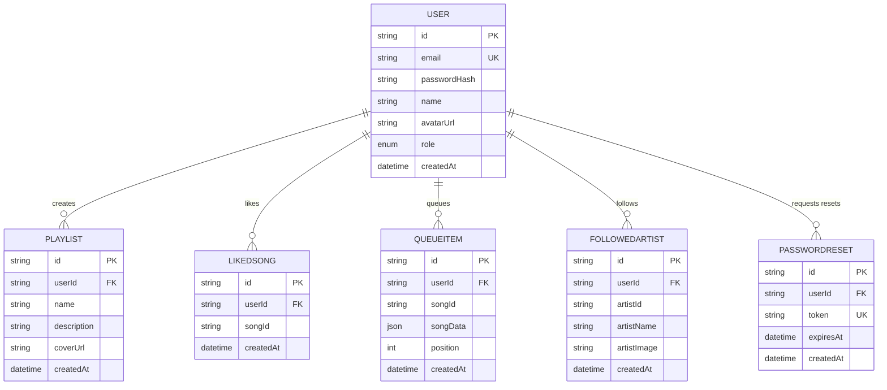
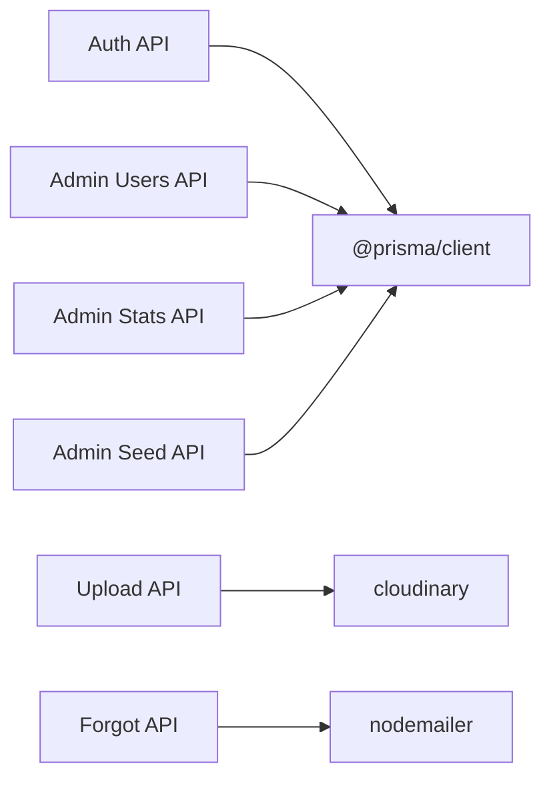

# Security Considerations

<cite>
**Referenced Files in This Document**
- [app/api/auth/route.ts](file://app/api/auth/route.ts)
- [app/api/auth/forgot/route.ts](file://app/api/auth/forgot/route.ts)
- [app/api/auth/reset/route.ts](file://app/api/auth/reset/route.ts)
- [app/api/admin/users/route.ts](file://app/api/admin/users/route.ts)
- [app/api/admin/stats/route.ts](file://app/api/admin/stats/route.ts)
- [app/api/admin/seed/route.ts](file://app/api/admin/seed/route.ts)
- [app/api/upload/route.ts](file://app/api/upload/route.ts)
- [lib/db.ts](file://lib/db.ts)
- [lib/cloudinary.ts](file://lib/cloudinary.ts)
- [prisma/schema.prisma](file://prisma/schema.prisma)
- [hooks/useAuthGuard.ts](file://hooks/useAuthGuard.ts)
- [app/admin/page.tsx](file://app/admin/page.tsx)
- [app/admin/login/page.tsx](file://app/admin/login/page.tsx)
- [app/reset-password/page.tsx](file://app/reset-password/page.tsx)
- [package.json](file://package.json)
</cite>

## Table of Contents
1. [Introduction](#introduction)
2. [Project Structure](#project-structure)
3. [Core Components](#core-components)
4. [Architecture Overview](#architecture-overview)
5. [Detailed Component Analysis](#detailed-component-analysis)
6. [Dependency Analysis](#dependency-analysis)
7. [Performance Considerations](#performance-considerations)
8. [Troubleshooting Guide](#troubleshooting-guide)
9. [Conclusion](#conclusion)
10. [Appendices](#appendices)

## Introduction
This document provides comprehensive security documentation for SonicStream. It focuses on authentication and authorization, password hashing, session management, role-based access control, input validation and sanitization, protection against common vulnerabilities, secure API design, rate limiting and abuse prevention, data protection, encryption, privacy compliance, secure file uploads and Cloudinary integration, email service security, monitoring and logging, incident response, and secure development practices.

## Project Structure
SonicStream is a Next.js application with a layered architecture:
- Frontend pages and UI components under app/ and components/
- API routes under app/api/ implementing server-side logic
- Database access via Prisma ORM
- Utilities for Cloudinary image uploads and database client initialization
- Authentication and admin dashboards with local storage-based sessions

**Diagram sources**
- [app/admin/login/page.tsx](file://app/admin/login/page.tsx)
- [app/admin/page.tsx](file://app/admin/page.tsx)
- [app/reset-password/page.tsx](file://app/reset-password/page.tsx)
- [app/api/auth/route.ts](file://app/api/auth/route.ts)
- [app/api/auth/forgot/route.ts](file://app/api/auth/forgot/route.ts)
- [app/api/auth/reset/route.ts](file://app/api/auth/reset/route.ts)
- [app/api/admin/users/route.ts](file://app/api/admin/users/route.ts)
- [app/api/admin/stats/route.ts](file://app/api/admin/stats/route.ts)
- [app/api/admin/seed/route.ts](file://app/api/admin/seed/route.ts)
- [app/api/upload/route.ts](file://app/api/upload/route.ts)
- [lib/db.ts](file://lib/db.ts)
- [lib/cloudinary.ts](file://lib/cloudinary.ts)
- [prisma/schema.prisma](file://prisma/schema.prisma)

**Section sources**
- [app/admin/login/page.tsx](file://app/admin/login/page.tsx)
- [app/admin/page.tsx](file://app/admin/page.tsx)
- [app/api/auth/route.ts](file://app/api/auth/route.ts)
- [app/api/admin/users/route.ts](file://app/api/admin/users/route.ts)
- [app/api/admin/stats/route.ts](file://app/api/admin/stats/route.ts)
- [app/api/admin/seed/route.ts](file://app/api/admin/seed/route.ts)
- [app/api/upload/route.ts](file://app/api/upload/route.ts)
- [lib/db.ts](file://lib/db.ts)
- [lib/cloudinary.ts](file://lib/cloudinary.ts)
- [prisma/schema.prisma](file://prisma/schema.prisma)

## Core Components
- Authentication and Authorization:
  - Email/password sign-up/sign-in with hashed passwords
  - Role-based access control (USER vs ADMIN)
  - Admin-only dashboard protected by local storage session and role checks
- Password Management:
  - Password reset with time-bound tokens and email delivery
- Data Access:
  - Prisma ORM for database queries and relations
- File Uploads:
  - Base64 image upload to Cloudinary with transformations
- Session Management:
  - Local storage-based admin session persistence

**Section sources**
- [app/api/auth/route.ts](file://app/api/auth/route.ts)
- [app/api/auth/forgot/route.ts](file://app/api/auth/forgot/route.ts)
- [app/api/auth/reset/route.ts](file://app/api/auth/reset/route.ts)
- [app/admin/page.tsx](file://app/admin/page.tsx)
- [app/admin/login/page.tsx](file://app/admin/login/page.tsx)
- [prisma/schema.prisma](file://prisma/schema.prisma)
- [lib/cloudinary.ts](file://lib/cloudinary.ts)

## Architecture Overview
The security architecture centers around:
- API boundaries enforcing authentication and authorization
- Role checks for privileged endpoints
- Secure password handling and reset workflows
- Controlled file upload pipeline to Cloudinary
- Database schema with strong typing and constraints

**Diagram sources**
- [app/api/auth/route.ts](file://app/api/auth/route.ts)
- [app/admin/login/page.tsx](file://app/admin/login/page.tsx)
- [app/admin/page.tsx](file://app/admin/page.tsx)
- [lib/db.ts](file://lib/db.ts)

## Detailed Component Analysis

### Authentication and Authorization
- Sign-up and Sign-in:
  - Validates presence of email and password
  - On sign-up, optionally uploads avatar to Cloudinary and stores hashed password
  - On sign-in, compares hashed password and returns user with role
- Role-Based Access Control:
  - Role enum includes USER and ADMIN
  - Admin dashboard enforces role check and redirects unauthorized users
- Admin Session Management:
  - Stores minimal user info in localStorage under admin-session
  - Redirects to login if session missing or role is not ADMIN

**Diagram sources**
- [app/admin/login/page.tsx](file://app/admin/login/page.tsx)
- [app/api/auth/route.ts](file://app/api/auth/route.ts)
- [app/admin/page.tsx](file://app/admin/page.tsx)

**Section sources**
- [app/api/auth/route.ts](file://app/api/auth/route.ts)
- [app/admin/login/page.tsx](file://app/admin/login/page.tsx)
- [app/admin/page.tsx](file://app/admin/page.tsx)
- [prisma/schema.prisma](file://prisma/schema.prisma)

### Password Hashing and Reset
- Hashing:
  - Uses Web Crypto SHA-256 with a fixed salt appended to the password
  - Note: For production, replace with a robust library designed for password hashing
- Reset Workflow:
  - Forgot endpoint generates a random token, stores expiry, and sends email
  - Reset endpoint validates token, expiry, hashes new password, updates user, and cleans tokens

**Diagram sources**
- [app/api/auth/forgot/route.ts](file://app/api/auth/forgot/route.ts)
- [prisma/schema.prisma](file://prisma/schema.prisma)

**Section sources**
- [app/api/auth/route.ts](file://app/api/auth/route.ts)
- [app/api/auth/forgot/route.ts](file://app/api/auth/forgot/route.ts)
- [app/api/auth/reset/route.ts](file://app/api/auth/reset/route.ts)
- [prisma/schema.prisma](file://prisma/schema.prisma)

### Admin Operations and RBAC
- Admin Dashboard:
  - Lists users with counts and stats
  - Supports role toggling and deletion
- Admin APIs:
  - GET /api/admin/users supports search and pagination-friendly ordering
  - DELETE and PATCH endpoints update roles and names
  - Stats endpoint aggregates counts and recent users

**Diagram sources**
- [app/admin/page.tsx](file://app/admin/page.tsx)
- [app/api/admin/users/route.ts](file://app/api/admin/users/route.ts)
- [app/api/admin/stats/route.ts](file://app/api/admin/stats/route.ts)
- [lib/db.ts](file://lib/db.ts)

**Section sources**
- [app/admin/page.tsx](file://app/admin/page.tsx)
- [app/api/admin/users/route.ts](file://app/api/admin/users/route.ts)
- [app/api/admin/stats/route.ts](file://app/api/admin/stats/route.ts)
- [lib/db.ts](file://lib/db.ts)

### Secure File Uploads and Cloudinary Integration
- Upload Endpoint:
  - Accepts base64 image and optional folder
  - Delegates upload to Cloudinary with configured transformations
- Cloudinary Configuration:
  - Reads credentials from environment variables
  - Applies transformations for avatar sizing and auto quality/format

**Diagram sources**
- [app/api/upload/route.ts](file://app/api/upload/route.ts)
- [lib/cloudinary.ts](file://lib/cloudinary.ts)

**Section sources**
- [app/api/upload/route.ts](file://app/api/upload/route.ts)
- [lib/cloudinary.ts](file://lib/cloudinary.ts)

### Database Schema and Data Protection
- Strong Typing and Constraints:
  - Enum Role ensures only USER or ADMIN values
  - Unique constraints on email
  - Cascading deletes for related records
- Data Exposure:
  - API responses exclude sensitive fields; ensure no unintended leakage

**Diagram sources**
- [prisma/schema.prisma](file://prisma/schema.prisma)

**Section sources**
- [prisma/schema.prisma](file://prisma/schema.prisma)

### Input Validation, Sanitization, and Vulnerability Mitigation
- Current State:
  - Minimal validation occurs at API boundaries (presence checks)
  - No explicit sanitization or escaping for HTML contexts
  - No CSRF protection middleware
  - No rate limiting or abuse controls
- Recommended Improvements:
  - Enforce strict input validation and sanitization (e.g., Zod)
  - Implement Content Security Policy (CSP), SameSite cookies, CSRF tokens
  - Add rate limiting per IP and per user
  - Escape HTML in frontend rendering contexts
  - Use HTTPS/TLS termination and secure cookie flags

[No sources needed since this section provides general guidance]

### Secure API Design Patterns
- Authentication:
  - Prefer short-lived tokens with refresh mechanisms
  - Avoid storing secrets in client-side storage for admin sessions
- Authorization:
  - Enforce RBAC on all privileged endpoints
  - Use least privilege for API keys and service accounts
- Error Handling:
  - Avoid leaking internal errors; return generic messages
  - Log structured errors with correlation IDs

[No sources needed since this section provides general guidance]

### Rate Limiting and Abuse Prevention
- Immediate Actions:
  - Integrate express-rate-limit or equivalent middleware
  - Apply limits to auth endpoints and admin endpoints
- Monitoring:
  - Track request volumes, error rates, and blocked requests
  - Alert on unusual spikes

[No sources needed since this section provides general guidance]

### Data Protection, Encryption, and Privacy
- At Rest:
  - Ensure database encryption at rest via hosting provider
- In Transit:
  - Enforce TLS 1.3+ for all endpoints
- Privacy:
  - Comply with applicable regulations (e.g., GDPR)
  - Minimize data retention; implement deletion on request

[No sources needed since this section provides general guidance]

### Email Service Security
- SMTP Configuration:
  - Use environment variables for credentials
  - Prefer OAuth or dedicated mail APIs over basic SMTP
- Token Delivery:
  - Ensure reset links are time-bound and single-use semantics

**Section sources**
- [app/api/auth/forgot/route.ts](file://app/api/auth/forgot/route.ts)
- [package.json](file://package.json)

### Security Monitoring, Logging, and Incident Response
- Logging:
  - Centralize logs and apply structured logging
  - Mask sensitive fields (tokens, emails)
- Monitoring:
  - Monitor anomalies (failed logins, repeated errors)
- Incident Response:
  - Define escalation paths and remediation steps
  - Rotate secrets and revoke compromised tokens promptly

[No sources needed since this section provides general guidance]

## Dependency Analysis
External dependencies relevant to security:
- Prisma Client for database access
- Cloudinary SDK for image uploads
- Nodemailer for sending reset emails
- Express Rate Limit (available in lockfile) for rate limiting

**Diagram sources**
- [app/api/auth/route.ts](file://app/api/auth/route.ts)
- [app/api/upload/route.ts](file://app/api/upload/route.ts)
- [app/api/auth/forgot/route.ts](file://app/api/auth/forgot/route.ts)
- [app/api/admin/users/route.ts](file://app/api/admin/users/route.ts)
- [app/api/admin/stats/route.ts](file://app/api/admin/stats/route.ts)
- [app/api/admin/seed/route.ts](file://app/api/admin/seed/route.ts)
- [package.json](file://package.json)

**Section sources**
- [package.json](file://package.json)
- [lib/db.ts](file://lib/db.ts)
- [lib/cloudinary.ts](file://lib/cloudinary.ts)

## Performance Considerations
- Authentication and Admin endpoints are lightweight; ensure database connection pooling and indexing
- Cloudinary uploads add latency; consider CDN caching and pre-signed URLs for downloads
- Avoid excessive re-renders in admin UI; memoize queries and mutations

[No sources needed since this section provides general guidance]

## Troubleshooting Guide
- Authentication Failures:
  - Verify email uniqueness and correct password hashing
  - Check admin role enforcement in dashboard
- Upload Issues:
  - Confirm Cloudinary credentials and base64 format
- Admin Privileges:
  - Ensure seed endpoint created ADMIN user or role was updated
- Reset Link Problems:
  - Validate token expiry and SMTP configuration

**Section sources**
- [app/api/auth/route.ts](file://app/api/auth/route.ts)
- [app/admin/page.tsx](file://app/admin/page.tsx)
- [app/api/admin/seed/route.ts](file://app/api/admin/seed/route.ts)
- [app/api/auth/forgot/route.ts](file://app/api/auth/forgot/route.ts)
- [lib/cloudinary.ts](file://lib/cloudinary.ts)

## Conclusion
SonicStream implements foundational authentication and admin controls with role-based access and secure file uploads. To achieve production-grade security, adopt robust password hashing, implement CSRF protections, add rate limiting, harden input validation, strengthen transport and storage encryption, and establish comprehensive monitoring and incident response procedures.

[No sources needed since this section summarizes without analyzing specific files]

## Appendices

### Security Checklist
- Replace current password hashing with a secure library
- Add CSRF protection and SameSite cookies
- Implement rate limiting for auth and admin endpoints
- Enforce HTTPS/TLS and secure headers
- Sanitize and escape all user-generated content
- Review and restrict Cloudinary transformations
- Configure SMTP securely and rotate credentials
- Establish logging and alerting for security events
- Perform periodic vulnerability assessments

[No sources needed since this section provides general guidance]

### Vulnerability Assessment Guidelines
- Static Analysis: Scan for hardcoded secrets and unsafe patterns
- Dynamic Analysis: Penetration test auth, admin, and upload endpoints
- Dependency Review: Audit packages for known vulnerabilities
- Secrets Management: Ensure secrets are environment-driven and rotated

[No sources needed since this section provides general guidance]

### Secure Development Practices
- Treat security as code quality
- Enforce PR reviews with security checkpoints
- Automate linting and dependency scanning
- Keep dependencies updated and patched
- Document threat models and mitigations

[No sources needed since this section provides general guidance]