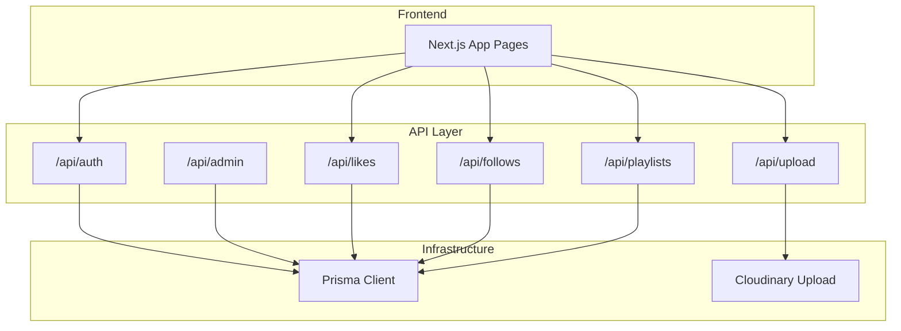
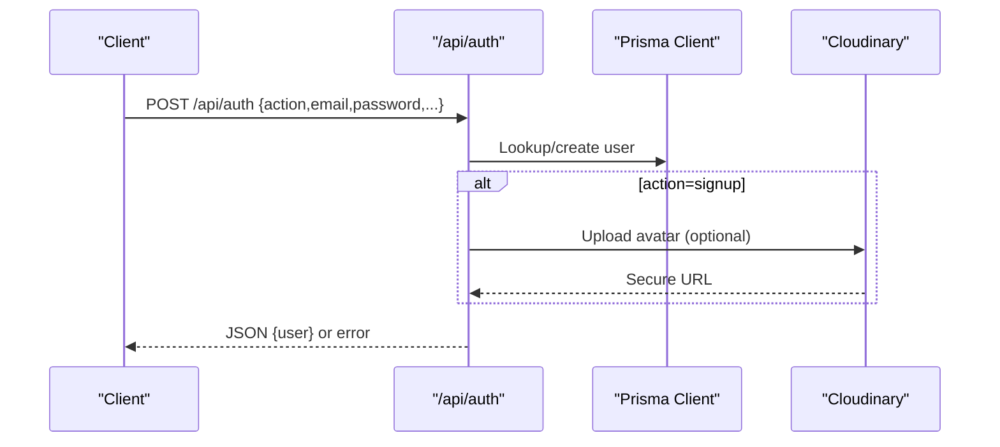
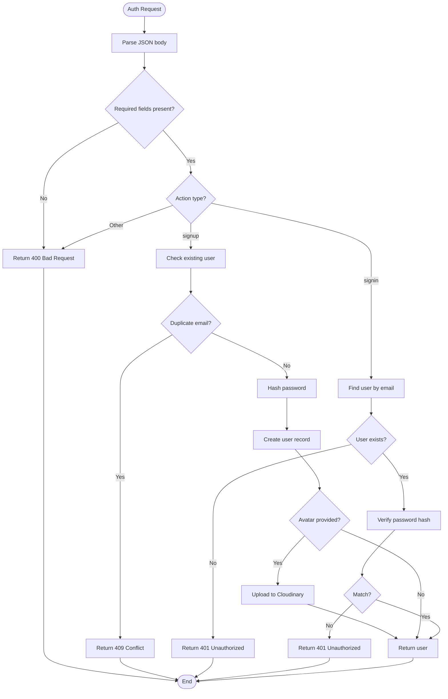
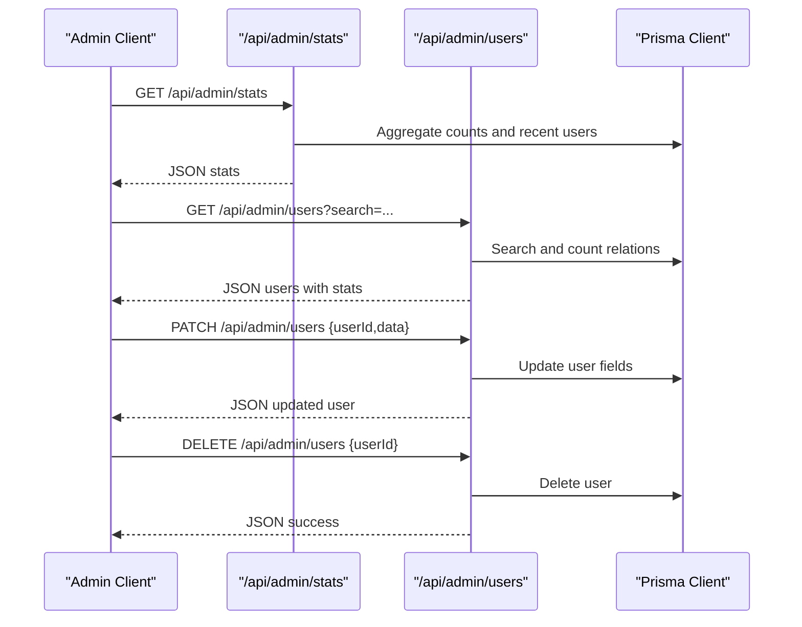
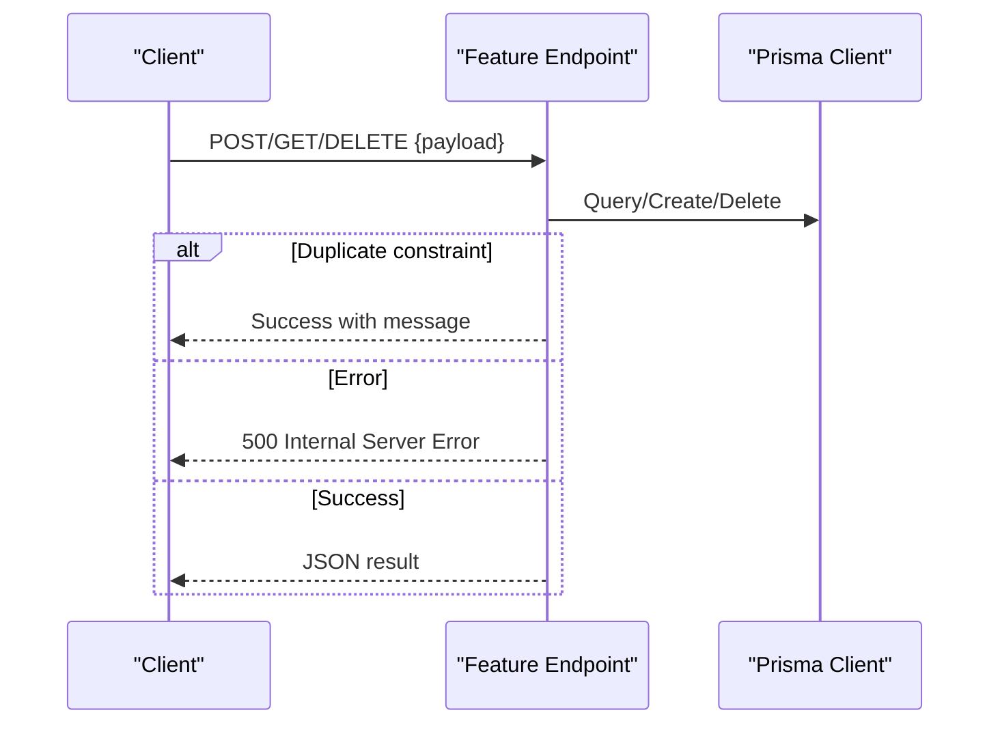
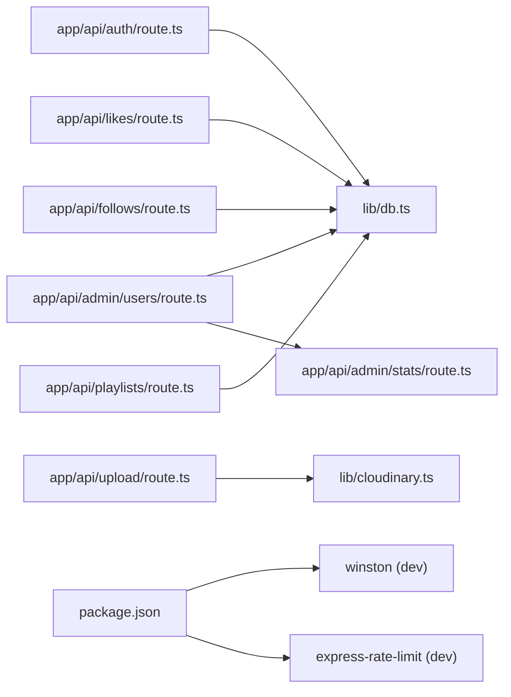

# Security Monitoring and Logging

<cite>
**Referenced Files in This Document**
- [route.ts](file://app/api/auth/route.ts)
- [db.ts](file://lib/db.ts)
- [useAuthGuard.ts](file://hooks/useAuthGuard.ts)
- [route.ts](file://app/api/admin/stats/route.ts)
- [route.ts](file://app/api/admin/users/route.ts)
- [route.ts](file://app/api/follows/route.ts)
- [route.ts](file://app/api/likes/route.ts)
- [route.ts](file://app/api/playlists/route.ts)
- [route.ts](file://app/api/upload/route.ts)
- [cloudinary.ts](file://lib/cloudinary.ts)
- [next.config.ts](file://next.config.ts)
- [package.json](file://package.json)
- [package-lock.json](file://package-lock.json)
</cite>

## Table of Contents
1. [Introduction](#introduction)
2. [Project Structure](#project-structure)
3. [Core Components](#core-components)
4. [Architecture Overview](#architecture-overview)
5. [Detailed Component Analysis](#detailed-component-analysis)
6. [Dependency Analysis](#dependency-analysis)
7. [Performance Considerations](#performance-considerations)
8. [Troubleshooting Guide](#troubleshooting-guide)
9. [Conclusion](#conclusion)
10. [Appendices](#appendices)

## Introduction
This document defines a security monitoring and logging strategy for SonicStream. It focuses on logging strategies for security events, authentication attempts, and suspicious activities; error logging patterns; detection and alerting mechanisms; monitoring setup for authentication failures, rate limiting triggers, and API abuse detection; log aggregation and SIEM integration; automated security monitoring; security metrics collection; anomaly detection patterns; incident response procedures; log retention and secure storage; audit trail maintenance; security testing and vulnerability scanning integration; and compliance reporting and security dashboards.

## Project Structure
SonicStream is a Next.js application with a modular API surface under app/api. Authentication and user lifecycle endpoints reside under app/api/auth. Administrative endpoints for stats and user management live under app/api/admin. Feature endpoints for likes, follows, playlists, and uploads are located under app/api/*.

**Diagram sources**
- [route.ts:15-72](file://app/api/auth/route.ts#L15-L72)
- [route.ts:4-27](file://app/api/admin/stats/route.ts#L4-L27)
- [route.ts:4-74](file://app/api/admin/users/route.ts#L4-L74)
- [route.ts:4-54](file://app/api/likes/route.ts#L4-L54)
- [route.ts:4-54](file://app/api/follows/route.ts#L4-L54)
- [route.ts:18-89](file://app/api/playlists/route.ts#L18-L89)
- [route.ts:4-19](file://app/api/upload/route.ts#L4-L19)
- [db.ts:1-9](file://lib/db.ts#L1-L9)
- [cloudinary.ts:1-21](file://lib/cloudinary.ts#L1-L21)

**Section sources**
- [route.ts:15-72](file://app/api/auth/route.ts#L15-L72)
- [route.ts:4-27](file://app/api/admin/stats/route.ts#L4-L27)
- [route.ts:4-74](file://app/api/admin/users/route.ts#L4-L74)
- [route.ts:4-54](file://app/api/likes/route.ts#L4-L54)
- [route.ts:4-54](file://app/api/follows/route.ts#L4-L54)
- [route.ts:18-89](file://app/api/playlists/route.ts#L18-L89)
- [route.ts:4-19](file://app/api/upload/route.ts#L4-L19)
- [db.ts:1-9](file://lib/db.ts#L1-L9)
- [cloudinary.ts:1-21](file://lib/cloudinary.ts#L1-L21)

## Core Components
- Authentication service: handles sign-up, sign-in, and credential validation. It logs errors and returns structured responses.
- Admin service: exposes administrative statistics and user management endpoints.
- Feature services: likes, follows, playlists, and uploads with CRUD operations and error handling.
- Infrastructure: Prisma client for database operations and Cloudinary for image uploads.

Key security-relevant observations:
- Authentication endpoints return explicit HTTP status codes for invalid actions, missing parameters, duplicates, and invalid credentials.
- Error handling uses console.error for unhandled exceptions and returns generic internal server error responses.
- Rate limiting and IP-based throttling are not present in the current codebase.

**Section sources**
- [route.ts:15-72](file://app/api/auth/route.ts#L15-L72)
- [route.ts:4-27](file://app/api/admin/stats/route.ts#L4-L27)
- [route.ts:4-74](file://app/api/admin/users/route.ts#L4-L74)
- [route.ts:4-54](file://app/api/likes/route.ts#L4-L54)
- [route.ts:4-54](file://app/api/follows/route.ts#L4-L54)
- [route.ts:18-89](file://app/api/playlists/route.ts#L18-L89)
- [route.ts:4-19](file://app/api/upload/route.ts#L4-L19)
- [db.ts:1-9](file://lib/db.ts#L1-L9)
- [cloudinary.ts:1-21](file://lib/cloudinary.ts#L1-L21)

## Architecture Overview
The system architecture integrates frontend pages with API routes. Authentication interacts with the database via Prisma. Uploads integrate with Cloudinary. Administrative endpoints aggregate counts and user data.

**Diagram sources**
- [route.ts:15-72](file://app/api/auth/route.ts#L15-L72)
- [cloudinary.ts:9-18](file://lib/cloudinary.ts#L9-L18)
- [db.ts:1-9](file://lib/db.ts#L1-L9)

## Detailed Component Analysis

### Authentication Security Logging and Detection
- Logging strategy:
  - Log all authentication attempts with contextual information (action, email, IP, timestamp).
  - Record successful sign-ins and failed attempts separately.
  - Capture invalid actions, missing parameters, duplicate emails, and invalid credentials.
  - Log unhandled exceptions with stack traces.
- Detection patterns:
  - Authentication failure spikes per IP or user.
  - Rapid repeated sign-in/sign-up requests from the same IP.
  - Bulk creation of accounts with similar patterns.
- Alerting:
  - Trigger alerts for sustained failure rates, blocked IPs, or suspicious account creation bursts.
- Metrics:
  - Count of sign-ups, sign-ins, failures, and errors per minute/hour/day.

**Diagram sources**
- [route.ts:15-72](file://app/api/auth/route.ts#L15-L72)

**Section sources**
- [route.ts:15-72](file://app/api/auth/route.ts#L15-L72)

### Admin Monitoring and Audit Trail
- Admin stats endpoint aggregates counts and recent users for visibility.
- Admin users endpoint supports listing, updating roles, and deletion.
- Logging strategy:
  - Log all admin actions with actor identity, target user, requested changes, and outcome.
  - Track deletions and role changes for audit trails.
- Metrics:
  - Daily/weekly user growth, top user actions, and admin activity volume.

**Diagram sources**
- [route.ts:4-27](file://app/api/admin/stats/route.ts#L4-L27)
- [route.ts:4-74](file://app/api/admin/users/route.ts#L4-L74)
- [db.ts:1-9](file://lib/db.ts#L1-L9)

**Section sources**
- [route.ts:4-27](file://app/api/admin/stats/route.ts#L4-L27)
- [route.ts:4-74](file://app/api/admin/users/route.ts#L4-L74)
- [db.ts:1-9](file://lib/db.ts#L1-L9)

### Feature Services Security Logging
- Likes, follows, playlists, and uploads:
  - Log all requests with method, endpoint, user ID, and outcome.
  - Capture constraint violations (e.g., duplicate entries) and handle gracefully.
  - Log upload failures and external service errors.
- Detection patterns:
  - Sudden spikes in likes/follows/playlist modifications.
  - Bulk deletion or modification patterns indicating abuse.
  - Upload failures correlating with Cloudinary outages or rate limits.

**Diagram sources**
- [route.ts:17-35](file://app/api/likes/route.ts#L17-L35)
- [route.ts:17-36](file://app/api/follows/route.ts#L17-L36)
- [route.ts:18-74](file://app/api/playlists/route.ts#L18-L74)
- [route.ts:4-19](file://app/api/upload/route.ts#L4-L19)
- [db.ts:1-9](file://lib/db.ts#L1-L9)

**Section sources**
- [route.ts:4-54](file://app/api/likes/route.ts#L4-L54)
- [route.ts:4-54](file://app/api/follows/route.ts#L4-L54)
- [route.ts:18-89](file://app/api/playlists/route.ts#L18-L89)
- [route.ts:4-19](file://app/api/upload/route.ts#L4-L19)
- [db.ts:1-9](file://lib/db.ts#L1-L9)

### Rate Limiting and Abuse Detection
- Current state: No built-in rate limiting or throttling in API routes.
- Recommended implementation:
  - Integrate express-rate-limit or equivalent middleware at the edge or API gateway level.
  - Apply per-IP and per-user limits for authentication endpoints.
  - Enforce burst and sustained rate thresholds for bulk operations.
  - Correlate with logs for anomaly detection and alerting.

[No sources needed since this section provides general guidance]

### SIEM Integration and Log Aggregation
- Recommended approach:
  - Emit structured JSON logs with fields: timestamp, level, service, endpoint, method, userId, ip, userAgent, statusCode, error, duration.
  - Forward logs to a centralized collector (e.g., syslog, filebeat, AWS CloudWatch, GCP Logging, Azure Monitor).
  - Index logs in SIEM for correlation and alerting.
- Fields to capture:
  - Authentication: action, email, result, reason.
  - Admin: actor, target, changes, result.
  - Feature: operation, entity, result, error.
  - Upload: result, error, provider.

[No sources needed since this section provides general guidance]

### Automated Security Monitoring and Dashboards
- Metrics to track:
  - Authentication failure rate, sign-up rate, top error codes, latency p95/p99.
  - Admin actions per operator, user deletions, role changes.
  - Upload success rate, provider errors.
- Dashboards:
  - Real-time charts for authentication trends, admin activity, and feature usage.
  - Anomaly detection panels for spikes and unusual patterns.
- Alerts:
  - Threshold-based alerts for failure spikes and quota exhaustion.
  - Behavioral anomalies via ML-based detectors.

[No sources needed since this section provides general guidance]

### Log Retention, Secure Storage, and Audit Trails
- Retention:
  - Define retention periods by log type (authentication: 90–180 days; audit: 1–7 years depending on policy).
- Secure storage:
  - Encrypt logs at rest and in transit.
  - Restrict access to log systems and dashboards.
- Audit trails:
  - Maintain immutable records of admin actions and sensitive operations.
  - Enable log signing and tamper-evident storage where applicable.

[No sources needed since this section provides general guidance]

### Security Testing, Penetration Testing, and Vulnerability Scanning
- Preparation:
  - Inventory all API endpoints and authentication flows.
  - Identify sensitive data and PII exposure points.
  - Plan load and stress tests to validate rate limiting effectiveness.
- Vulnerability scanning:
  - Static analysis for secrets and insecure configurations.
  - Dynamic scanning of endpoints for OWASP Top 10 issues.
- Penetration testing:
  - Authorized test against staging with signed agreements.
  - Focus on authentication bypass, injection, CSRF, and SSRF vectors.

[No sources needed since this section provides general guidance]

### Compliance Reporting and Security Dashboard
- Compliance:
  - Map logs to regulatory requirements (e.g., GDPR, SOC 2).
  - Provide reports on data access, deletions, and security events.
- Dashboards:
  - Executive KPIs: incident counts, resolution times, compliance scores.
  - Analyst views: drill-down into events, timelines, and correlations.

[No sources needed since this section provides general guidance]

## Dependency Analysis
External dependencies relevant to security monitoring and logging:
- Winston (logging framework) is present in dev dependencies.
- Express Rate Limit (rate limiting) is present in dev dependencies.

**Diagram sources**
- [route.ts:1-2](file://app/api/auth/route.ts#L1-L2)
- [route.ts:1-2](file://app/api/upload/route.ts#L1-L2)
- [cloudinary.ts:1-7](file://lib/cloudinary.ts#L1-L7)
- [route.ts:1-2](file://app/api/admin/users/route.ts#L1-L2)
- [route.ts:1-2](file://app/api/admin/stats/route.ts#L1-L2)
- [route.ts:1-2](file://app/api/likes/route.ts#L1-L2)
- [route.ts:1-2](file://app/api/follows/route.ts#L1-L2)
- [route.ts:1-2](file://app/api/playlists/route.ts#L1-L2)
- [db.ts:1-9](file://lib/db.ts#L1-L9)
- [package.json](file://package.json)
- [package-lock.json](file://package-lock.json)

**Section sources**
- [package.json](file://package.json)
- [package-lock.json](file://package-lock.json)

## Performance Considerations
- Authentication hashing is lightweight but not cryptographically strong; consider migrating to bcrypt in production.
- Database queries are straightforward; ensure indexes on frequently queried fields (email, user ID).
- Image uploads depend on Cloudinary; monitor provider SLAs and implement retries.

[No sources needed since this section provides general guidance]

## Troubleshooting Guide
Common issues and remediation steps:
- Authentication failures:
  - Verify email/password presence and correctness.
  - Check for duplicate email on sign-up.
  - Review console logs for unhandled exceptions.
- Upload failures:
  - Confirm Cloudinary credentials and network connectivity.
  - Inspect error logs for provider-specific messages.
- Feature endpoint errors:
  - Validate payload fields and constraints.
  - Check for duplicate entries and handle gracefully.

**Section sources**
- [route.ts:68-70](file://app/api/auth/route.ts#L68-L70)
- [route.ts:15-17](file://app/api/upload/route.ts#L15-L17)

## Conclusion
SonicStream’s current API routes provide a foundation for robust security monitoring and logging. By implementing structured logging, rate limiting, SIEM integration, anomaly detection, and comprehensive audit trails, the platform can achieve strong security posture and compliance readiness. The recommended enhancements focus on observability, automation, and governance without compromising user experience.

## Appendices
- Next.js configuration does not restrict remote image hosts; ensure only trusted domains are used to mitigate SSRF risks.
- Authentication hook guards UI actions but does not replace backend authorization; enforce permissions server-side.

**Section sources**
- [next.config.ts:12-50](file://next.config.ts#L12-L50)
- [useAuthGuard.ts:12-28](file://hooks/useAuthGuard.ts#L12-L28)