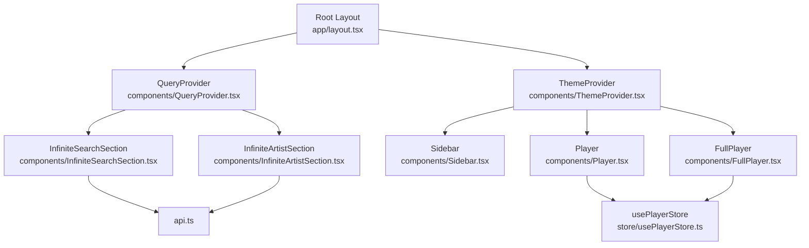
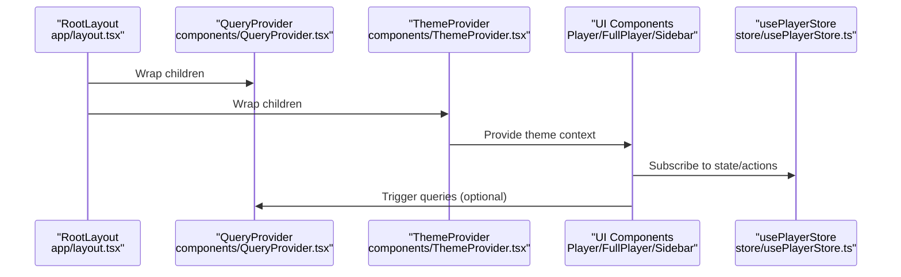
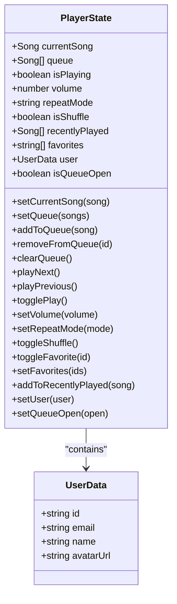
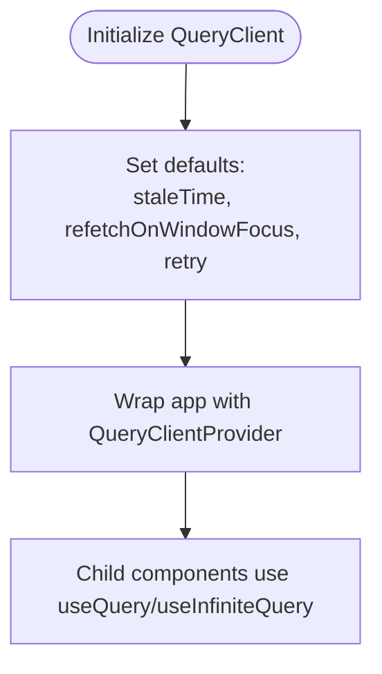
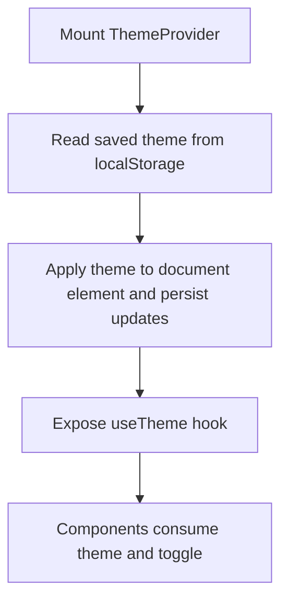
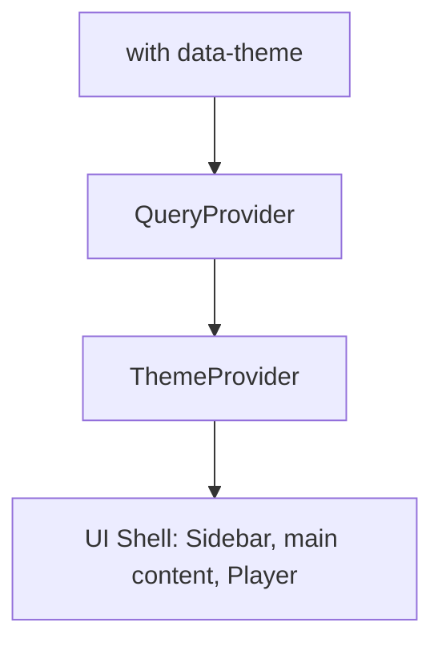
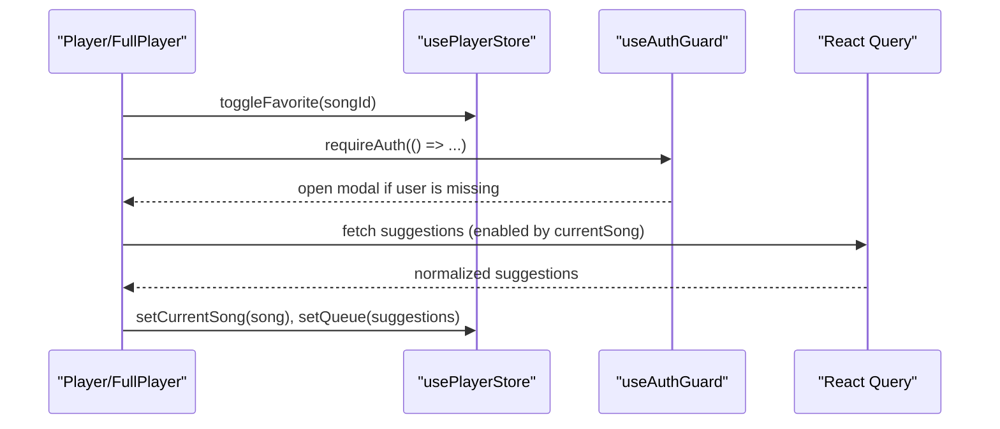
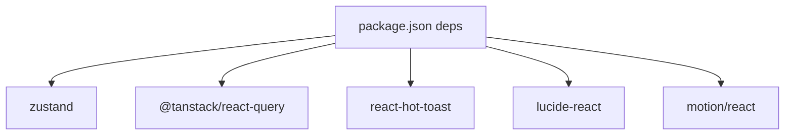

# Global State Patterns

<cite>
**Referenced Files in This Document**
- [usePlayerStore.ts](file://store/usePlayerStore.ts)
- [QueryProvider.tsx](file://components/QueryProvider.tsx)
- [ThemeProvider.tsx](file://components/ThemeProvider.tsx)
- [layout.tsx](file://app/layout.tsx)
- [Player.tsx](file://components/Player.tsx)
- [FullPlayer.tsx](file://components/FullPlayer.tsx)
- [InfiniteSearchSection.tsx](file://components/InfiniteSearchSection.tsx)
- [InfiniteArtistSection.tsx](file://components/InfiniteArtistSection.tsx)
- [useAuthGuard.ts](file://hooks/useAuthGuard.ts)
- [api.ts](file://lib/api.ts)
- [package.json](file://package.json)
</cite>

## Table of Contents
1. [Introduction](#introduction)
2. [Project Structure](#project-structure)
3. [Core Components](#core-components)
4. [Architecture Overview](#architecture-overview)
5. [Detailed Component Analysis](#detailed-component-analysis)
6. [Dependency Analysis](#dependency-analysis)
7. [Performance Considerations](#performance-considerations)
8. [Troubleshooting Guide](#troubleshooting-guide)
9. [Conclusion](#conclusion)
10. [Appendices](#appendices)

## Introduction
This document explains the global state management patterns in SonicStream. It focuses on how Zustand stores, React Query providers, and theme providers integrate at the root layout level, how state is composed and partitioned, and how cross-store communication occurs. It also covers client-side initialization, persistence, and practical guidance for extending the architecture while maintaining consistency and performance.

## Project Structure
SonicStream organizes state management across three layers:
- Providers at the root layout wrap the entire application.
- A single Zustand store manages player-centric state and user preferences.
- React Query is configured via a dedicated provider for caching and data fetching.

**Diagram sources**
- [layout.tsx:44-71](file://app/layout.tsx#L44-L71)
- [QueryProvider.tsx:6-25](file://components/QueryProvider.tsx#L6-L25)
- [ThemeProvider.tsx:21-44](file://components/ThemeProvider.tsx#L21-L44)
- [Player.tsx:19-25](file://components/Player.tsx#L19-L25)
- [FullPlayer.tsx:34-42](file://components/FullPlayer.tsx#L34-L42)
- [InfiniteSearchSection.tsx:23-44](file://components/InfiniteSearchSection.tsx#L23-L44)
- [InfiniteArtistSection.tsx:21-70](file://components/InfiniteArtistSection.tsx#L21-L70)
- [api.ts:39-83](file://lib/api.ts#L39-L83)

**Section sources**
- [layout.tsx:44-71](file://app/layout.tsx#L44-L71)
- [package.json:12-32](file://package.json#L12-L32)

## Core Components
- Zustand store (usePlayerStore): Manages playback state, queue, favorites, recent history, user identity, and UI toggles. It persists a subset of state to local storage for quick client-side initialization.
- React Query provider: Wraps the app to enable caching, background refetching, and pagination helpers.
- Theme provider: Manages theme state and persistence, exposing a simple hook for UI components.

Key responsibilities:
- State composition: The Zustand store encapsulates all player-related state and user preferences in one slice.
- Provider hierarchy: Providers are layered so that child components can consume both query cache and theme context.
- Cross-store communication: Components can coordinate between UI state (Zustand) and remote data (React Query) without tight coupling.

**Section sources**
- [usePlayerStore.ts:43-127](file://store/usePlayerStore.ts#L43-L127)
- [QueryProvider.tsx:6-25](file://components/QueryProvider.tsx#L6-L25)
- [ThemeProvider.tsx:21-44](file://components/ThemeProvider.tsx#L21-L44)

## Architecture Overview
The root layout composes providers and passes them down to all pages. Components consume Zustand for immediate UI state, React Query for server-cached data, and the theme provider for appearance.

**Diagram sources**
- [layout.tsx:52-67](file://app/layout.tsx#L52-L67)
- [QueryProvider.tsx:6-25](file://components/QueryProvider.tsx#L6-L25)
- [ThemeProvider.tsx:21-44](file://components/ThemeProvider.tsx#L21-L44)
- [Player.tsx:19-25](file://components/Player.tsx#L19-L25)
- [FullPlayer.tsx:34-42](file://components/FullPlayer.tsx#L34-L42)
- [usePlayerStore.ts:43-127](file://store/usePlayerStore.ts#L43-L127)

## Detailed Component Analysis

### Zustand Store: usePlayerStore
The store defines a single slice for player state and user preferences. It uses persistence to selectively hydrate state on the client.

- State composition: All playback and user-related UI state is co-located, simplifying cross-feature coordination (e.g., auth gating via user presence).
- Persistence: Only selected fields are persisted to local storage, reducing payload size and avoiding sensitive data leakage.
- Actions: Methods encapsulate playback logic, queue manipulation, and preference updates.

**Diagram sources**
- [usePlayerStore.ts:12-41](file://store/usePlayerStore.ts#L12-L41)
- [usePlayerStore.ts:43-127](file://store/usePlayerStore.ts#L43-L127)

**Section sources**
- [usePlayerStore.ts:43-127](file://store/usePlayerStore.ts#L43-L127)

### React Query Provider: QueryProvider
Configures a client with default caching and retry behavior, enabling efficient data fetching across the app.

- Caching: Queries are cached per key; staleTime reduces redundant network requests.
- Infinite queries: Helpers support paginated lists in search and artist views.
- Integration: Components can opt into caching without manual cache management.

**Diagram sources**
- [QueryProvider.tsx:6-25](file://components/QueryProvider.tsx#L6-L25)
- [InfiniteSearchSection.tsx:31-44](file://components/InfiniteSearchSection.tsx#L31-L44)
- [InfiniteArtistSection.tsx:50-70](file://components/InfiniteArtistSection.tsx#L50-L70)

**Section sources**
- [QueryProvider.tsx:6-25](file://components/QueryProvider.tsx#L6-L25)
- [InfiniteSearchSection.tsx:31-44](file://components/InfiniteSearchSection.tsx#L31-L44)
- [InfiniteArtistSection.tsx:50-70](file://components/InfiniteArtistSection.tsx#L50-L70)

### Theme Provider: ThemeProvider
Manages theme state and persistence, exposing a simple hook for UI components.

- Hydration: Theme is applied after mount to avoid SSR mismatches.
- Persistence: Changes are saved to localStorage and reflected immediately.

**Diagram sources**
- [ThemeProvider.tsx:21-44](file://components/ThemeProvider.tsx#L21-L44)

**Section sources**
- [ThemeProvider.tsx:21-44](file://components/ThemeProvider.tsx#L21-L44)

### Provider Hierarchy in Root Layout
Providers are nested so that theme and query contexts are available globally.

- Hydration: The root layout sets a data attribute and suppresses hydration warnings to avoid mismatch during initial render.
- Order matters: Theme provider wraps UI so that components can toggle theme and read current mode consistently.

**Diagram sources**
- [layout.tsx:44-71](file://app/layout.tsx#L44-L71)

**Section sources**
- [layout.tsx:44-71](file://app/layout.tsx#L44-L71)

### Cross-Store Communication Patterns
- Auth gating: The auth hook reads the user field from the player store and conditionally triggers UI flows.
- UI-state + remote-data coordination: Components update Zustand state (e.g., queue, favorites) while React Query manages server-provided suggestions and paginated lists.

**Diagram sources**
- [Player.tsx:63-67](file://components/Player.tsx#L63-L67)
- [FullPlayer.tsx:44-51](file://components/FullPlayer.tsx#L44-L51)
- [useAuthGuard.ts:12-28](file://hooks/useAuthGuard.ts#L12-L28)
- [usePlayerStore.ts:36-40](file://store/usePlayerStore.ts#L36-L40)

**Section sources**
- [useAuthGuard.ts:12-28](file://hooks/useAuthGuard.ts#L12-L28)
- [Player.tsx:63-67](file://components/Player.tsx#L63-L67)
- [FullPlayer.tsx:44-51](file://components/FullPlayer.tsx#L44-L51)

### Client-Side Initialization and Hydration
- Zustand persistence: On mount, the store restores persisted fields (volume, favorites, recent history, user) from local storage.
- Theme persistence: The theme provider reads and writes to localStorage to maintain user preference across sessions.
- Provider initialization: QueryClient is created once and reused across the app lifecycle.

**Section sources**
- [usePlayerStore.ts:117-126](file://store/usePlayerStore.ts#L117-L126)
- [ThemeProvider.tsx:25-35](file://components/ThemeProvider.tsx#L25-L35)
- [QueryProvider.tsx:7-18](file://components/QueryProvider.tsx#L7-L18)

### Extending the State Management Architecture
Guidelines for adding new state slices and maintaining consistency:
- Keep cohesive features together: If a new domain (e.g., playlists) grows beyond a single concern, consider a separate Zustand slice to preserve separation of concerns.
- Prefer small, focused actions: Encapsulate side effects (e.g., persisting preferences) within the store to reduce duplication.
- Use selectors for derived state: Compute derived values (e.g., favorite counts) in components or via helper utilities to keep the store lean.
- Maintain a single source of truth: Avoid duplicating state between stores and props; centralize authoritative state in Zustand or React Query where appropriate.
- Keep persistence minimal: Persist only frequently-used UI preferences to reduce storage overhead.

[No sources needed since this section provides general guidance]

### Adding New State Slices
Steps to introduce a new Zustand slice:
- Define a new store file under store/ with a clear shape and actions.
- Integrate the store in components via hooks.
- Decide whether to persist fields; if so, configure partialize carefully.
- Ensure cross-slice communication remains explicit (e.g., pass callbacks or use shared hooks).

[No sources needed since this section provides general guidance]

## Dependency Analysis
External libraries and their roles:
- Zustand: Local state management with middleware for persistence.
- @tanstack/react-query: Caching and data fetching for search and artist pages.
- react-hot-toast: Toast notifications for user feedback.
- lucide-react: Icons for UI controls.
- motion/react: Smooth animations for player panels.

**Diagram sources**
- [package.json:12-32](file://package.json#L12-L32)

**Section sources**
- [package.json:12-32](file://package.json#L12-L32)

## Performance Considerations
- Minimize re-renders: Use shallow equality where possible; split slices to narrow subscriptions.
- Persist only essential fields: Limit persisted state to UI preferences to reduce serialization costs.
- Tune React Query defaults: Adjust staleTime and retries to balance freshness and bandwidth.
- Debounce heavy UI updates: Throttle seek/volume sliders to reduce frequent state churn.
- Lazy loading: Continue leveraging infinite queries for large lists to avoid loading entire datasets at once.

[No sources needed since this section provides general guidance]

## Troubleshooting Guide
Common issues and remedies:
- Hydration mismatches: Ensure providers wrap the app and suppressHydrationWarning is used appropriately in the root layout.
- Theme not applying: Verify localStorage key and that the theme is applied to the document element after mount.
- Favorites not updating: Confirm the store action is called and the UI re-renders based on the subscribed selector.
- Suggestions not loading: Check that the query key includes the current song ID and that enabled conditions are met.

**Section sources**
- [layout.tsx:46-50](file://app/layout.tsx#L46-L50)
- [ThemeProvider.tsx:25-35](file://components/ThemeProvider.tsx#L25-L35)
- [usePlayerStore.ts:36-40](file://store/usePlayerStore.ts#L36-L40)
- [FullPlayer.tsx:44-51](file://components/FullPlayer.tsx#L44-L51)

## Conclusion
SonicStream’s state management combines a single, well-scoped Zustand store with React Query and a lightweight theme provider. This design yields predictable state composition, clear separation of concerns, and straightforward cross-store coordination. By following the extension guidelines and performance recommendations, teams can evolve the architecture safely and efficiently.

[No sources needed since this section summarizes without analyzing specific files]

## Appendices

### API Utilities Used by Providers
- Normalization and image/download helpers support consistent rendering across components.

**Section sources**
- [api.ts:39-83](file://lib/api.ts#L39-L83)