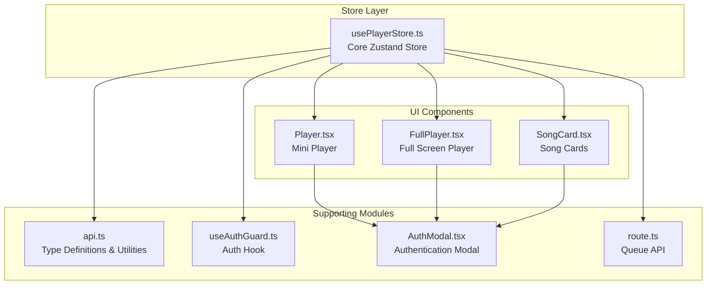
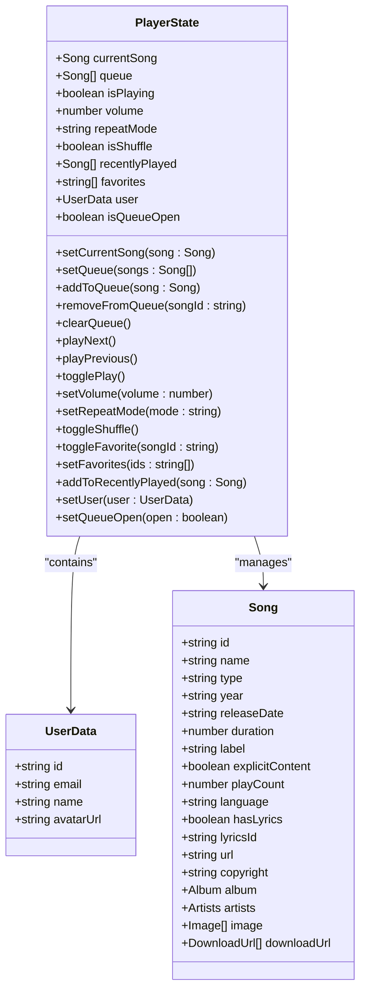
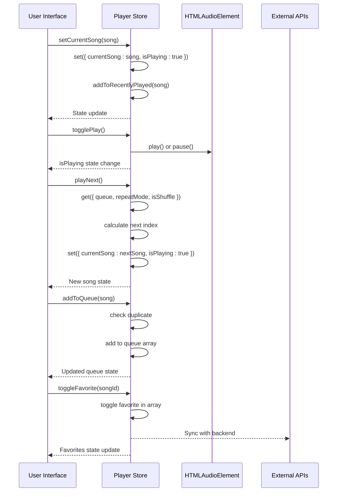
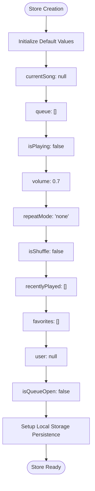
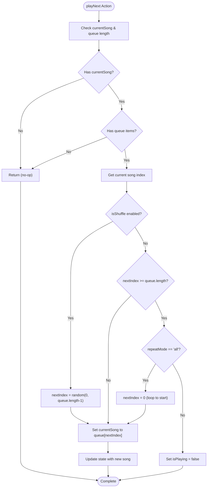
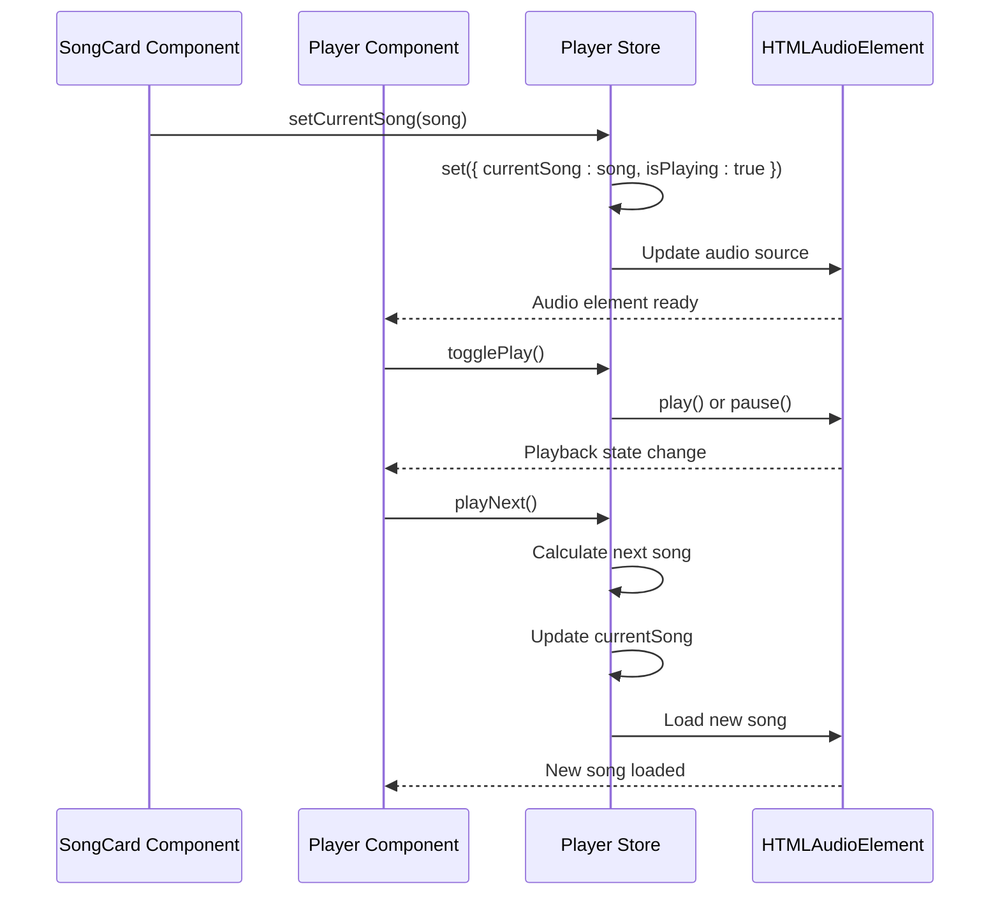
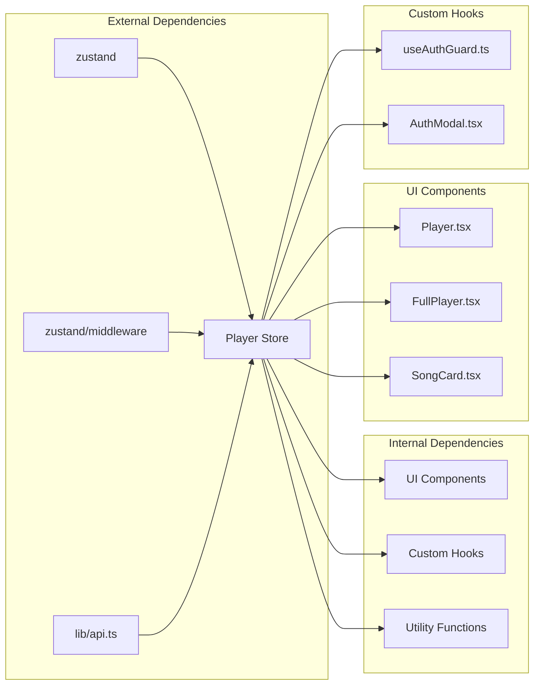
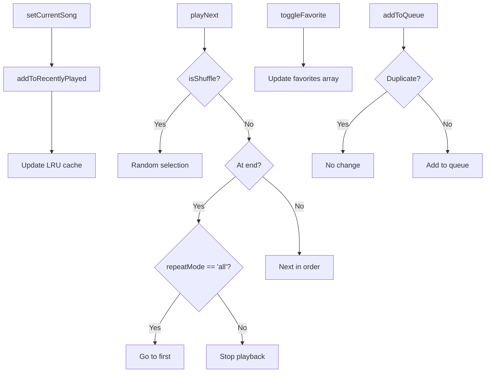

# Player Store Implementation

<cite>
**Referenced Files in This Document**
- [usePlayerStore.ts](file://store/usePlayerStore.ts)
- [Player.tsx](file://components/Player.tsx)
- [FullPlayer.tsx](file://components/FullPlayer.tsx)
- [SongCard.tsx](file://components/SongCard.tsx)
- [api.ts](file://lib/api.ts)
- [useAuthGuard.ts](file://hooks/useAuthGuard.ts)
- [AuthModal.tsx](file://components/AuthModal.tsx)
- [route.ts](file://app/api/queue/route.ts)
</cite>

## Table of Contents
1. [Introduction](#introduction)
2. [Project Structure](#project-structure)
3. [Core Components](#core-components)
4. [Architecture Overview](#architecture-overview)
5. [Detailed Component Analysis](#detailed-component-analysis)
6. [Dependency Analysis](#dependency-analysis)
7. [Performance Considerations](#performance-considerations)
8. [Troubleshooting Guide](#troubleshooting-guide)
9. [Conclusion](#conclusion)

## Introduction

The SonicStream player store is built using Zustand, a lightweight state management solution for React applications. This implementation provides a comprehensive audio player experience with persistent state management, queue handling, playback controls, and user preference storage. The store manages all player-related state including current song playback, queue management, user preferences, and recently played songs.

The player store integrates seamlessly with the audio player components, providing a reactive state that drives the user interface and audio playback functionality. It supports advanced features like shuffle mode, repeat modes, volume control, and user authentication integration.

## Project Structure

The player store implementation is organized across several key files:



**Diagram sources**
- [usePlayerStore.ts:1-128](file://store/usePlayerStore.ts#L1-L128)
- [Player.tsx:1-251](file://components/Player.tsx#L1-L251)
- [FullPlayer.tsx:1-243](file://components/FullPlayer.tsx#L1-L243)

**Section sources**
- [usePlayerStore.ts:1-128](file://store/usePlayerStore.ts#L1-L128)
- [Player.tsx:1-251](file://components/Player.tsx#L1-L251)
- [FullPlayer.tsx:1-243](file://components/FullPlayer.tsx#L1-L243)

## Core Components

### State Structure

The player store maintains a comprehensive state structure with the following properties:

| Property | Type | Default Value | Description |
|----------|------|---------------|-------------|
| `currentSong` | `Song \| null` | `null` | Currently playing song or null if nothing is playing |
| `queue` | `Song[]` | `[]` | Array of songs in the playback queue |
| `isPlaying` | `boolean` | `false` | Current playback state (playing/paused) |
| `volume` | `number` | `0.7` | Volume level (0.0 to 1.0) |
| `repeatMode` | `"none" \| "one" \| "all"` | `"none"` | Repeat mode: none, one, or all |
| `isShuffle` | `boolean` | `false` | Shuffle mode enabled/disabled |
| `recentlyPlayed` | `Song[]` | `[]` | Last 30 songs played (LRU cache) |
| `favorites` | `string[]` | `[]` | Array of favorite song IDs |
| `user` | `UserData \| null` | `null` | Currently authenticated user data |
| `isQueueOpen` | `boolean` | `false` | Whether queue panel is visible |

### Action Types and Interfaces

The store defines a comprehensive interface for all actions:



**Diagram sources**
- [usePlayerStore.ts:5-41](file://store/usePlayerStore.ts#L5-L41)

**Section sources**
- [usePlayerStore.ts:12-41](file://store/usePlayerStore.ts#L12-L41)
- [api.ts:1-35](file://lib/api.ts#L1-L35)

## Architecture Overview

The player store follows a unidirectional data flow architecture with reactive updates:



**Diagram sources**
- [usePlayerStore.ts:57-115](file://store/usePlayerStore.ts#L57-L115)
- [Player.tsx:33-57](file://components/Player.tsx#L33-L57)

## Detailed Component Analysis

### State Initialization and Persistence

The store initializes with sensible defaults and persists critical user preferences:



**Diagram sources**
- [usePlayerStore.ts:43-55](file://store/usePlayerStore.ts#L43-L55)
- [usePlayerStore.ts:117-127](file://store/usePlayerStore.ts#L117-L127)

### Playback Control Actions

The playback control system implements sophisticated queue management logic:



**Diagram sources**
- [usePlayerStore.ts:70-89](file://store/usePlayerStore.ts#L70-L89)

### Queue Management Operations

The queue management system provides comprehensive song manipulation capabilities:

| Operation | Implementation | Behavior |
|-----------|----------------|----------|
| `setQueue` | Direct replacement | Replaces entire queue with provided array |
| `addToQueue` | Duplicate check + append | Prevents duplicates, adds to end |
| `removeFromQueue` | Filter by ID | Removes specific song by ID |
| `clearQueue` | Empty array | Resets queue to empty |
| `playNext` | Index calculation + bounds checking | Handles shuffle, repeat, and bounds |
| `playPrevious` | Reverse index calculation | Circular queue navigation |

**Section sources**
- [usePlayerStore.ts:61-89](file://store/usePlayerStore.ts#L61-L89)

### User Preference Management

The store manages user preferences with automatic persistence:

```mermaid
classDiagram
class FavoriteSystem {
+toggleFavorite(songId : string)
+setFavorites(ids : string[])
+favorites : string[]
toggleFavorite() {
if (includes(songId)) {
return filter out songId
} else {
return append songId
}
}
}
class RecentlyPlayedSystem {
+addToRecentlyPlayed(song : Song)
+recentlyPlayed : Song[]
addToRecentlyPlayed() {
const filtered = filter out duplicate song
return [song, ...filtered].slice(0, 30)
}
}
class UserSystem {
+setUser(user : UserData)
+user : UserData
+requireAuth(action : Function)
}
FavoriteSystem --> RecentlyPlayedSystem : "complements"
UserSystem --> FavoriteSystem : "provides context"
```

**Diagram sources**
- [usePlayerStore.ts:104-115](file://store/usePlayerStore.ts#L104-L115)
- [usePlayerStore.ts:110-113](file://store/usePlayerStore.ts#L110-L113)

**Section sources**
- [usePlayerStore.ts:104-115](file://store/usePlayerStore.ts#L104-L115)
- [usePlayerStore.ts:110-113](file://store/usePlayerStore.ts#L110-L113)

### Integration with Audio Player Components

The store integrates deeply with the audio player components:



**Diagram sources**
- [SongCard.tsx:30-35](file://components/SongCard.tsx#L30-L35)
- [Player.tsx:33-57](file://components/Player.tsx#L33-L57)

**Section sources**
- [SongCard.tsx:23-35](file://components/SongCard.tsx#L23-L35)
- [Player.tsx:19-25](file://components/Player.tsx#L19-L25)

## Dependency Analysis

The player store has minimal external dependencies and maintains clean separation of concerns:



**Diagram sources**
- [usePlayerStore.ts:1-3](file://store/usePlayerStore.ts#L1-L3)
- [Player.tsx:3-17](file://components/Player.tsx#L3-L17)
- [FullPlayer.tsx:3-18](file://components/FullPlayer.tsx#L3-L18)

### State Flow Dependencies

The store maintains internal dependencies between actions:



**Diagram sources**
- [usePlayerStore.ts:57-89](file://store/usePlayerStore.ts#L57-L89)
- [usePlayerStore.ts:104-115](file://store/usePlayerStore.ts#L104-L115)

**Section sources**
- [usePlayerStore.ts:57-115](file://store/usePlayerStore.ts#L57-L115)

## Performance Considerations

### Memory Management

The store implements efficient memory management through:

1. **LRU Cache for Recently Played**: Limits recent history to 30 songs
2. **Queue Deduplication**: Prevents duplicate song entries
3. **Selective Persistence**: Only persists essential user preferences

### State Updates

Optimization strategies include:

- **Batched Updates**: Atomic state updates prevent intermediate render states
- **Conditional Effects**: Audio element updates only when song changes
- **Efficient Array Operations**: O(n) operations for queue management

### Storage Persistence

The persistence middleware optimizes storage by:

- **Partial Serialization**: Only stores relevant user preferences
- **Selective Restoration**: Restores only necessary state on mount

## Troubleshooting Guide

### Common Issues and Solutions

| Issue | Symptoms | Solution |
|-------|----------|----------|
| Audio not playing | `isPlaying` true but no sound | Check `currentSong` is set and audio source URL is valid |
| Queue not updating | UI shows old queue | Verify `setQueue` action is called with new array |
| Favorites not syncing | Local state differs from server | Ensure `setFavorites` is called after API response |
| Shuffle not working | Always plays next sequential song | Confirm `isShuffle` flag is properly toggled |

### Debugging State Changes

To debug state changes, use React DevTools to inspect the store state and track action dispatches. The store's immutable nature ensures predictable state transitions.

### Integration Patterns

Common integration patterns include:

1. **Component-Level Usage**: Import `usePlayerStore` and destructure required actions
2. **Effect-Based Updates**: Use effects to synchronize audio element with store state
3. **Event-Driven Updates**: Handle audio events (ended, timeupdate) to update store state

**Section sources**
- [usePlayerStore.ts:117-127](file://store/usePlayerStore.ts#L117-L127)
- [Player.tsx:68-82](file://components/Player.tsx#L68-L82)

## Conclusion

The Zustand player store implementation in SonicStream provides a robust, scalable foundation for audio playback functionality. Its clean architecture, comprehensive action set, and thoughtful integration patterns make it easy to extend and maintain. The store effectively balances simplicity with powerful features, supporting everything from basic playback controls to advanced queue management and user preference persistence.

The implementation demonstrates best practices in state management, including proper separation of concerns, efficient memory usage, and seamless integration with React components. The modular design allows for easy testing and future enhancements while maintaining backward compatibility.