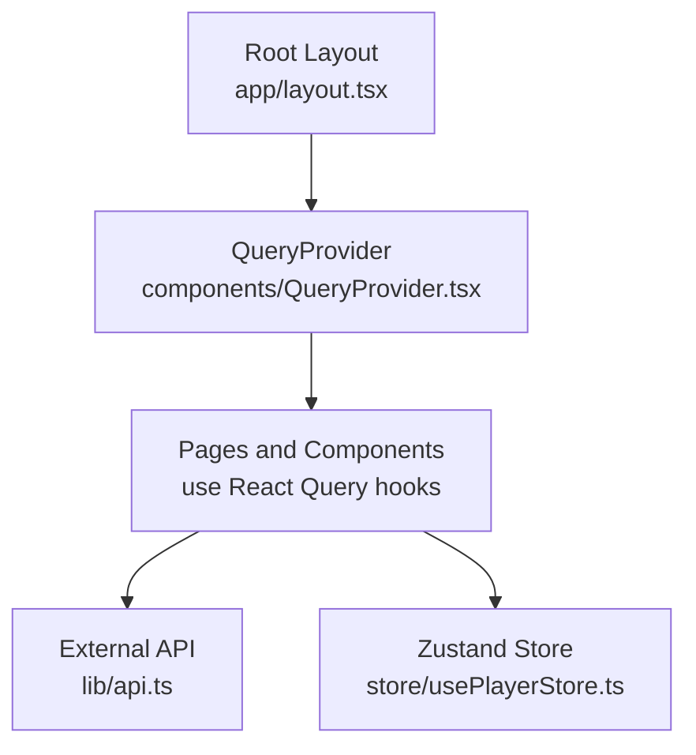
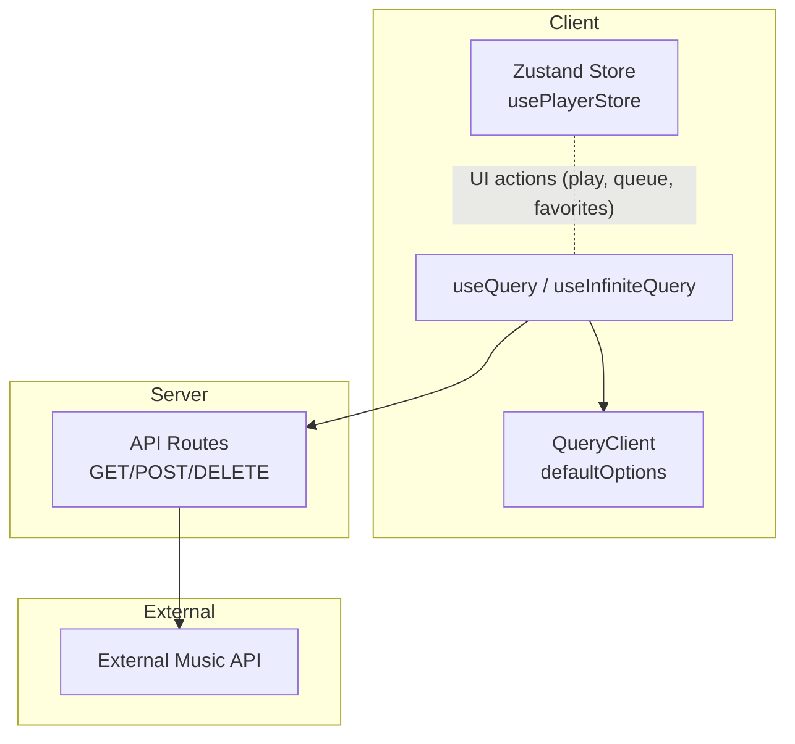
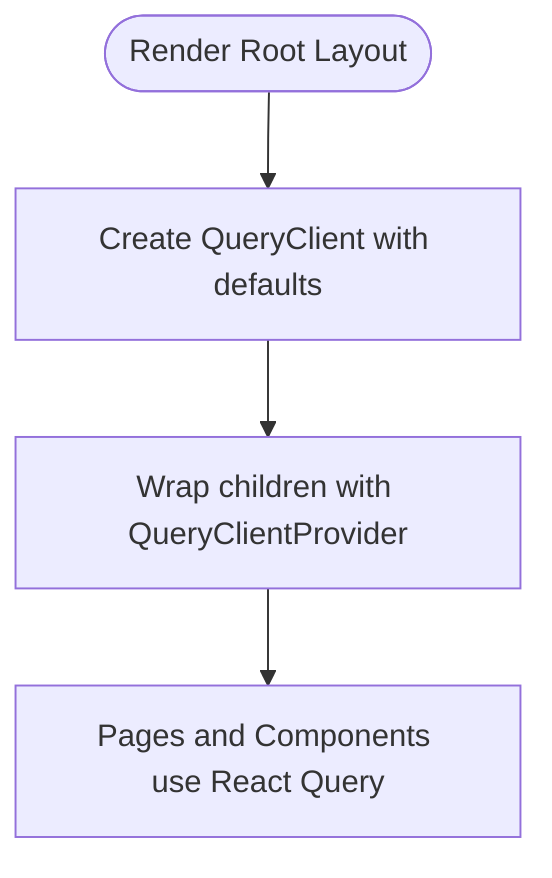
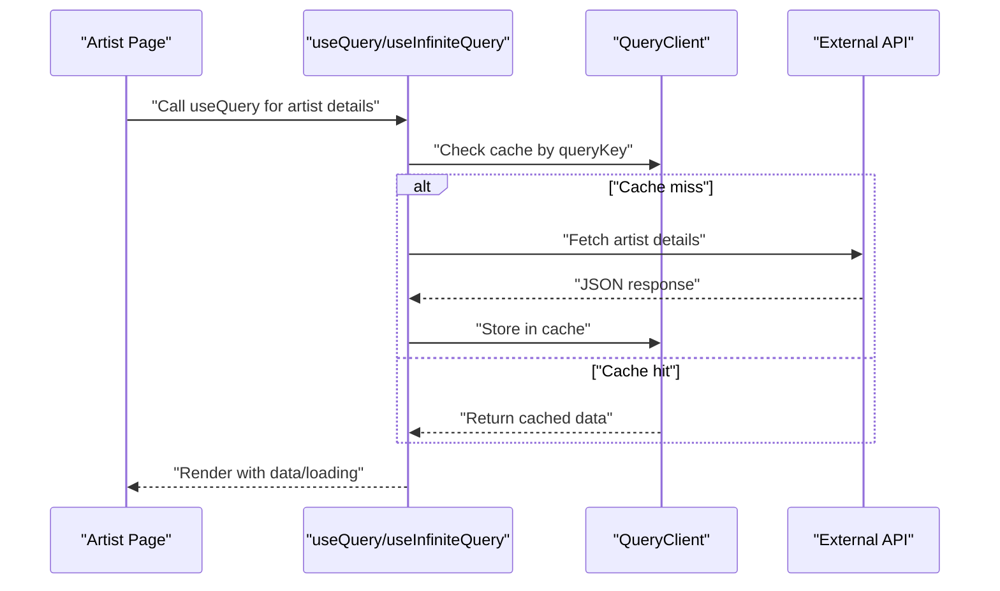
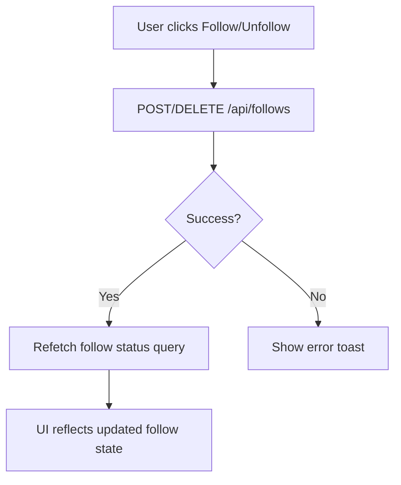
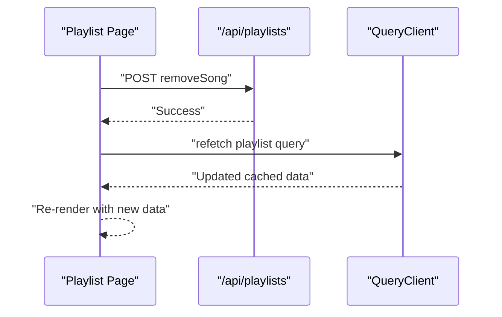
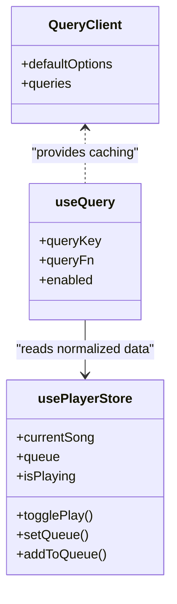
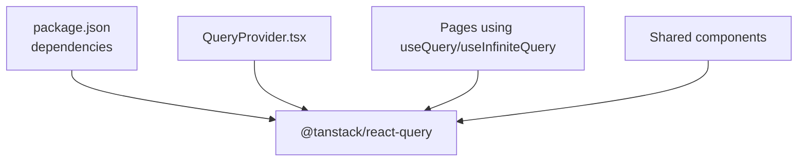

# React Query Integration

<cite>
**Referenced Files in This Document**
- [QueryProvider.tsx](file://components/QueryProvider.tsx)
- [layout.tsx](file://app/layout.tsx)
- [api.ts](file://lib/api.ts)
- [InfiniteSearchSection.tsx](file://components/InfiniteSearchSection.tsx)
- [InfiniteArtistSection.tsx](file://components/InfiniteArtistSection.tsx)
- [album [id]/page.tsx](file://app/album/[id]/page.tsx)
- [artist [id]/page.tsx](file://app/artist/[id]/page.tsx)
- [library/playlists/[id]/page.tsx](file://app/library/playlists/[id]/page.tsx)
- [usePlayerStore.ts](file://store/usePlayerStore.ts)
- [follows/route.ts](file://app/api/follows/route.ts)
- [package.json](file://package.json)
</cite>

## Table of Contents
1. [Introduction](#introduction)
2. [Project Structure](#project-structure)
3. [Core Components](#core-components)
4. [Architecture Overview](#architecture-overview)
5. [Detailed Component Analysis](#detailed-component-analysis)
6. [Dependency Analysis](#dependency-analysis)
7. [Performance Considerations](#performance-considerations)
8. [Troubleshooting Guide](#troubleshooting-guide)
9. [Conclusion](#conclusion)

## Introduction
This document explains how React Query is integrated into SonicStream’s state management architecture. It covers QueryClient configuration, provider setup in the root layout, caching strategies, data fetching patterns, automatic refetching, background updates, cache invalidation, and the integration between server state (React Query) and client state (Zustand). It also includes examples of query hooks usage, mutation handling, error boundaries, loading state management, performance optimization techniques, query prefetching, and server-side rendering considerations for state synchronization.

## Project Structure
React Query is initialized at the application root via a dedicated provider component and consumed across multiple pages and shared components. The provider is placed in the root layout so that all pages benefit from a single QueryClient instance with shared defaults.

**Diagram sources**
- [layout.tsx:78-101](file://app/layout.tsx#L78-L101)
- [QueryProvider.tsx:6-25](file://components/QueryProvider.tsx#L6-L25)

**Section sources**
- [layout.tsx:78-101](file://app/layout.tsx#L78-L101)
- [QueryProvider.tsx:6-25](file://components/QueryProvider.tsx#L6-L25)

## Core Components
- QueryClient configuration and provider:
  - A single QueryClient is created with default options for queries, including a short stale time, disabled window focus refetch, and limited retries.
  - The provider wraps the entire application in the root layout.

- API utilities:
  - A typed Song interface and a fetcher helper are provided.
  - An api object defines endpoint builders for search, songs, albums, artists, and playlists.
  - Utility functions normalize external data inconsistencies and format durations/images.

- Infinite scrolling components:
  - InfiniteSearchSection and InfiniteArtistSection implement infinite pagination using React Query’s useInfiniteQuery, extracting results consistently across varying response shapes.

- Player store (Zustand):
  - A persistent Zustand store manages playback state, queue, favorites, and user preferences. It integrates with React Query-managed server state for seamless UI updates.

**Section sources**
- [QueryProvider.tsx:6-25](file://components/QueryProvider.tsx#L6-L25)
- [layout.tsx:78-101](file://app/layout.tsx#L78-L101)
- [api.ts:1-153](file://lib/api.ts#L1-L153)
- [InfiniteSearchSection.tsx:23-44](file://components/InfiniteSearchSection.tsx#L23-L44)
- [InfiniteArtistSection.tsx:50-70](file://components/InfiniteArtistSection.tsx#L50-L70)
- [usePlayerStore.ts:43-127](file://store/usePlayerStore.ts#L43-L127)

## Architecture Overview
The integration centers on a single QueryClient instance shared across the app. Pages and components use React Query hooks to fetch and cache data. The Zustand store maintains client-side state (player controls, queue, favorites). Mutations update server state via API routes, after which React Query caches are invalidated or refetched to keep the UI synchronized.

**Diagram sources**
- [QueryProvider.tsx:6-25](file://components/QueryProvider.tsx#L6-L25)
- [artist [id]/page.tsx:28-43](file://app/artist/[id]/page.tsx#L28-L43)
- [library/playlists/[id]/page.tsx:21-31](file://app/library/playlists/[id]/page.tsx#L21-L31)
- [usePlayerStore.ts:43-127](file://store/usePlayerStore.ts#L43-L127)

## Detailed Component Analysis

### QueryClient Configuration and Provider Setup
- Provider placement:
  - The QueryProvider is rendered inside the root layout, ensuring all pages inherit the same QueryClient instance.
- Default query options:
  - Stale time is configured to balance freshness and performance.
  - Window focus refetch is disabled to avoid unnecessary network activity.
  - Retry is set to a small positive number to handle transient failures.

**Diagram sources**
- [layout.tsx:78-101](file://app/layout.tsx#L78-L101)
- [QueryProvider.tsx:6-25](file://components/QueryProvider.tsx#L6-L25)

**Section sources**
- [layout.tsx:78-101](file://app/layout.tsx#L78-L101)
- [QueryProvider.tsx:6-25](file://components/QueryProvider.tsx#L6-L25)

### Caching Strategies and Data Fetching Patterns
- Album details page:
  - Uses useQuery with a query key scoped to the album ID and fetches from the external API via a helper.
  - Loading states are handled with skeleton loaders while data is being fetched.
- Artist page:
  - Uses multiple queries: artist details, follow status, and fallback suggestions.
  - Follow status uses a separate query with a key that includes the current user ID to ensure per-user state isolation.
  - Fallback suggestions are loaded when the artist is not found.
- Infinite pagination:
  - InfiniteSearchSection and InfiniteArtistSection use useInfiniteQuery with a page size and a getNextPageParam function derived from the length of results.
  - Results are normalized and deduplicated to ensure consistent UI rendering.

**Diagram sources**
- [artist [id]/page.tsx:28-43](file://app/artist/[id]/page.tsx#L28-L43)
- [InfiniteSearchSection.tsx:31-44](file://components/InfiniteSearchSection.tsx#L31-L44)
- [InfiniteArtistSection.tsx:56-70](file://components/InfiniteArtistSection.tsx#L56-L70)

**Section sources**
- [album [id]/page.tsx:19-27](file://app/album/[id]/page.tsx#L19-L27)
- [artist [id]/page.tsx:28-43](file://app/artist/[id]/page.tsx#L28-L43)
- [artist [id]/page.tsx:81-90](file://app/artist/[id]/page.tsx#L81-L90)
- [InfiniteSearchSection.tsx:23-44](file://components/InfiniteSearchSection.tsx#L23-L44)
- [InfiniteArtistSection.tsx:50-70](file://components/InfiniteArtistSection.tsx#L50-L70)

### Automatic Refetching and Background Updates
- Disabled window focus refetch:
  - The default option disables refetching when the window regains focus, reducing network churn.
- Manual refetch:
  - Follow toggles on the artist page call refetch on the follow status query after mutations to refresh the UI immediately.
- Infinite queries:
  - Infinite pagination relies on user-triggered fetchNextPage; there is no automatic background refetching.

**Diagram sources**
- [artist [id]/page.tsx:47-72](file://app/artist/[id]/page.tsx#L47-L72)
- [follows/route.ts:5-15](file://app/api/follows/route.ts#L5-L15)
- [follows/route.ts:18-36](file://app/api/follows/route.ts#L18-L36)
- [follows/route.ts:39-54](file://app/api/follows/route.ts#L39-L54)

**Section sources**
- [QueryProvider.tsx:10-16](file://components/QueryProvider.tsx#L10-L16)
- [artist [id]/page.tsx:47-72](file://app/artist/[id]/page.tsx#L47-L72)
- [follows/route.ts:5-15](file://app/api/follows/route.ts#L5-L15)
- [follows/route.ts:18-36](file://app/api/follows/route.ts#L18-L36)
- [follows/route.ts:39-54](file://app/api/follows/route.ts#L39-L54)

### Cache Invalidation and Synchronization
- Playlist removal:
  - Removing a song triggers a POST to the playlists API route. After a successful response, the parent component calls refetch on the playlist query to synchronize UI with server state.
- Follow toggling:
  - After a successful follow/unfollow mutation, the follow status query is refetched to reflect the change immediately.
- Stale-time caching:
  - With a short stale time, data remains fresh without constant refetches, balancing performance and correctness.

**Diagram sources**
- [library/playlists/[id]/page.tsx:53-67](file://app/library/playlists/[id]/page.tsx#L53-L67)
- [library/playlists/[id]/page.tsx:63](file://app/library/playlists/[id]/page.tsx#L63)

**Section sources**
- [library/playlists/[id]/page.tsx:53-67](file://app/library/playlists/[id]/page.tsx#L53-L67)

### Integration Between Server State (React Query) and Client State (Zustand)
- Playback and queue:
  - The player store manages current song, queue, and playback controls. UI actions (play, queue, favorites) update Zustand state directly.
- Data normalization:
  - External API responses are normalized before being stored in React Query caches or passed to UI components, ensuring consistent shapes for rendering.
- Optimistic updates:
  - While there is no explicit optimistic update pattern shown, the combination of Zustand for immediate UI feedback and React Query for server synchronization provides a robust UX. For example, adding to queue updates Zustand immediately, while server-backed operations (like follow/remove song) rely on refetches to reconcile server state.

**Diagram sources**
- [QueryProvider.tsx:6-25](file://components/QueryProvider.tsx#L6-L25)
- [artist [id]/page.tsx:74-L75](file://app/artist/[id]/page.tsx#L74-L75)
- [usePlayerStore.ts:43-127](file://store/usePlayerStore.ts#L43-L127)

**Section sources**
- [usePlayerStore.ts:43-127](file://store/usePlayerStore.ts#L43-L127)
- [api.ts:92-152](file://lib/api.ts#L92-L152)

### Examples of Query Hooks Usage and Error Boundaries
- Basic query usage:
  - Album page demonstrates a simple useQuery with a query key and fetcher function, plus an enabled guard to prevent premature requests.
- Infinite queries:
  - InfiniteSearchSection and InfiniteArtistSection demonstrate useInfiniteQuery with page param handling, result extraction, and deduplication.
- Error handling:
  - Pages check for loading states and render skeletons. On not-found conditions, fallback suggestions are fetched and rendered.
- Loading state management:
  - Components use isLoading, isFetching, and isFetchingNextPage flags to provide granular loading feedback.

**Section sources**
- [album [id]/page.tsx:19-27](file://app/album/[id]/page.tsx#L19-L27)
- [InfiniteSearchSection.tsx:23-44](file://components/InfiniteSearchSection.tsx#L23-L44)
- [InfiniteArtistSection.tsx:50-70](file://components/InfiniteArtistSection.tsx#L50-L70)
- [artist [id]/page.tsx:92-L93](file://app/artist/[id]/page.tsx#L92-L93)

### Mutation Handling and Conflict Resolution
- Follow/unfollow:
  - Uses a dedicated API route with GET/POST/DELETE methods. After mutation, the follow status query is refetched to resolve conflicts with concurrent updates.
- Playlist song removal:
  - A POST to the playlists route removes a song and triggers a refetch of the playlist to ensure UI consistency.

**Section sources**
- [artist [id]/page.tsx:47-72](file://app/artist/[id]/page.tsx#L47-L72)
- [library/playlists/[id]/page.tsx:53-67](file://app/library/playlists/[id]/page.tsx#L53-L67)
- [follows/route.ts:5-15](file://app/api/follows/route.ts#L5-L15)
- [follows/route.ts:18-36](file://app/api/follows/route.ts#L18-L36)
- [follows/route.ts:39-54](file://app/api/follows/route.ts#L39-L54)

## Dependency Analysis
React Query is a core dependency managed by the project’s package configuration. The provider and hooks are used across pages and shared components.

**Diagram sources**
- [package.json:12-33](file://package.json#L12-L33)
- [QueryProvider.tsx:3](file://components/QueryProvider.tsx#L3)
- [album [id]/page.tsx:5](file://app/album/[id]/page.tsx#L5)
- [InfiniteSearchSection.tsx:4](file://components/InfiniteSearchSection.tsx#L4)

**Section sources**
- [package.json:12-33](file://package.json#L12-L33)
- [QueryProvider.tsx:3](file://components/QueryProvider.tsx#L3)
- [album [id]/page.tsx:5](file://app/album/[id]/page.tsx#L5)
- [InfiniteSearchSection.tsx:4](file://components/InfiniteSearchSection.tsx#L4)

## Performance Considerations
- Stale time:
  - A short stale time balances freshness and reduces redundant network requests.
- Retry policy:
  - Limited retries help recover from transient failures without indefinite polling.
- Infinite pagination:
  - Using page params and checking result lengths prevents unnecessary fetches and avoids loading empty pages.
- Deduplication:
  - Unique result filtering ensures consistent UI rendering and avoids repeated items.
- Normalization:
  - Normalizing external data reduces downstream complexity and improves cache hit rates by stabilizing shapes.

[No sources needed since this section provides general guidance]

## Troubleshooting Guide
- Queries not triggering:
  - Ensure query keys are unique and stable. Verify enabled guards are satisfied.
- Infinite queries stuck:
  - Confirm getNextPageParam logic aligns with actual response shape and that results arrays are properly checked for emptiness.
- Cache not updating after mutation:
  - Call refetch on affected queries or invalidate cache entries to synchronize UI with server state.
- Follow status not reflecting:
  - After POST/DELETE to the follows route, refetch the follow status query to update the UI.

**Section sources**
- [artist [id]/page.tsx:35-L43](file://app/artist/[id]/page.tsx#L35-L43)
- [library/playlists/[id]/page.tsx:63](file://app/library/playlists/[id]/page.tsx#L63)
- [follows/route.ts:5-15](file://app/api/follows/route.ts#L5-L15)
- [follows/route.ts:18-36](file://app/api/follows/route.ts#L18-L36)
- [follows/route.ts:39-54](file://app/api/follows/route.ts#L39-L54)

## Conclusion
SonicStream integrates React Query centrally via a root provider with conservative defaults that optimize for responsiveness and reliability. Pages and components leverage both basic and infinite queries to fetch and paginate data, while Zustand manages client-side playback and user preferences. Mutations update server state and are followed by targeted refetches to maintain synchronization. The combination of caching strategies, normalization, and careful refetching provides a smooth, consistent user experience across the application.