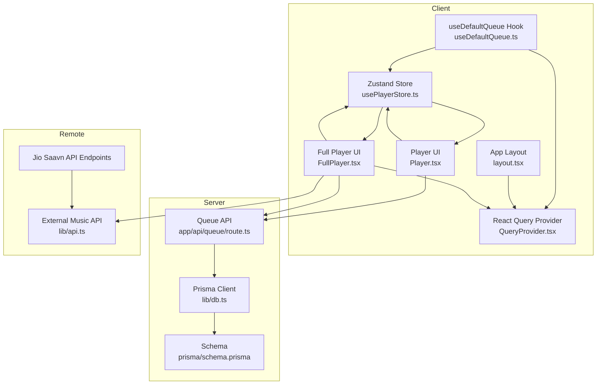
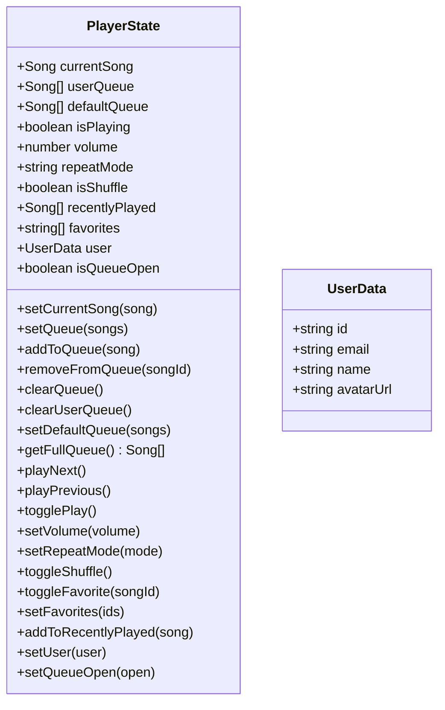
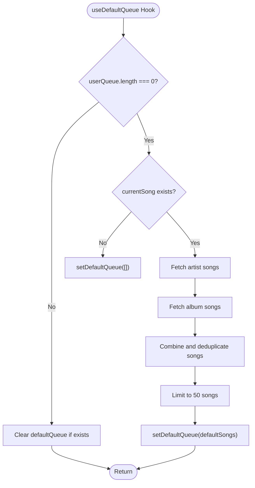
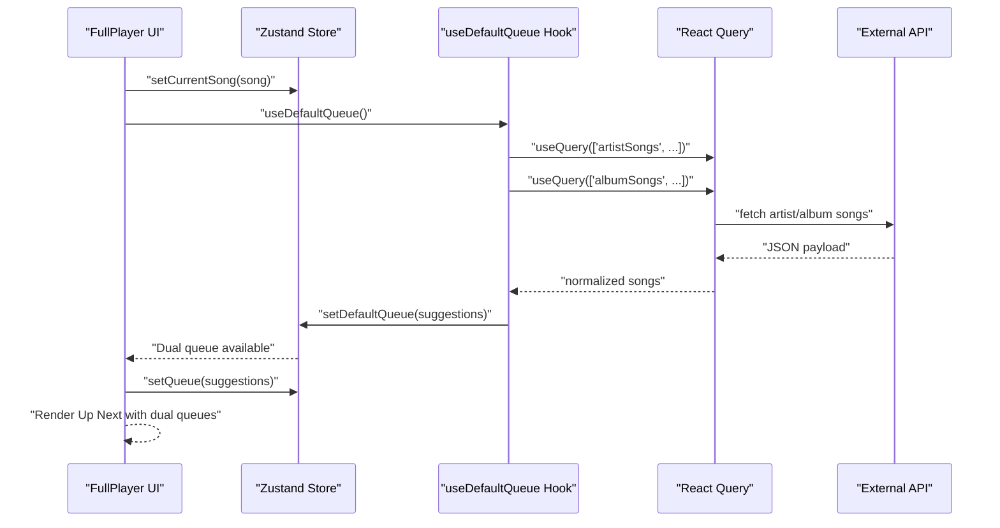
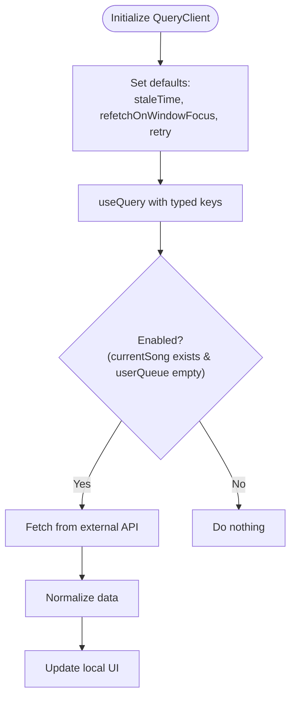
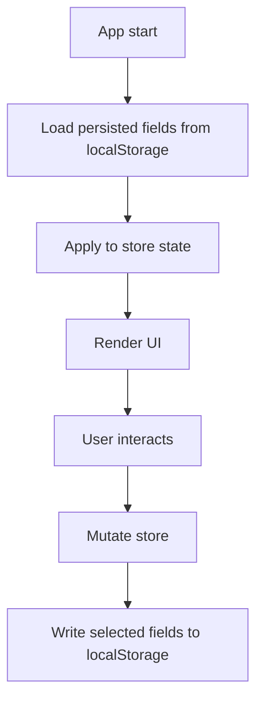
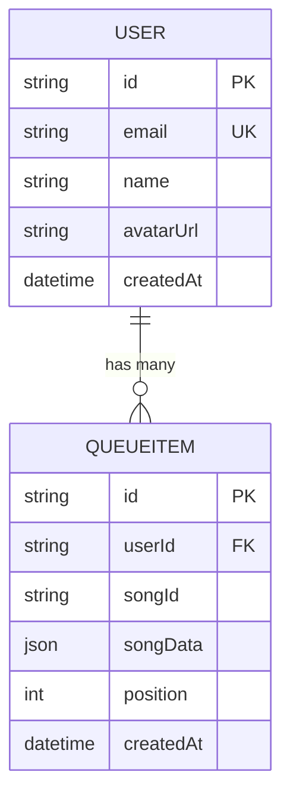
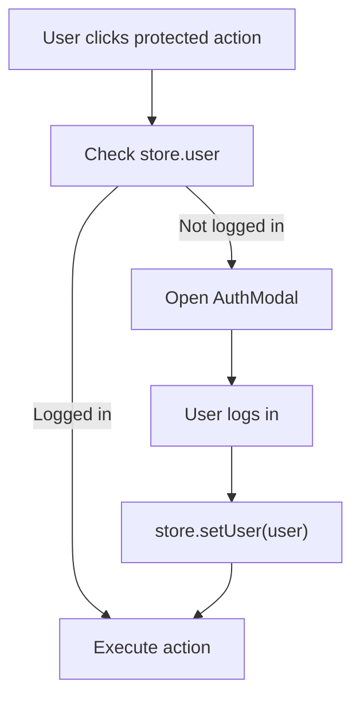
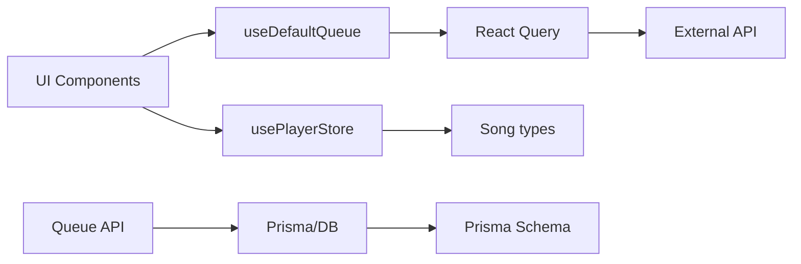

# State Management

<cite>
**Referenced Files in This Document**
- [usePlayerStore.ts](file://store/usePlayerStore.ts)
- [useDefaultQueue.ts](file://hooks/useDefaultQueue.ts)
- [Player.tsx](file://components/Player.tsx)
- [FullPlayer.tsx](file://components/FullPlayer.tsx)
- [QueryProvider.tsx](file://components/QueryProvider.tsx)
- [layout.tsx](file://app/layout.tsx)
- [api.ts](file://lib/api.ts)
- [db.ts](file://lib/db.ts)
- [schema.prisma](file://prisma/schema.prisma)
- [route.ts](file://app/api/queue/route.ts)
- [useAuthGuard.ts](file://hooks/useAuthGuard.ts)
- [AuthModal.tsx](file://components/AuthModal.tsx)
</cite>

## Update Summary
**Changes Made**
- Enhanced player store with dual-queue state management (userQueue and defaultQueue)
- Added new useDefaultQueue hook for automatic queue generation
- Updated queue management logic to support priority-based queue system
- Modified playNext and playPrevious actions to handle dual-queue navigation
- Updated UI components to consume both queue slices

## Table of Contents
1. [Introduction](#introduction)
2. [Project Structure](#project-structure)
3. [Core Components](#core-components)
4. [Architecture Overview](#architecture-overview)
5. [Detailed Component Analysis](#detailed-component-analysis)
6. [Dependency Analysis](#dependency-analysis)
7. [Performance Considerations](#performance-considerations)
8. [Troubleshooting Guide](#troubleshooting-guide)
9. [Conclusion](#conclusion)
10. [Appendices](#appendices)

## Introduction
This document explains SonicStream's state management architecture with a focus on the enhanced Zustand-based player store featuring dual-queue state management, the new useDefaultQueue hook for automatic queue generation, React Query integration for server state, and patterns for persistence, synchronization, and extension. It covers:
- Zustand store shape with dual-queue architecture, actions, reducers, and persistence
- Global state patterns and store composition
- Integration with React components and automatic queue generation
- Synchronization between local store and database
- Optimistic updates and conflict resolution
- State migration, debugging, and performance optimization
- React Query cache invalidation and data synchronization
- Persistence across sessions, hydration, and cleanup

## Project Structure
The state management spans three layers with enhanced dual-queue capabilities:
- Local client state: Zustand store for playback controls, dual queues (userQueue and defaultQueue), favorites, and user session
- Server state: Prisma-managed database and REST endpoints for persistent queues and user preferences
- Remote data: React Query for fetching artist/album suggestions and other server-backed data



**Diagram sources**
- [usePlayerStore.ts:1-157](file://store/usePlayerStore.ts#L1-L157)
- [useDefaultQueue.ts:1-85](file://hooks/useDefaultQueue.ts#L1-L85)
- [Player.tsx:1-200](file://components/Player.tsx#L1-L200)
- [FullPlayer.tsx:1-200](file://components/FullPlayer.tsx#L1-L200)
- [QueryProvider.tsx:1-26](file://components/QueryProvider.tsx#L1-L26)
- [layout.tsx:1-49](file://app/layout.tsx#L1-L49)
- [route.ts:1-85](file://app/api/queue/route.ts#L1-L85)
- [db.ts:1-10](file://lib/db.ts#L1-L10)
- [schema.prisma:1-111](file://prisma/schema.prisma#L1-L111)
- [api.ts:1-153](file://lib/api.ts#L1-L153)

**Section sources**
- [usePlayerStore.ts:1-157](file://store/usePlayerStore.ts#L1-L157)
- [useDefaultQueue.ts:1-85](file://hooks/useDefaultQueue.ts#L1-L85)
- [QueryProvider.tsx:1-26](file://components/QueryProvider.tsx#L1-L26)
- [layout.tsx:1-49](file://app/layout.tsx#L1-L49)
- [route.ts:1-85](file://app/api/queue/route.ts#L1-L85)
- [schema.prisma:1-111](file://prisma/schema.prisma#L1-L111)
- [api.ts:1-153](file://lib/api.ts#L1-L153)

## Core Components
- Zustand store (usePlayerStore.ts): Enhanced centralized client-side state for playback, dual queues (userQueue and defaultQueue), favorites, recent history, user, and UI flags. Persisted to localStorage via Zustand middleware.
- useDefaultQueue hook (useDefaultQueue.ts): Automatic queue generation system that fetches artist and album suggestions to populate the defaultQueue when userQueue is empty.
- Player UI (Player.tsx): Consumes the store to drive audio playback, controls, dual queue panel, and keyboard shortcuts with automatic queue generation.
- Full Player UI (FullPlayer.tsx): Rich playback screen with remote suggestions fetched via React Query and dual queue management.
- React Query Provider (QueryProvider.tsx): Configures caching and refetch policies for server-backed data.
- Queue API (app/api/queue/route.ts): CRUD endpoints for persistent queue items per user.
- Prisma Schema (prisma/schema.prisma): Defines QueueItem and related relations.
- External API (lib/api.ts): Normalization and helpers for remote music data including Jio Saavn API integration.

**Section sources**
- [usePlayerStore.ts:1-157](file://store/usePlayerStore.ts#L1-L157)
- [useDefaultQueue.ts:1-85](file://hooks/useDefaultQueue.ts#L1-L85)
- [Player.tsx:1-200](file://components/Player.tsx#L1-L200)
- [FullPlayer.tsx:1-200](file://components/FullPlayer.tsx#L1-L200)
- [QueryProvider.tsx:1-26](file://components/QueryProvider.tsx#L1-L26)
- [route.ts:1-85](file://app/api/queue/route.ts#L1-L85)
- [schema.prisma:1-111](file://prisma/schema.prisma#L1-L111)
- [api.ts:1-153](file://lib/api.ts#L1-L153)

## Architecture Overview
The system combines immediate local state with dual-queue management and server-backed persistence:

```mermaid
sequenceDiagram
participant UI as "Player UI"
participant Store as "Zustand Store"
participant Hook as "useDefaultQueue Hook"
participant API as "Queue API"
participant DB as "Prisma/DB"
UI->>Store : "User adds song to queue"
Store->>Store : "addToQueue reducer updates userQueue"
Store-->>UI : "Re-render with updated queue"
UI->>Hook : "useDefaultQueue() hook"
Hook->>Hook : "Fetch artist/album suggestions"
Hook->>Store : "setDefaultQueue(suggestions)"
Store-->>UI : "Dual queue system active"
UI->>API : "POST /api/queue { action : 'add', userId, songId, songData }"
API->>DB : "Insert QueueItem"
DB-->>API : "Success"
API-->>UI : "Success response"
Note over Store,DB : "User queue has priority; default queue auto-generates when empty"
```

**Diagram sources**
- [Player.tsx:28-29](file://components/Player.tsx#L28-L29)
- [usePlayerStore.ts:68-84](file://store/usePlayerStore.ts#L68-L84)
- [useDefaultQueue.ts:41-83](file://hooks/useDefaultQueue.ts#L41-L83)
- [route.ts:24-66](file://app/api/queue/route.ts#L24-L66)

## Detailed Component Analysis

### Enhanced Zustand Store: Dual-Queue Player State
- State slices: currentSong, userQueue (priority queue), defaultQueue (auto-generated), isPlaying, volume, repeatMode, isShuffle, recentlyPlayed, favorites, user, isQueueOpen.
- Actions:
  - Playback: setCurrentSong, togglePlay, setVolume, setRepeatMode, toggleShuffle
  - Queue Management: setQueue, addToQueue, removeFromQueue, clearQueue, clearUserQueue, setDefaultQueue, getFullQueue
  - Navigation: playNext, playPrevious
  - Engagement: toggleFavorite, setFavorites, addToRecentlyPlayed
  - Session: setUser, setQueueOpen
- Reducers: Pure setters and computed transitions with dual-queue awareness (e.g., playNext respects both queues and shuffle/repeat modes).
- Persistence: Zustand persist middleware stores selected fields (volume, favorites, recentlyPlayed, user) under a single storage key.



**Diagram sources**
- [usePlayerStore.ts:12-45](file://store/usePlayerStore.ts#L12-L45)

**Section sources**
- [usePlayerStore.ts:12-45](file://store/usePlayerStore.ts#L12-L45)
- [usePlayerStore.ts:47-157](file://store/usePlayerStore.ts#L47-L157)

### useDefaultQueue Hook: Automatic Queue Generation
- Purpose: Automatically generates defaultQueue content when userQueue is empty and currentSong changes.
- Data Sources: Fetches artist songs and album songs from external API endpoints.
- Priority Logic: Clears defaultQueue when user adds songs, prioritizing userQueue over defaultQueue.
- Deduplication: Prevents duplicate songs by tracking IDs and excluding current song.
- Limits: Caps defaultQueue at 50 songs to prevent performance issues.



**Diagram sources**
- [useDefaultQueue.ts:10-83](file://hooks/useDefaultQueue.ts#L10-L83)

**Section sources**
- [useDefaultQueue.ts:1-85](file://hooks/useDefaultQueue.ts#L1-L85)

### UI Integration: Player and Full Player with Dual-Queue Support
- Player.tsx:
  - Subscribes to both userQueue and defaultQueue for comprehensive queue management.
  - Initializes useDefaultQueue hook for automatic queue generation.
  - Uses audio element lifecycle to sync isPlaying and volume.
  - Integrates with AuthGuard to gate actions requiring login.
- FullPlayer.tsx:
  - Uses React Query to fetch song suggestions and normalizes them.
  - Provides "Up Next" carousel with dual queue awareness.
  - Shares the same store bindings for playback actions including dual queue management.



**Diagram sources**
- [FullPlayer.tsx:179-186](file://components/FullPlayer.tsx#L179-L186)
- [useDefaultQueue.ts:14-39](file://hooks/useDefaultQueue.ts#L14-L39)
- [usePlayerStore.ts:32-44](file://store/usePlayerStore.ts#L32-L44)

**Section sources**
- [Player.tsx:28-29](file://components/Player.tsx#L28-L29)
- [Player.tsx:21-26](file://components/Player.tsx#L21-L26)
- [FullPlayer.tsx:38-44](file://components/FullPlayer.tsx#L38-L44)

### React Query Integration and Cache Strategy
- QueryClient configured with a short staleTime and minimal refetchOnWindowFocus to reduce network churn.
- useDefaultQueue hook uses typed queryKeys for artistSongs and albumSongs with 5-minute staleTime.
- FullPlayer uses a typed queryKey for suggestions and enables the query only when a song is present.
- No explicit cache invalidation is implemented in the UI; optimistic updates are handled locally.



**Diagram sources**
- [QueryProvider.tsx:6-18](file://components/QueryProvider.tsx#L6-L18)
- [useDefaultQueue.ts:14-39](file://hooks/useDefaultQueue.ts#L14-L39)

**Section sources**
- [QueryProvider.tsx:1-26](file://components/QueryProvider.tsx#L1-L26)
- [useDefaultQueue.ts:14-39](file://hooks/useDefaultQueue.ts#L14-L39)

### State Persistence and Hydration
- Local persistence: Zustand persist stores volume, favorites, recentlyPlayed, and user to localStorage.
- Hydration: On app load, persisted fields are restored into the store.
- Cleanup: The partialize function limits stored fields to minimize footprint and avoid sensitive data.



**Diagram sources**
- [usePlayerStore.ts:146-155](file://store/usePlayerStore.ts#L146-L155)

**Section sources**
- [usePlayerStore.ts:146-155](file://store/usePlayerStore.ts#L146-L155)

### Server State: Queue Persistence
- Endpoint GET /api/queue?userId retrieves ordered queue items for a user.
- Endpoint POST /api/queue supports adding or clearing the queue.
- Endpoint DELETE removes individual items by id or by userId+songId combination.
- Prisma model QueueItem stores JSON songData and position, enabling server-side ordering.



**Diagram sources**
- [schema.prisma:73-84](file://prisma/schema.prisma#L73-L84)
- [route.ts:4-22](file://app/api/queue/route.ts#L4-L22)
- [route.ts:24-66](file://app/api/queue/route.ts#L24-L66)
- [route.ts:68-85](file://app/api/queue/route.ts#L68-L85)

**Section sources**
- [route.ts:1-85](file://app/api/queue/route.ts#L1-L85)
- [schema.prisma:73-84](file://prisma/schema.prisma#L73-L84)

### State Synchronization Between Local Store and Database
- Local-first model: UI updates are immediate and optimistic.
- Server persistence: Queue mutations are sent to the backend; successful responses confirm persistence.
- Conflict resolution: If the server order differs from the client, the UI remains responsive and can reconcile on next load or explicit refresh.
- Favoriting and user data: Persisted fields (favorites, user) are restored on hydration; server-side likes are not reflected until queried.
- Dual-queue synchronization: UserQueue is prioritized and cleared when user adds songs, while defaultQueue is managed automatically.

```mermaid
sequenceDiagram
participant UI as "Player UI"
participant Store as "Zustand Store"
participant Hook as "useDefaultQueue Hook"
participant API as "Queue API"
participant DB as "Prisma/DB"
UI->>Store : "addToQueue(song)"
Store-->>UI : "userQueue updated immediately"
UI->>Hook : "useDefaultQueue()"
Hook->>Store : "setDefaultQueue(suggestions)"
Store-->>UI : "Both queues active"
UI->>API : "POST /api/queue { action : 'add' }"
API->>DB : "INSERT QueueItem"
DB-->>API : "OK"
API-->>UI : "OK"
Note over UI,Store : "User queue has priority; server eventual consistency"
```

**Diagram sources**
- [Player.tsx:28-29](file://components/Player.tsx#L28-L29)
- [usePlayerStore.ts:68-84](file://store/usePlayerStore.ts#L68-L84)
- [useDefaultQueue.ts:41-83](file://hooks/useDefaultQueue.ts#L41-L83)
- [route.ts:24-66](file://app/api/queue/route.ts#L24-L66)

**Section sources**
- [Player.tsx:28-29](file://components/Player.tsx#L28-L29)
- [usePlayerStore.ts:68-84](file://store/usePlayerStore.ts#L68-L84)
- [useDefaultQueue.ts:41-83](file://hooks/useDefaultQueue.ts#L41-L83)
- [route.ts:24-66](file://app/api/queue/route.ts#L24-L66)

### Authentication and Authorization Hooks
- useAuthGuard wraps actions that require a logged-in user, opening an AuthModal otherwise.
- AuthModal updates the store's user field upon successful login, enabling protected actions.



**Diagram sources**
- [useAuthGuard.ts:12-28](file://hooks/useAuthGuard.ts#L12-L28)
- [AuthModal.tsx:14-24](file://components/AuthModal.tsx#L14-L24)
- [usePlayerStore.ts:144](file://store/usePlayerStore.ts#L144)

**Section sources**
- [useAuthGuard.ts:1-28](file://hooks/useAuthGuard.ts#L1-L28)
- [AuthModal.tsx:1-24](file://components/AuthModal.tsx#L1-L24)
- [usePlayerStore.ts:144](file://store/usePlayerStore.ts#L144)

## Dependency Analysis
- Zustand store depends on:
  - Song type from lib/api.ts
  - Zustand and Zustand persist middleware
- useDefaultQueue hook depends on:
  - usePlayerStore for state/actions
  - React Query for remote data fetching
  - External API endpoints for artist/album suggestions
- UI components depend on:
  - usePlayerStore for state/actions
  - useDefaultQueue hook for automatic queue generation
  - React Query for remote data
  - Auth hooks/modals for protected actions
- Server depends on:
  - Prisma client initialized in lib/db.ts
  - Prisma schema defines QueueItem and relations



**Diagram sources**
- [usePlayerStore.ts:1-3](file://store/usePlayerStore.ts#L1-L3)
- [useDefaultQueue.ts:3-6](file://hooks/useDefaultQueue.ts#L3-L6)
- [Player.tsx:3-5](file://components/Player.tsx#L3-L5)
- [FullPlayer.tsx:12-13](file://components/FullPlayer.tsx#L12-L13)
- [api.ts:1-35](file://lib/api.ts#L1-L35)
- [route.ts:1-2](file://app/api/queue/route.ts#L1-L2)
- [db.ts:1-10](file://lib/db.ts#L1-L10)
- [schema.prisma:1-111](file://prisma/schema.prisma#L1-L111)

**Section sources**
- [usePlayerStore.ts:1-3](file://store/usePlayerStore.ts#L1-L3)
- [useDefaultQueue.ts:3-6](file://hooks/useDefaultQueue.ts#L3-L6)
- [Player.tsx:3-5](file://components/Player.tsx#L3-L5)
- [FullPlayer.tsx:12-13](file://components/FullPlayer.tsx#L12-L13)
- [api.ts:1-35](file://lib/api.ts#L1-L35)
- [route.ts:1-2](file://app/api/queue/route.ts#L1-L2)
- [db.ts:1-10](file://lib/db.ts#L1-L10)
- [schema.prisma:1-111](file://prisma/schema.prisma#L1-L111)

## Performance Considerations
- Prefer granular selectors: Subscribe only to the parts of the store needed by each component to minimize re-renders.
- Keep persisted fields minimal: The current partialize avoids storing large arrays; maintain this pattern.
- Debounce heavy UI updates: For example, seek slider updates should throttle audio seeks.
- Optimize rendering:
  - Use memoization for derived lists (e.g., queue items).
  - Virtualize long lists (e.g., queue) if they grow large.
  - Implement efficient queue merging in getFullQueue for large dual-queues.
- React Query:
  - Increase staleTime for infrequently changing data (currently 5 minutes for default queue).
  - Use enabled guards to avoid unnecessary requests.
  - Consider background refetch strategies for frequently changing data.
- Dual-Queue Optimization:
  - Monitor queue sizes to prevent memory issues.
  - Implement lazy loading for defaultQueue when it grows large.
  - Cache normalized song data to avoid repeated normalization.

## Troubleshooting Guide
- Store not hydrating:
  - Verify the localStorage key matches the configured name and that the partialize fields align with stored keys.
- Queue desync:
  - Confirm the backend responds successfully to add/clear/remove operations; reconcile on next load if needed.
- Default queue not populating:
  - Ensure currentSong has artist/album information and userQueue is empty.
  - Check external API endpoints are accessible and returning data.
- Suggestions not loading:
  - Ensure the queryKey includes the current song ID and that the query is enabled when a song exists.
- Audio not playing:
  - Check autoplay policies and user gesture requirements; ensure isPlaying is toggled after user interaction.
- Auth gating not working:
  - Confirm useAuthGuard is invoked before protected actions and that setUser is called after login.
- Dual-queue conflicts:
  - Verify userQueue takes precedence over defaultQueue as designed.
  - Check that removeFromQueue clears both queues appropriately.

**Section sources**
- [usePlayerStore.ts:146-155](file://store/usePlayerStore.ts#L146-L155)
- [useDefaultQueue.ts:41-83](file://hooks/useDefaultQueue.ts#L41-L83)
- [route.ts:24-66](file://app/api/queue/route.ts#L24-L66)
- [FullPlayer.tsx:179-186](file://components/FullPlayer.tsx#L179-L186)
- [useAuthGuard.ts:16-25](file://hooks/useAuthGuard.ts#L16-L25)

## Conclusion
SonicStream employs a sophisticated state management stack with dual-queue architecture:
- Immediate, reliable UI updates via Zustand with enhanced dual-queue support
- Automatic queue generation via useDefaultQueue hook for seamless user experience
- Optional persistence via localStorage for user preferences and engagement data
- Server-backed persistence for queues and playlists
- React Query for remote data with conservative caching
- Clear separation of concerns and straightforward extension points

## Appendices

### State Migration Strategies
- Versioned storage keys: Rotate the localStorage key name when store shape changes; migrate old data on first boot.
- Partialize updates: When adding new persisted fields, update partialize and provide defaults for missing keys.
- Backend migrations: For schema changes (e.g., QueueItem), run Prisma migrations and adjust endpoints accordingly.
- Dual-queue migration: When upgrading from single-queue to dual-queue, migrate existing queue data to userQueue and implement defaultQueue logic.

**Section sources**
- [usePlayerStore.ts:146-155](file://store/usePlayerStore.ts#L146-L155)
- [schema.prisma:73-84](file://prisma/schema.prisma#L73-L84)
- [usePlayerStore.ts:67-84](file://store/usePlayerStore.ts#L67-L84)

### Debugging Techniques
- Enable Zustand Devtools for time-travel debugging and action inspection.
- Log query keys and responses in React Query devtools.
- Inspect localStorage entries for persisted fields.
- Add console traces around store actions to track state transitions.
- Monitor dual-queue synchronization using console logs in useDefaultQueue hook.
- Debug queue priority by checking which queue (userQueue vs defaultQueue) is being used.

**Section sources**
- [usePlayerStore.ts:47-157](file://store/usePlayerStore.ts#L47-L157)
- [useDefaultQueue.ts:1-85](file://hooks/useDefaultQueue.ts#L1-L85)
- [QueryProvider.tsx:6-18](file://components/QueryProvider.tsx#L6-L18)

### Extending the State Management System
- Adding a new state slice:
  - Define a new Zustand store with a unique selector namespace.
  - Persist only necessary fields via partialize.
  - Consume the slice in components via dedicated hooks.
- Integrating a new server-backed domain:
  - Add Prisma models and relations.
  - Implement REST endpoints and ensure proper error handling.
  - Wire UI to call endpoints and update local store optimistically.
- Enhancing queue systems:
  - Implement priority-based queue logic similar to dual-queue pattern.
  - Add queue merging strategies for complex queue hierarchies.
  - Consider implementing queue persistence alongside userQueue.
- Guidelines:
  - Keep reducers pure and deterministic.
  - Use typed queryKeys for React Query.
  - Avoid storing sensitive data in localStorage.
  - Provide fallbacks and graceful degradation for offline scenarios.
  - Implement proper queue synchronization between local and server states.

**Section sources**
- [usePlayerStore.ts:12-45](file://store/usePlayerStore.ts#L12-L45)
- [useDefaultQueue.ts:1-85](file://hooks/useDefaultQueue.ts#L1-L85)
- [schema.prisma:1-111](file://prisma/schema.prisma#L1-L111)
- [route.ts:1-85](file://app/api/queue/route.ts#L1-L85)