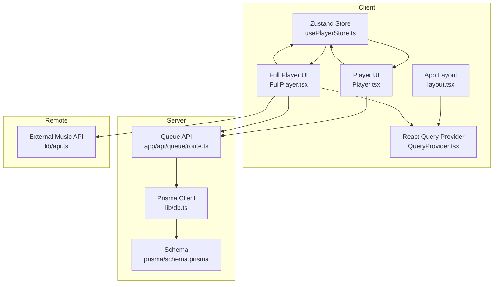
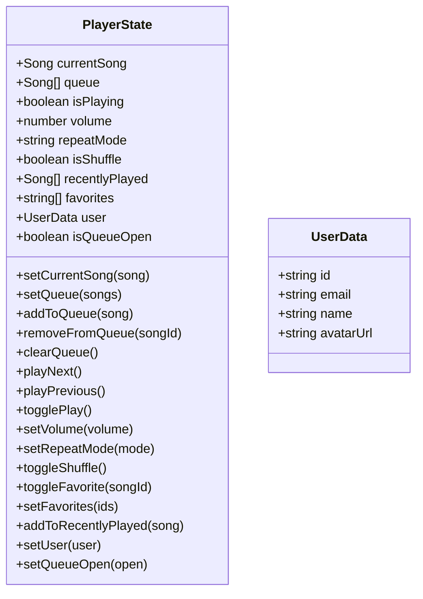
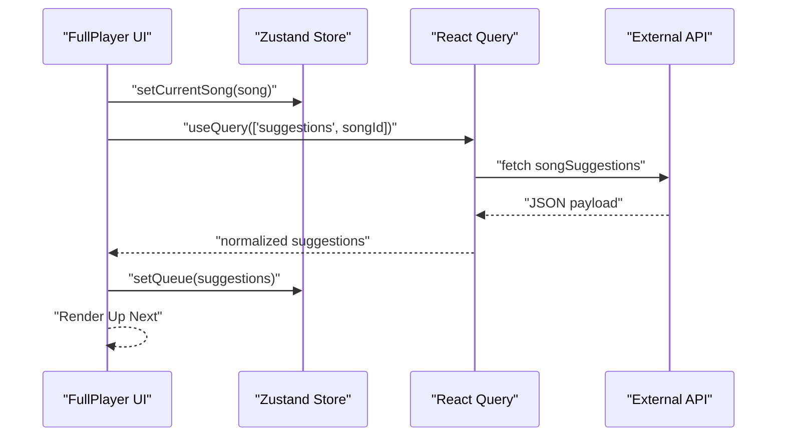
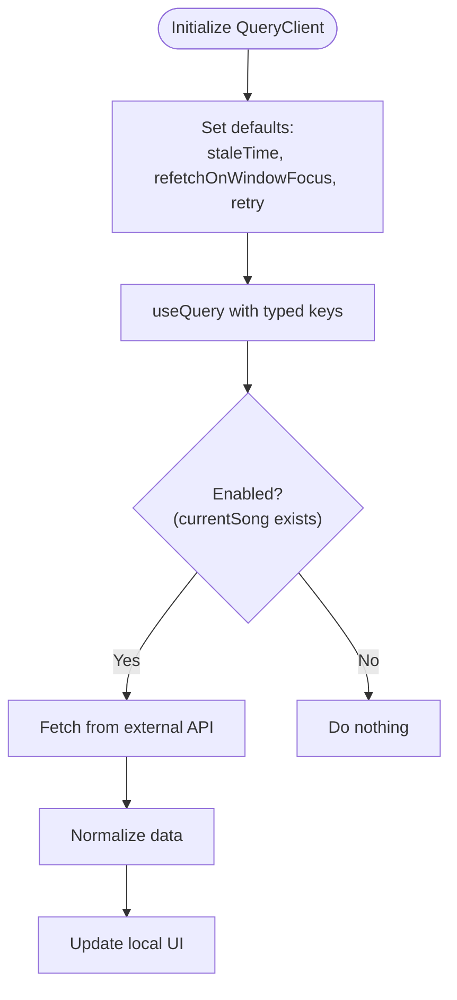
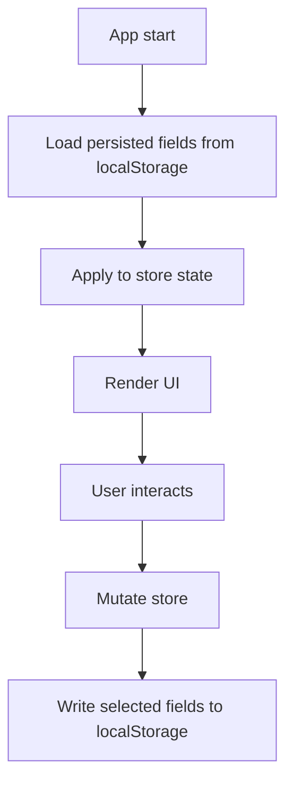
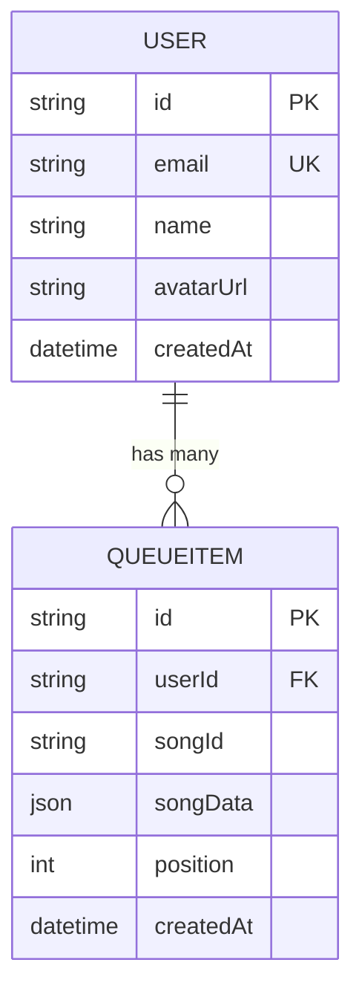
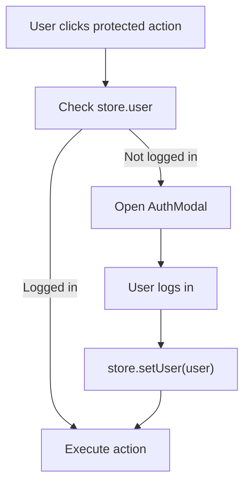
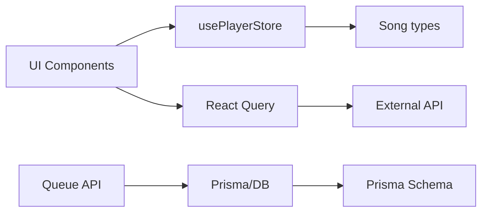

# State Management

<cite>
**Referenced Files in This Document**
- [usePlayerStore.ts](file://store/usePlayerStore.ts)
- [Player.tsx](file://components/Player.tsx)
- [FullPlayer.tsx](file://components/FullPlayer.tsx)
- [QueryProvider.tsx](file://components/QueryProvider.tsx)
- [layout.tsx](file://app/layout.tsx)
- [api.ts](file://lib/api.ts)
- [db.ts](file://lib/db.ts)
- [schema.prisma](file://prisma/schema.prisma)
- [route.ts](file://app/api/queue/route.ts)
- [useAuthGuard.ts](file://hooks/useAuthGuard.ts)
- [AuthModal.tsx](file://components/AuthModal.tsx)
</cite>

## Table of Contents
1. [Introduction](#introduction)
2. [Project Structure](#project-structure)
3. [Core Components](#core-components)
4. [Architecture Overview](#architecture-overview)
5. [Detailed Component Analysis](#detailed-component-analysis)
6. [Dependency Analysis](#dependency-analysis)
7. [Performance Considerations](#performance-considerations)
8. [Troubleshooting Guide](#troubleshooting-guide)
9. [Conclusion](#conclusion)
10. [Appendices](#appendices)

## Introduction
This document explains SonicStream’s state management architecture with a focus on the Zustand-based player store, React Query integration for server state, and patterns for persistence, synchronization, and extension. It covers:
- Zustand store shape, actions, reducers, and persistence
- Global state patterns and store composition
- Integration with React components
- Synchronization between local store and database
- Optimistic updates and conflict resolution
- State migration, debugging, and performance optimization
- React Query cache invalidation and data synchronization
- Persistence across sessions, hydration, and cleanup

## Project Structure
The state management spans three layers:
- Local client state: Zustand store for playback controls, queue, favorites, and user session
- Server state: Prisma-managed database and REST endpoints for persistent queues and user preferences
- Remote data: React Query for fetching suggestions and other server-backed data



**Diagram sources**
- [usePlayerStore.ts:1-128](file://store/usePlayerStore.ts#L1-L128)
- [Player.tsx:1-251](file://components/Player.tsx#L1-L251)
- [FullPlayer.tsx:1-243](file://components/FullPlayer.tsx#L1-L243)
- [QueryProvider.tsx:1-26](file://components/QueryProvider.tsx#L1-L26)
- [layout.tsx:1-49](file://app/layout.tsx#L1-L49)
- [route.ts:1-85](file://app/api/queue/route.ts#L1-L85)
- [db.ts:1-10](file://lib/db.ts#L1-L10)
- [schema.prisma:1-111](file://prisma/schema.prisma#L1-L111)
- [api.ts:1-153](file://lib/api.ts#L1-L153)

**Section sources**
- [usePlayerStore.ts:1-128](file://store/usePlayerStore.ts#L1-L128)
- [QueryProvider.tsx:1-26](file://components/QueryProvider.tsx#L1-L26)
- [layout.tsx:1-49](file://app/layout.tsx#L1-L49)
- [route.ts:1-85](file://app/api/queue/route.ts#L1-L85)
- [schema.prisma:1-111](file://prisma/schema.prisma#L1-L111)
- [api.ts:1-153](file://lib/api.ts#L1-L153)

## Core Components
- Zustand store (usePlayerStore.ts): Centralized client-side state for playback, queue, favorites, recent history, user, and UI flags. Persisted to localStorage via Zustand middleware.
- Player UI (Player.tsx): Consumes the store to drive audio playback, controls, queue panel, and keyboard shortcuts.
- Full Player UI (FullPlayer.tsx): Rich playback screen with remote suggestions fetched via React Query.
- React Query Provider (QueryProvider.tsx): Configures caching and refetch policies for server-backed data.
- Queue API (app/api/queue/route.ts): CRUD endpoints for persistent queue items per user.
- Prisma Schema (prisma/schema.prisma): Defines QueueItem and related relations.
- External API (lib/api.ts): Normalization and helpers for remote music data.

**Section sources**
- [usePlayerStore.ts:1-128](file://store/usePlayerStore.ts#L1-L128)
- [Player.tsx:1-251](file://components/Player.tsx#L1-L251)
- [FullPlayer.tsx:1-243](file://components/FullPlayer.tsx#L1-L243)
- [QueryProvider.tsx:1-26](file://components/QueryProvider.tsx#L1-L26)
- [route.ts:1-85](file://app/api/queue/route.ts#L1-L85)
- [schema.prisma:1-111](file://prisma/schema.prisma#L1-L111)
- [api.ts:1-153](file://lib/api.ts#L1-L153)

## Architecture Overview
The system combines immediate local state with server-backed persistence and remote data:

```mermaid
sequenceDiagram
participant UI as "Player UI"
participant Store as "Zustand Store"
participant API as "Queue API"
participant DB as "Prisma/DB"
UI->>Store : "User adds song to queue"
Store->>Store : "addToQueue reducer updates local queue"
Store-->>UI : "Re-render with updated queue"
UI->>API : "POST /api/queue { action : 'add', userId, songId, songData }"
API->>DB : "Insert QueueItem"
DB-->>API : "Success"
API-->>UI : "Success response"
Note over Store,DB : "Local state is authoritative for UI; server persists asynchronously"
```

**Diagram sources**
- [Player.tsx:19-25](file://components/Player.tsx#L19-L25)
- [usePlayerStore.ts:62-68](file://store/usePlayerStore.ts#L62-L68)
- [route.ts:24-66](file://app/api/queue/route.ts#L24-L66)

## Detailed Component Analysis

### Zustand Store: Player State
- State slice: currentSong, queue, isPlaying, volume, repeatMode, isShuffle, recentlyPlayed, favorites, user, isQueueOpen.
- Actions:
  - Playback: setCurrentSong, togglePlay, setVolume, setRepeatMode, toggleShuffle
  - Queue: setQueue, addToQueue, removeFromQueue, clearQueue, playNext, playPrevious
  - Engagement: toggleFavorite, setFavorites, addToRecentlyPlayed
  - Session: setUser, setQueueOpen
- Reducers: Pure setters and computed transitions (e.g., playNext respects shuffle and repeat).
- Persistence: Zustand persist middleware stores selected fields (volume, favorites, recentlyPlayed, user) under a single storage key.



**Diagram sources**
- [usePlayerStore.ts:5-41](file://store/usePlayerStore.ts#L5-L41)

**Section sources**
- [usePlayerStore.ts:12-41](file://store/usePlayerStore.ts#L12-L41)
- [usePlayerStore.ts:43-127](file://store/usePlayerStore.ts#L43-L127)

### UI Integration: Player and Full Player
- Player.tsx:
  - Subscribes to playback state and exposes controls for play/pause, seek, volume, shuffle, repeat, queue panel, and like.
  - Uses audio element lifecycle to sync isPlaying and volume.
  - Integrates with AuthGuard to gate actions requiring login.
- FullPlayer.tsx:
  - Uses React Query to fetch song suggestions and normalizes them.
  - Provides “Up Next” carousel and richer controls.
  - Shares the same store bindings for playback actions.



**Diagram sources**
- [FullPlayer.tsx:44-51](file://components/FullPlayer.tsx#L44-L51)
- [api.ts:92-152](file://lib/api.ts#L92-L152)
- [usePlayerStore.ts:57-61](file://store/usePlayerStore.ts#L57-L61)

**Section sources**
- [Player.tsx:19-25](file://components/Player.tsx#L19-L25)
- [Player.tsx:33-82](file://components/Player.tsx#L33-L82)
- [FullPlayer.tsx:34-70](file://components/FullPlayer.tsx#L34-L70)

### React Query Integration and Cache Strategy
- QueryClient configured with a short staleTime and minimal refetchOnWindowFocus to reduce network churn.
- FullPlayer uses a typed queryKey for suggestions and enables the query only when a song is present.
- No explicit cache invalidation is implemented in the UI; optimistic updates are handled locally.



**Diagram sources**
- [QueryProvider.tsx:6-18](file://components/QueryProvider.tsx#L6-L18)
- [FullPlayer.tsx:44-51](file://components/FullPlayer.tsx#L44-L51)

**Section sources**
- [QueryProvider.tsx:1-26](file://components/QueryProvider.tsx#L1-L26)
- [FullPlayer.tsx:44-51](file://components/FullPlayer.tsx#L44-L51)

### State Persistence and Hydration
- Local persistence: Zustand persist stores volume, favorites, recentlyPlayed, and user to localStorage.
- Hydration: On app load, persisted fields are restored into the store.
- Cleanup: The partialize function limits stored fields to minimize footprint and avoid sensitive data.



**Diagram sources**
- [usePlayerStore.ts:117-126](file://store/usePlayerStore.ts#L117-L126)

**Section sources**
- [usePlayerStore.ts:117-126](file://store/usePlayerStore.ts#L117-L126)

### Server State: Queue Persistence
- Endpoint GET /api/queue?userId retrieves ordered queue items for a user.
- Endpoint POST /api/queue supports adding or clearing the queue.
- Endpoint DELETE removes individual items by id or by userId+songId combination.
- Prisma model QueueItem stores JSON songData and position, enabling server-side ordering.



**Diagram sources**
- [schema.prisma:73-84](file://prisma/schema.prisma#L73-L84)
- [route.ts:4-22](file://app/api/queue/route.ts#L4-L22)
- [route.ts:24-66](file://app/api/queue/route.ts#L24-L66)
- [route.ts:68-85](file://app/api/queue/route.ts#L68-L85)

**Section sources**
- [route.ts:1-85](file://app/api/queue/route.ts#L1-L85)
- [schema.prisma:73-84](file://prisma/schema.prisma#L73-L84)

### State Synchronization Between Local Store and Database
- Local-first model: UI updates are immediate and optimistic.
- Server persistence: Queue mutations are sent to the backend; successful responses confirm persistence.
- Conflict resolution: If the server order differs from the client, the UI remains responsive and can reconcile on next load or explicit refresh.
- Favoriting and user data: Persisted fields (favorites, user) are restored on hydration; server-side likes are not reflected until queried.

```mermaid
sequenceDiagram
participant UI as "Player UI"
participant Store as "Zustand Store"
participant API as "Queue API"
participant DB as "Prisma/DB"
UI->>Store : "addToQueue(song)"
Store-->>UI : "queue updated immediately"
UI->>API : "POST /api/queue { action : 'add' }"
API->>DB : "INSERT QueueItem"
DB-->>API : "OK"
API-->>UI : "OK"
Note over UI,Store : "UI remains consistent; server eventual consistency"
```

**Diagram sources**
- [Player.tsx:23-25](file://components/Player.tsx#L23-L25)
- [usePlayerStore.ts:62-68](file://store/usePlayerStore.ts#L62-L68)
- [route.ts:24-66](file://app/api/queue/route.ts#L24-L66)

**Section sources**
- [Player.tsx:23-25](file://components/Player.tsx#L23-L25)
- [usePlayerStore.ts:62-68](file://store/usePlayerStore.ts#L62-L68)
- [route.ts:24-66](file://app/api/queue/route.ts#L24-L66)

### Authentication and Authorization Hooks
- useAuthGuard wraps actions that require a logged-in user, opening an AuthModal otherwise.
- AuthModal updates the store’s user field upon successful login, enabling protected actions.



**Diagram sources**
- [useAuthGuard.ts:12-28](file://hooks/useAuthGuard.ts#L12-L28)
- [AuthModal.tsx:14-24](file://components/AuthModal.tsx#L14-L24)
- [usePlayerStore.ts:114](file://store/usePlayerStore.ts#L114)

**Section sources**
- [useAuthGuard.ts:1-28](file://hooks/useAuthGuard.ts#L1-L28)
- [AuthModal.tsx:1-24](file://components/AuthModal.tsx#L1-L24)
- [usePlayerStore.ts:114](file://store/usePlayerStore.ts#L114)

## Dependency Analysis
- Zustand store depends on:
  - Song type from lib/api.ts
  - Zustand and Zustand persist middleware
- UI components depend on:
  - usePlayerStore for state/actions
  - React Query for remote data
  - Auth hooks/modals for protected actions
- Server depends on:
  - Prisma client initialized in lib/db.ts
  - Prisma schema defines QueueItem and relations



**Diagram sources**
- [usePlayerStore.ts:1-3](file://store/usePlayerStore.ts#L1-L3)
- [Player.tsx:3-5](file://components/Player.tsx#L3-L5)
- [FullPlayer.tsx:12-13](file://components/FullPlayer.tsx#L12-L13)
- [api.ts:1-35](file://lib/api.ts#L1-L35)
- [route.ts:1-2](file://app/api/queue/route.ts#L1-L2)
- [db.ts:1-10](file://lib/db.ts#L1-L10)
- [schema.prisma:1-111](file://prisma/schema.prisma#L1-L111)

**Section sources**
- [usePlayerStore.ts:1-3](file://store/usePlayerStore.ts#L1-L3)
- [Player.tsx:3-5](file://components/Player.tsx#L3-L5)
- [FullPlayer.tsx:12-13](file://components/FullPlayer.tsx#L12-L13)
- [api.ts:1-35](file://lib/api.ts#L1-L35)
- [route.ts:1-2](file://app/api/queue/route.ts#L1-L2)
- [db.ts:1-10](file://lib/db.ts#L1-L10)
- [schema.prisma:1-111](file://prisma/schema.prisma#L1-L111)

## Performance Considerations
- Prefer granular selectors: Subscribe only to the parts of the store needed by each component to minimize re-renders.
- Keep persisted fields minimal: The current partialize avoids storing large arrays; maintain this pattern.
- Debounce heavy UI updates: For example, seek slider updates should throttle audio seeks.
- Optimize rendering:
  - Use memoization for derived lists (e.g., queue items).
  - Virtualize long lists (e.g., queue) if they grow large.
- React Query:
  - Increase staleTime for infrequently changing data.
  - Use enabled guards to avoid unnecessary requests.
  - Consider background refetch strategies for frequently changing data.

[No sources needed since this section provides general guidance]

## Troubleshooting Guide
- Store not hydrating:
  - Verify the localStorage key matches the configured name and that the partialize fields align with stored keys.
- Queue desync:
  - Confirm the backend responds successfully to add/clear/remove operations; reconcile on next load if needed.
- Suggestions not loading:
  - Ensure the queryKey includes the current song ID and that the query is enabled when a song exists.
- Audio not playing:
  - Check autoplay policies and user gesture requirements; ensure isPlaying is toggled after user interaction.
- Auth gating not working:
  - Confirm useAuthGuard is invoked before protected actions and that setUser is called after login.

**Section sources**
- [usePlayerStore.ts:117-126](file://store/usePlayerStore.ts#L117-L126)
- [route.ts:24-66](file://app/api/queue/route.ts#L24-L66)
- [FullPlayer.tsx:44-51](file://components/FullPlayer.tsx#L44-L51)
- [useAuthGuard.ts:16-25](file://hooks/useAuthGuard.ts#L16-L25)

## Conclusion
SonicStream employs a pragmatic state management stack:
- Immediate, reliable UI updates via Zustand
- Optional persistence via localStorage for user preferences and engagement data
- Server-backed persistence for queues and playlists
- React Query for remote data with conservative caching
- Clear separation of concerns and straightforward extension points

[No sources needed since this section summarizes without analyzing specific files]

## Appendices

### State Migration Strategies
- Versioned storage keys: Rotate the localStorage key name when store shape changes; migrate old data on first boot.
- Partialize updates: When adding new persisted fields, update partialize and provide defaults for missing keys.
- Backend migrations: For schema changes (e.g., QueueItem), run Prisma migrations and adjust endpoints accordingly.

**Section sources**
- [usePlayerStore.ts:117-126](file://store/usePlayerStore.ts#L117-L126)
- [schema.prisma:73-84](file://prisma/schema.prisma#L73-L84)

### Debugging Techniques
- Enable Zustand Devtools for time-travel debugging and action inspection.
- Log query keys and responses in React Query devtools.
- Inspect localStorage entries for persisted fields.
- Add console traces around store actions to track state transitions.

**Section sources**
- [usePlayerStore.ts:43-127](file://store/usePlayerStore.ts#L43-L127)
- [QueryProvider.tsx:6-18](file://components/QueryProvider.tsx#L6-L18)

### Extending the State Management System
- Adding a new state slice:
  - Define a new Zustand store with a unique selector namespace.
  - Persist only necessary fields via partialize.
  - Consume the slice in components via dedicated hooks.
- Integrating a new server-backed domain:
  - Add Prisma models and relations.
  - Implement REST endpoints and ensure proper error handling.
  - Wire UI to call endpoints and update local store optimistically.
- Guidelines:
  - Keep reducers pure and deterministic.
  - Use typed queryKeys for React Query.
  - Avoid storing sensitive data in localStorage.
  - Provide fallbacks and graceful degradation for offline scenarios.

**Section sources**
- [usePlayerStore.ts:12-41](file://store/usePlayerStore.ts#L12-L41)
- [schema.prisma:1-111](file://prisma/schema.prisma#L1-L111)
- [route.ts:1-85](file://app/api/queue/route.ts#L1-L85)