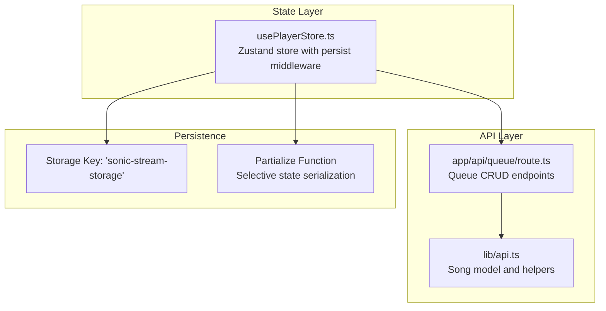
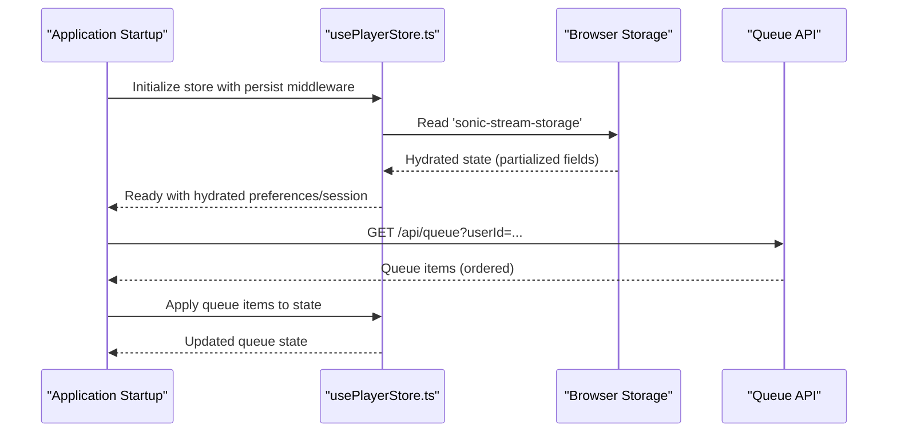
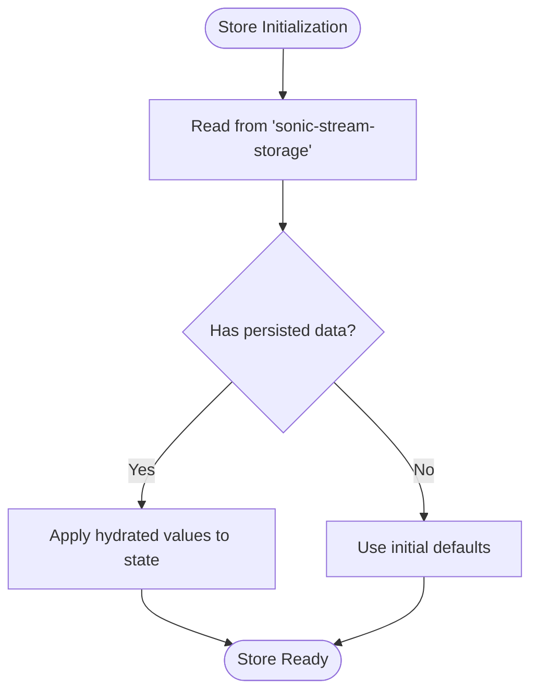
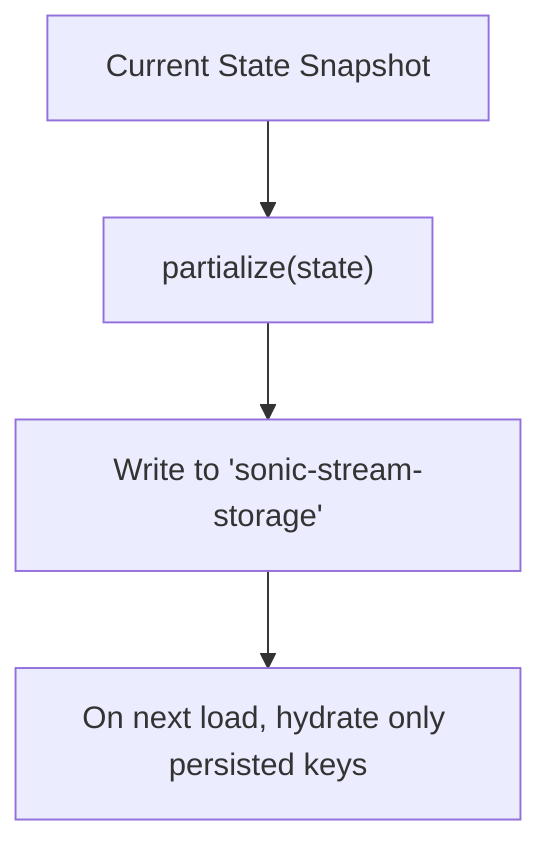
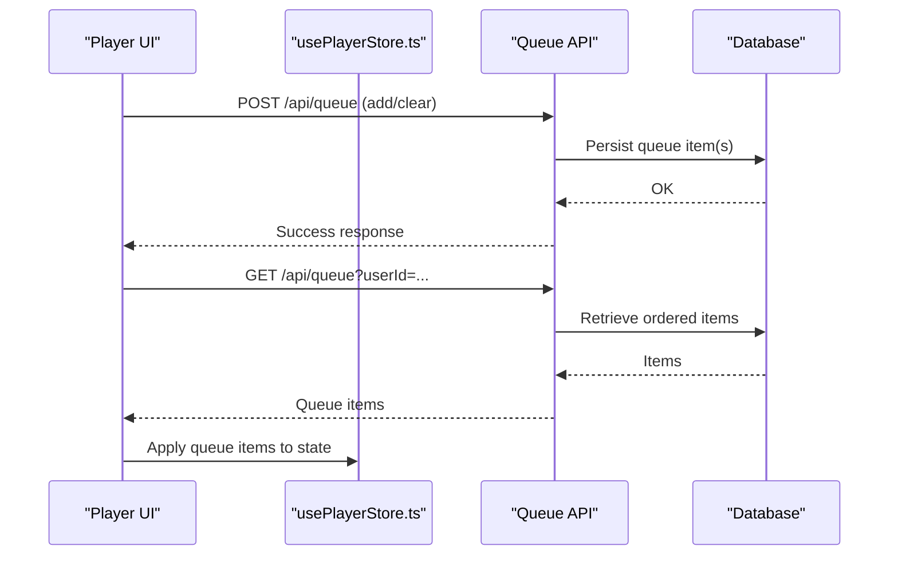
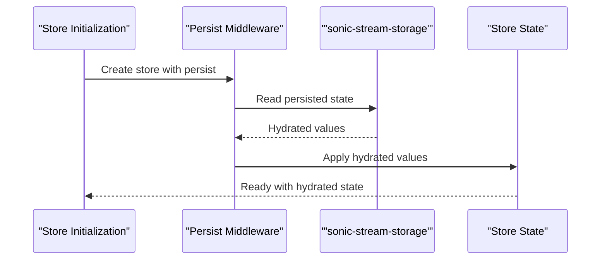
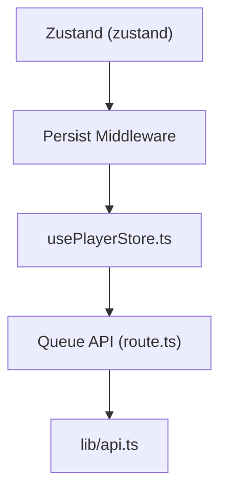

# State Persistence Strategies

<cite>
**Referenced Files in This Document**
- [usePlayerStore.ts](file://store/usePlayerStore.ts)
- [api.ts](file://lib/api.ts)
- [db.ts](file://lib/db.ts)
- [route.ts](file://app/api/queue/route.ts)
- [useAuthGuard.ts](file://hooks/useAuthGuard.ts)
- [package.json](file://package.json)
</cite>

## Table of Contents
1. [Introduction](#introduction)
2. [Project Structure](#project-structure)
3. [Core Components](#core-components)
4. [Architecture Overview](#architecture-overview)
5. [Detailed Component Analysis](#detailed-component-analysis)
6. [Dependency Analysis](#dependency-analysis)
7. [Performance Considerations](#performance-considerations)
8. [Troubleshooting Guide](#troubleshooting-guide)
9. [Conclusion](#conclusion)

## Introduction
This document explains the state persistence mechanisms in SonicStream, focusing on the Zustand persist middleware implementation. It covers storage configuration, selective state serialization, the storage key, partial state persistence, and how user preferences, session data, and queue state are persisted. It also provides guidance on state hydration on startup, storage cleanup, handling storage quota exceeded scenarios, debugging persistence issues, state versioning, and migration between application versions.

## Project Structure
The state persistence logic is centralized in a single Zustand store that integrates the persist middleware. Supporting APIs and utilities are located in dedicated modules for queue synchronization and data normalization.

**Diagram sources**
- [usePlayerStore.ts:43-127](file://store/usePlayerStore.ts#L43-L127)
- [route.ts:1-52](file://app/api/queue/route.ts#L1-L52)
- [api.ts:1-153](file://lib/api.ts#L1-L153)

**Section sources**
- [usePlayerStore.ts:43-127](file://store/usePlayerStore.ts#L43-L127)
- [route.ts:1-52](file://app/api/queue/route.ts#L1-L52)
- [api.ts:1-153](file://lib/api.ts#L1-L153)

## Core Components
- Zustand store with persist middleware: Implements state hydration, selective serialization via partialize, and a storage key for persistence.
- Queue API: Provides server-side queue persistence and retrieval for authenticated users.
- Utilities: Song model and helpers support consistent data structures across the app.

Key responsibilities:
- Persist user preferences (volume, favorites, recently played).
- Persist user session data (user profile).
- Hydrate queue state on startup.
- Provide server-backed queue synchronization for multi-device consistency.

**Section sources**
- [usePlayerStore.ts:12-41](file://store/usePlayerStore.ts#L12-L41)
- [usePlayerStore.ts:117-127](file://store/usePlayerStore.ts#L117-L127)
- [route.ts:1-52](file://app/api/queue/route.ts#L1-L52)
- [api.ts:1-35](file://lib/api.ts#L1-L35)

## Architecture Overview
The persistence architecture combines client-side Zustand storage with server-side queue persistence. The client hydrates preferences and session data automatically, while queue state can be synchronized with the backend for continuity across devices.

**Diagram sources**
- [usePlayerStore.ts:117-127](file://store/usePlayerStore.ts#L117-L127)
- [route.ts:4-22](file://app/api/queue/route.ts#L4-L22)

## Detailed Component Analysis

### Zustand Persist Middleware Configuration
- Storage key: The middleware uses a fixed storage key to namespace persisted state.
- Partialize function: Only selected fields are serialized to storage, reducing payload size and avoiding sensitive data leakage.
- Hydration: On initialization, the store reads from storage and applies hydrated values to the state.

Fields persisted via partialize:
- Volume preference
- Favorites list
- Recently played history
- User profile

Non-persisted fields:
- Current song, queue, shuffle/repeat mode, and UI flags remain transient in storage.

**Diagram sources**
- [usePlayerStore.ts:117-127](file://store/usePlayerStore.ts#L117-L127)

**Section sources**
- [usePlayerStore.ts:117-127](file://store/usePlayerStore.ts#L117-L127)

### Selective State Serialization and Partialize Function
The partialize function controls which parts of the state are written to storage. It ensures:
- Lightweight persistence by excluding large or frequently changing fields.
- Privacy by avoiding sensitive fields in local storage.
- Predictable hydration behavior by limiting serialized keys.

**Diagram sources**
- [usePlayerStore.ts:119-124](file://store/usePlayerStore.ts#L119-L124)

**Section sources**
- [usePlayerStore.ts:119-124](file://store/usePlayerStore.ts#L119-L124)

### User Preferences Persistence
- Volume: Stored and restored automatically on app launch.
- Favorites: Persisted as an array of song identifiers.
- Recently Played: Persisted as a bounded list of recent entries.

These preferences are hydrated from storage and applied during store initialization.

**Section sources**
- [usePlayerStore.ts:46-55](file://store/usePlayerStore.ts#L46-L55)
- [usePlayerStore.ts:119-124](file://store/usePlayerStore.ts#L119-L124)

### User Session Data
- User profile is persisted alongside preferences. This enables immediate access to user-specific features after hydration.
- Authentication gating can leverage the presence of user data to decide whether to prompt for login.

**Section sources**
- [usePlayerStore.ts:21](file://store/usePlayerStore.ts#L21)
- [usePlayerStore.ts:119-124](file://store/usePlayerStore.ts#L119-L124)
- [useAuthGuard.ts:12-28](file://hooks/useAuthGuard.ts#L12-L28)

### Queue State Persistence
- Client-side: Queue is not persisted in storage due to partialize exclusions and size considerations.
- Server-side: Queue items are stored per user and retrieved on demand to reconstruct the queue.

**Diagram sources**
- [route.ts:24-52](file://app/api/queue/route.ts#L24-L52)
- [db.ts:1-9](file://lib/db.ts#L1-L9)

**Section sources**
- [route.ts:1-52](file://app/api/queue/route.ts#L1-L52)
- [db.ts:1-9](file://lib/db.ts#L1-L9)

### State Hydration on Application Startup
- The store initializes with the persist middleware, which automatically attempts to hydrate state from storage using the configured key.
- After hydration, the store is ready for immediate use with user preferences and session data applied.

**Diagram sources**
- [usePlayerStore.ts:43-44](file://store/usePlayerStore.ts#L43-L44)
- [usePlayerStore.ts:117-127](file://store/usePlayerStore.ts#L117-L127)

**Section sources**
- [usePlayerStore.ts:43-44](file://store/usePlayerStore.ts#L43-L44)
- [usePlayerStore.ts:117-127](file://store/usePlayerStore.ts#L117-L127)

### Storage Migration Strategies
- Versioned storage keys: Introduce a new storage key for major state schema changes to prevent conflicts with previous versions.
- Partialize updates: When adding or removing persisted fields, update the partialize function to ensure compatibility and avoid stale data.
- Graceful degradation: If hydration fails or data is incompatible, fall back to defaults and log warnings for diagnostics.

[No sources needed since this section provides general guidance]

### Handling Storage Quota Exceeded Scenarios
- Monitor storage usage and warn users when limits are near.
- Implement periodic cleanup of large or outdated persisted lists (e.g., trimming recently played).
- Provide manual cleanup actions (e.g., clear preferences) and surface errors when writes fail.

[No sources needed since this section provides general guidance]

### Debugging Persistence Issues
- Verify the storage key exists and contains expected fields.
- Confirm the partialize function aligns with intended persisted fields.
- Inspect hydration timing and ensure store initialization occurs before UI rendering.
- Use browser developer tools to inspect storage contents and confirm write/read behavior.

[No sources needed since this section provides general guidance]

## Dependency Analysis
The persistence layer depends on:
- Zustand for state management and the persist middleware for storage.
- Queue API for server-side queue persistence.
- Song model utilities for consistent data representation.

**Diagram sources**
- [package.json:35](file://package.json#L35)
- [usePlayerStore.ts:1-3](file://store/usePlayerStore.ts#L1-L3)
- [route.ts:1-52](file://app/api/queue/route.ts#L1-L52)
- [api.ts:1-35](file://lib/api.ts#L1-L35)

**Section sources**
- [package.json:35](file://package.json#L35)
- [usePlayerStore.ts:1-3](file://store/usePlayerStore.ts#L1-L3)
- [route.ts:1-52](file://app/api/queue/route.ts#L1-L52)
- [api.ts:1-35](file://lib/api.ts#L1-L35)

## Performance Considerations
- Keep persisted state minimal: Only serialize essential fields to reduce storage footprint and improve hydration speed.
- Avoid serializing large arrays: Consider server-side persistence for extensive lists (e.g., queue).
- Normalize data: Use consistent shapes for persisted objects to minimize serialization overhead.

[No sources needed since this section provides general guidance]

## Troubleshooting Guide
Common issues and resolutions:
- Empty or missing preferences after reload: Confirm the storage key exists and partialize includes expected fields.
- Stale queue after logout/login: Ensure server-side queue retrieval is invoked after user changes.
- Storage quota exceeded: Trim large persisted lists and implement cleanup routines.

[No sources needed since this section provides general guidance]

## Conclusion
SonicStream’s state persistence leverages Zustand’s persist middleware with a carefully curated partialize function to store user preferences and session data efficiently. Queue state is managed server-side to maintain scalability and cross-device consistency. By following the outlined strategies for hydration, migration, and debugging, the application maintains a responsive and reliable user experience.