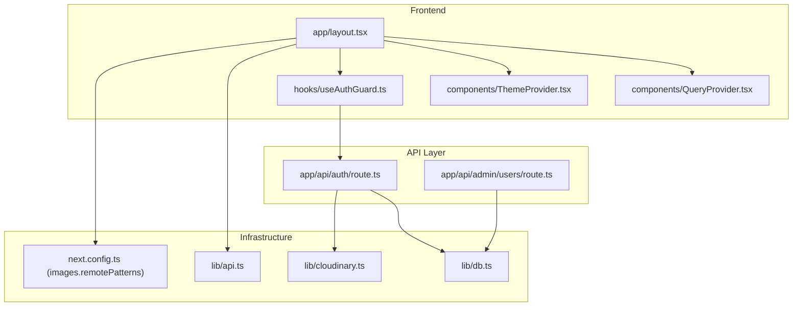
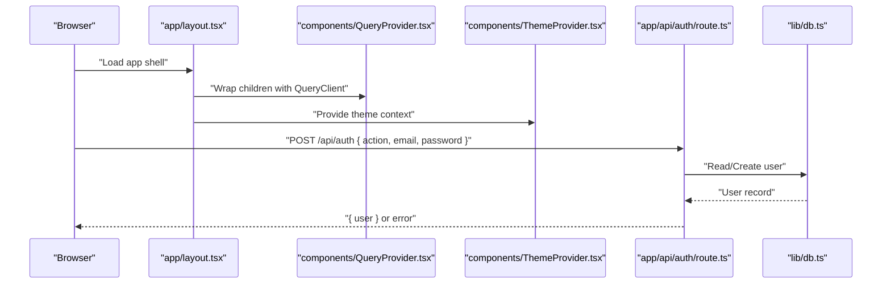
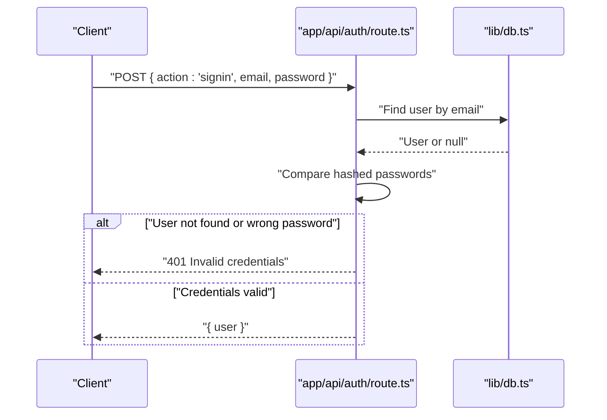
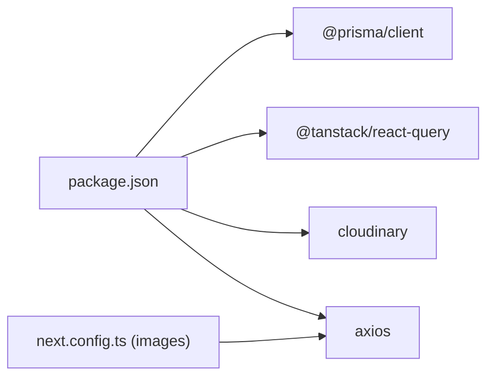

# Troubleshooting & FAQ

<cite>
**Referenced Files in This Document**
- [README.md](file://README.md)
- [package.json](file://package.json)
- [next.config.ts](file://next.config.ts)
- [lib/db.ts](file://lib/db.ts)
- [lib/api.ts](file://lib/api.ts)
- [lib/cloudinary.ts](file://lib/cloudinary.ts)
- [app/layout.tsx](file://app/layout.tsx)
- [components/QueryProvider.tsx](file://components/QueryProvider.tsx)
- [components/ThemeProvider.tsx](file://components/ThemeProvider.tsx)
- [hooks/useAuthGuard.ts](file://hooks/useAuthGuard.ts)
- [app/api/auth/route.ts](file://app/api/auth/route.ts)
- [app/api/admin/users/route.ts](file://app/api/admin/users/route.ts)
</cite>

## Table of Contents
1. [Introduction](#introduction)
2. [Project Structure](#project-structure)
3. [Core Components](#core-components)
4. [Architecture Overview](#architecture-overview)
5. [Detailed Component Analysis](#detailed-component-analysis)
6. [Dependency Analysis](#dependency-analysis)
7. [Performance Considerations](#performance-considerations)
8. [Troubleshooting Guide](#troubleshooting-guide)
9. [Conclusion](#conclusion)
10. [Appendices](#appendices)

## Introduction
This document provides comprehensive troubleshooting guidance and FAQs for SonicStream. It covers installation and setup issues, development environment diagnostics, frontend and API connectivity problems, database connection failures, performance tuning, memory leak detection, rendering issues, error interpretation, log analysis, and platform-specific considerations for Windows, macOS, and Linux. It also includes browser compatibility tips, mobile device troubleshooting, network connectivity checks, community resources, escalation procedures, preventive measures, monitoring setup, and proactive maintenance recommendations.

## Project Structure
SonicStream is a Next.js 15 application using the App Router. Key runtime concerns for troubleshooting include:
- Frontend providers and hydration (theme, query client, layout)
- API routes for authentication and admin operations
- Database client initialization via Prisma
- Remote image configuration for media assets
- Cloudinary integration for avatar uploads
- Utility helpers for API consumption and data normalization

**Diagram sources**
- [app/layout.tsx:21-48](file://app/layout.tsx#L21-L48)
- [components/QueryProvider.tsx:6-25](file://components/QueryProvider.tsx#L6-L25)
- [components/ThemeProvider.tsx:21-44](file://components/ThemeProvider.tsx#L21-L44)
- [hooks/useAuthGuard.ts:12-28](file://hooks/useAuthGuard.ts#L12-L28)
- [app/api/auth/route.ts:16-72](file://app/api/auth/route.ts#L16-L72)
- [app/api/admin/users/route.ts:5-74](file://app/api/admin/users/route.ts#L5-L74)
- [lib/db.ts:1-9](file://lib/db.ts#L1-L9)
- [lib/api.ts:37-69](file://lib/api.ts#L37-L69)
- [next.config.ts:12-51](file://next.config.ts#L12-L51)
- [lib/cloudinary.ts:3-18](file://lib/cloudinary.ts#L3-L18)

**Section sources**
- [README.md:32-66](file://README.md#L32-L66)
- [package.json:1-50](file://package.json#L1-L50)
- [next.config.ts:12-51](file://next.config.ts#L12-L51)
- [lib/db.ts:1-9](file://lib/db.ts#L1-L9)
- [lib/api.ts:37-69](file://lib/api.ts#L37-L69)
- [lib/cloudinary.ts:3-18](file://lib/cloudinary.ts#L3-L18)
- [app/layout.tsx:21-48](file://app/layout.tsx#L21-L48)
- [components/QueryProvider.tsx:6-25](file://components/QueryProvider.tsx#L6-L25)
- [components/ThemeProvider.tsx:21-44](file://components/ThemeProvider.tsx#L21-L44)
- [hooks/useAuthGuard.ts:12-28](file://hooks/useAuthGuard.ts#L12-L28)
- [app/api/auth/route.ts:16-72](file://app/api/auth/route.ts#L16-L72)
- [app/api/admin/users/route.ts:5-74](file://app/api/admin/users/route.ts#L5-L74)

## Core Components
- Database client initialization and lifecycle
- API client for external music service integration
- Remote image policy configuration
- Cloudinary avatar upload configuration
- TanStack Query provider defaults
- Theme provider with persistence
- Authentication API route with error handling
- Admin users API route with CRUD operations

Key troubleshooting anchors:
- Database client creation and environment gating
- API fetcher and response validation
- Remote image host allowlist
- Cloudinary credentials and transformations
- Query staleTime and retries
- Theme persistence and hydration
- Auth and admin route error responses

**Section sources**
- [lib/db.ts:1-9](file://lib/db.ts#L1-L9)
- [lib/api.ts:37-69](file://lib/api.ts#L37-L69)
- [next.config.ts:12-51](file://next.config.ts#L12-L51)
- [lib/cloudinary.ts:3-18](file://lib/cloudinary.ts#L3-L18)
- [components/QueryProvider.tsx:6-25](file://components/QueryProvider.tsx#L6-L25)
- [components/ThemeProvider.tsx:21-44](file://components/ThemeProvider.tsx#L21-L44)
- [app/api/auth/route.ts:16-72](file://app/api/auth/route.ts#L16-L72)
- [app/api/admin/users/route.ts:5-74](file://app/api/admin/users/route.ts#L5-L74)

## Architecture Overview
The application integrates frontend providers, API routes, and external services. Typical flows include:
- Authentication requests hitting the auth API route and interacting with the database
- Admin operations for user management
- Media asset retrieval via remote image hosts and Cloudinary uploads
- Data fetching using TanStack Query with default caching and retry policies

**Diagram sources**
- [app/layout.tsx:21-48](file://app/layout.tsx#L21-L48)
- [components/QueryProvider.tsx:6-25](file://components/QueryProvider.tsx#L6-L25)
- [components/ThemeProvider.tsx:21-44](file://components/ThemeProvider.tsx#L21-L44)
- [app/api/auth/route.ts:16-72](file://app/api/auth/route.ts#L16-L72)
- [lib/db.ts:1-9](file://lib/db.ts#L1-L9)

## Detailed Component Analysis

### Database Connectivity Troubleshooting
Common symptoms:
- Application fails to start or throws database-related errors
- Auth or admin routes fail with database errors

Root causes and resolutions:
- Verify Prisma client initialization and environment gating
  - Confirm the client is created only outside production and stored globally
  - Ensure NODE_ENV is correctly set in your environment
- Check database connection string availability
  - The Prisma client reads from environment configuration; confirm it is present
- Validate Prisma schema and migrations
  - Ensure local schema matches the target database

Operational steps:
- Confirm Prisma client creation and environment gating
  - See [lib/db.ts:1-9](file://lib/db.ts#L1-L9)
- Verify environment variables for database connectivity
  - Ensure required variables are present in your environment
- Re-run Prisma commands to synchronize schema and client
  - See [README.md:52-56](file://README.md#L52-L56)

**Section sources**
- [lib/db.ts:1-9](file://lib/db.ts#L1-L9)
- [README.md:52-56](file://README.md#L52-L56)

### Authentication API Troubleshooting
Common symptoms:
- Sign-up/sign-in returns “Email and password are required”
- Sign-up returns “Email already registered”
- Sign-in returns “Invalid credentials”
- Internal server error responses

Root causes and resolutions:
- Missing payload fields
  - Ensure the request includes action, email, and password
- Duplicate email during sign-up
  - Use a unique email address
- Incorrect credentials
  - Verify email and password match stored records
- Internal server errors
  - Check server logs for exceptions thrown in the route

Operational steps:
- Validate request payload structure
  - See [app/api/auth/route.ts:16-23](file://app/api/auth/route.ts#L16-L23)
- Confirm user existence and password hash comparison
  - See [app/api/auth/route.ts:51-65](file://app/api/auth/route.ts#L51-L65)
- Inspect error logging and response codes
  - See [app/api/auth/route.ts:68-72](file://app/api/auth/route.ts#L68-L72)

**Diagram sources**
- [app/api/auth/route.ts:51-65](file://app/api/auth/route.ts#L51-L65)
- [lib/db.ts:1-9](file://lib/db.ts#L1-L9)

**Section sources**
- [app/api/auth/route.ts:16-72](file://app/api/auth/route.ts#L16-L72)

### Admin Users API Troubleshooting
Common symptoms:
- Listing users returns empty or partial data
- Deleting or updating a user fails with internal server error

Root causes and resolutions:
- Missing userId in request body
  - Ensure the payload includes userId for DELETE/PATCH
- Database constraints or foreign keys
  - Investigate referential integrity constraints when deleting users
- Query filtering and ordering
  - Confirm search parameters and ordering behavior

Operational steps:
- Validate request payload for DELETE/PATCH
  - See [app/api/admin/users/route.ts:42-51](file://app/api/admin/users/route.ts#L42-L51)
- Review user listing with optional search and counts
  - See [app/api/admin/users/route.ts:5-39](file://app/api/admin/users/route.ts#L5-L39)
- Inspect error handling blocks
  - See [app/api/admin/users/route.ts:49-51](file://app/api/admin/users/route.ts#L49-L51), [app/api/admin/users/route.ts:71-73](file://app/api/admin/users/route.ts#L71-L73)

**Section sources**
- [app/api/admin/users/route.ts:5-74](file://app/api/admin/users/route.ts#L5-L74)

### Frontend Providers and Hydration Issues
Common symptoms:
- Theme not persisting or flickering on initial load
- Query cache not behaving as expected
- Layout shifts or hydration mismatches

Root causes and resolutions:
- Theme provider persistence and mounting
  - Ensure theme is applied after mount and saved to localStorage
- Query client defaults
  - Adjust staleTime and refetchOnWindowFocus per environment needs
- Hydration warnings and SSR considerations
  - Confirm HTML attributes and theme application are guarded

Operational steps:
- Verify theme persistence and DOM attribute setting
  - See [components/ThemeProvider.tsx:21-44](file://components/ThemeProvider.tsx#L21-L44)
- Review query client configuration
  - See [components/QueryProvider.tsx:6-25](file://components/QueryProvider.tsx#L6-L25)
- Confirm layout wrapping providers
  - See [app/layout.tsx:21-48](file://app/layout.tsx#L21-L48)

**Section sources**
- [components/ThemeProvider.tsx:21-44](file://components/ThemeProvider.tsx#L21-L44)
- [components/QueryProvider.tsx:6-25](file://components/QueryProvider.tsx#L6-L25)
- [app/layout.tsx:21-48](file://app/layout.tsx#L21-L48)

### API Connectivity and Media Assets
Common symptoms:
- Images not loading or blocked by CSP/image policy
- API fetch failures or inconsistent data

Root causes and resolutions:
- Remote image host allowlist
  - Ensure the requested hosts are included in remotePatterns
- API endpoint reachability and response validation
  - Confirm base URL and route composition
- Data normalization inconsistencies
  - Normalize artist/album structures and fallbacks

Operational steps:
- Confirm remotePatterns allowlist
  - See [next.config.ts:12-51](file://next.config.ts#L12-L51)
- Validate API routes and fetcher behavior
  - See [lib/api.ts:37-69](file://lib/api.ts#L37-L69)
- Normalize incoming data structures
  - See [lib/api.ts:92-152](file://lib/api.ts#L92-L152)

**Section sources**
- [next.config.ts:12-51](file://next.config.ts#L12-L51)
- [lib/api.ts:37-69](file://lib/api.ts#L37-L69)
- [lib/api.ts:92-152](file://lib/api.ts#L92-L152)

### Cloudinary Avatar Upload Troubleshooting
Common symptoms:
- Avatar upload fails or returns empty URL
- Cloudinary configuration errors

Root causes and resolutions:
- Missing Cloudinary credentials
  - Ensure cloud_name, api_key, and api_secret are configured
- Base64 payload issues
  - Validate the base64 string format and size limits
- Transformation constraints
  - Confirm transformations align with Cloudinary plan limits

Operational steps:
- Verify Cloudinary configuration
  - See [lib/cloudinary.ts:3-7](file://lib/cloudinary.ts#L3-L7)
- Confirm upload function parameters and transformations
  - See [lib/cloudinary.ts:9-18](file://lib/cloudinary.ts#L9-L18)
- Check auth route avatar upload invocation
  - See [app/api/auth/route.ts:31-34](file://app/api/auth/route.ts#L31-L34)

**Section sources**
- [lib/cloudinary.ts:3-18](file://lib/cloudinary.ts#L3-L18)
- [app/api/auth/route.ts:31-34](file://app/api/auth/route.ts#L31-L34)

### Authentication Guard and Modal Behavior
Common symptoms:
- Auth modal does not open for gated actions
- Unauthenticated actions silently fail

Root causes and resolutions:
- Store state not reflecting logged-in user
  - Ensure the player store sets user when authenticated
- Hook usage and modal visibility state
  - Confirm requireAuth triggers modal when user is missing

Operational steps:
- Use the auth guard hook for protected actions
  - See [hooks/useAuthGuard.ts:12-28](file://hooks/useAuthGuard.ts#L12-L28)
- Ensure store user presence for conditional logic
  - See [hooks/useAuthGuard.ts:13](file://hooks/useAuthGuard.ts#L13)

**Section sources**
- [hooks/useAuthGuard.ts:12-28](file://hooks/useAuthGuard.ts#L12-L28)

## Dependency Analysis
External dependencies relevant to troubleshooting:
- Prisma client for database operations
- TanStack Query for caching and retries
- Cloudinary for image uploads
- Next.js image optimization with remotePatterns
- Axios for generic HTTP requests (used in API module)

**Diagram sources**
- [package.json:12-32](file://package.json#L12-L32)
- [next.config.ts:12-51](file://next.config.ts#L12-L51)

**Section sources**
- [package.json:12-32](file://package.json#L12-L32)
- [next.config.ts:12-51](file://next.config.ts#L12-L51)

## Performance Considerations
- Query caching and retries
  - Adjust staleTime and retry count to balance freshness and bandwidth
  - See [components/QueryProvider.tsx:10-17](file://components/QueryProvider.tsx#L10-L17)
- Refetch on window focus
  - Disable if causing excessive network activity
  - See [components/QueryProvider.tsx:12-14](file://components/QueryProvider.tsx#L12-L14)
- Asset optimization
  - Ensure remotePatterns include all used hosts to avoid fallbacks
  - See [next.config.ts:12-51](file://next.config.ts#L12-L51)
- Theme persistence
  - Avoid frequent re-renders by persisting theme in localStorage
  - See [components/ThemeProvider.tsx:27-35](file://components/ThemeProvider.tsx#L27-L35)

[No sources needed since this section provides general guidance]

## Troubleshooting Guide

### Installation and Setup
Symptoms:
- npm install fails due to peer dependencies or engine mismatch
- Prisma commands fail with schema or client generation errors
- Development server does not start

Resolutions:
- Install dependencies with supported Node.js version
  - See [README.md:36-50](file://README.md#L36-L50)
- Run Prisma database push and client generation
  - See [README.md:52-56](file://README.md#L52-L56)
- Start the development server
  - See [README.md:58-61](file://README.md#L58-L61)

**Section sources**
- [README.md:36-61](file://README.md#L36-L61)

### Environment Variables and Secrets
Symptoms:
- Database connection errors
- Cloudinary upload failures
- Auth route internal errors

Resolutions:
- Provide database connection string for Prisma
- Set Cloudinary credentials (cloud_name, api_key, api_secret)
- Ensure environment is not production when using global Prisma client
  - See [lib/db.ts:9](file://lib/db.ts#L9)
- Confirm environment variables are loaded in your runtime

**Section sources**
- [lib/db.ts:9](file://lib/db.ts#L9)
- [lib/cloudinary.ts:3-7](file://lib/cloudinary.ts#L3-L7)

### Frontend Issues
Symptoms:
- Theme not applying or flickering
- Hydration warnings
- Layout shifting

Resolutions:
- Confirm theme provider wraps the app and persists to localStorage
  - See [components/ThemeProvider.tsx:21-44](file://components/ThemeProvider.tsx#L21-L44)
- Wrap the app with QueryProvider and ThemeProvider
  - See [app/layout.tsx:29-44](file://app/layout.tsx#L29-L44)
- Suppress hydration warnings only when necessary
  - See [app/layout.tsx:23-28](file://app/layout.tsx#L23-L28)

**Section sources**
- [components/ThemeProvider.tsx:21-44](file://components/ThemeProvider.tsx#L21-L44)
- [app/layout.tsx:21-48](file://app/layout.tsx#L21-L48)

### API Connectivity Problems
Symptoms:
- API fetch failures or timeouts
- Inconsistent data shapes from external API

Resolutions:
- Validate BASE_URL and route composition
  - See [lib/api.ts:37-69](file://lib/api.ts#L37-L69)
- Ensure response.ok before parsing JSON
  - See [lib/api.ts:39-43](file://lib/api.ts#L39-L43)
- Normalize artist/album structures and fallbacks
  - See [lib/api.ts:92-152](file://lib/api.ts#L92-L152)

**Section sources**
- [lib/api.ts:37-69](file://lib/api.ts#L37-L69)
- [lib/api.ts:39-43](file://lib/api.ts#L39-L43)
- [lib/api.ts:92-152](file://lib/api.ts#L92-L152)

### Database Connection Failures
Symptoms:
- Auth or admin routes fail with database errors
- Prisma client initialization errors

Resolutions:
- Confirm Prisma client creation and environment gating
  - See [lib/db.ts:1-9](file://lib/db.ts#L1-L9)
- Verify database connectivity and schema synchronization
  - See [README.md:52-56](file://README.md#L52-L56)

**Section sources**
- [lib/db.ts:1-9](file://lib/db.ts#L1-L9)
- [README.md:52-56](file://README.md#L52-L56)

### Performance Troubleshooting
Symptoms:
- Slow initial load or frequent refetches
- Excessive network requests

Resolutions:
- Tune query staleTime and retry count
  - See [components/QueryProvider.tsx:10-17](file://components/QueryProvider.tsx#L10-L17)
- Disable refetchOnWindowFocus if undesired
  - See [components/QueryProvider.tsx:12-14](file://components/QueryProvider.tsx#L12-L14)
- Optimize image loading with remotePatterns
  - See [next.config.ts:12-51](file://next.config.ts#L12-L51)

**Section sources**
- [components/QueryProvider.tsx:10-17](file://components/QueryProvider.tsx#L10-L17)
- [components/QueryProvider.tsx:12-14](file://components/QueryProvider.tsx#L12-L14)
- [next.config.ts:12-51](file://next.config.ts#L12-L51)

### Memory Leaks and Rendering Issues
Symptoms:
- Increasing memory usage over time
- UI jank or layout thrashing

Resolutions:
- Limit query cache size and TTL
  - Adjust staleTime and cacheTime in QueryClient defaults
  - See [components/QueryProvider.tsx:10-17](file://components/QueryProvider.tsx#L10-L17)
- Avoid unnecessary re-renders by memoizing callbacks and selectors
- Use theme persistence to minimize reflows
  - See [components/ThemeProvider.tsx:27-35](file://components/ThemeProvider.tsx#L27-L35)

**Section sources**
- [components/QueryProvider.tsx:10-17](file://components/QueryProvider.tsx#L10-L17)
- [components/ThemeProvider.tsx:27-35](file://components/ThemeProvider.tsx#L27-L35)

### Error Message Interpretation
Common HTTP statuses and causes:
- 400 Bad Request
  - Missing required fields in request payload
  - See [app/api/auth/route.ts:21-23](file://app/api/auth/route.ts#L21-L23), [app/api/admin/users/route.ts:44-47](file://app/api/admin/users/route.ts#L44-L47)
- 401 Unauthorized
  - Invalid credentials during sign-in
  - See [app/api/auth/route.ts:53-60](file://app/api/auth/route.ts#L53-L60)
- 409 Conflict
  - Email already registered during sign-up
  - See [app/api/auth/route.ts:26-29](file://app/api/auth/route.ts#L26-L29)
- 500 Internal Server Error
  - Exceptions caught and logged in routes
  - See [app/api/auth/route.ts:68-72](file://app/api/auth/route.ts#L68-L72), [app/api/admin/users/route.ts:49-51](file://app/api/admin/users/route.ts#L49-L51), [app/api/admin/users/route.ts:71-73](file://app/api/admin/users/route.ts#L71-L73)

**Section sources**
- [app/api/auth/route.ts:21-23](file://app/api/auth/route.ts#L21-L23)
- [app/api/auth/route.ts:26-29](file://app/api/auth/route.ts#L26-L29)
- [app/api/auth/route.ts:53-60](file://app/api/auth/route.ts#L53-L60)
- [app/api/auth/route.ts:68-72](file://app/api/auth/route.ts#L68-L72)
- [app/api/admin/users/route.ts:44-47](file://app/api/admin/users/route.ts#L44-L47)
- [app/api/admin/users/route.ts:49-51](file://app/api/admin/users/route.ts#L49-L51)
- [app/api/admin/users/route.ts:71-73](file://app/api/admin/users/route.ts#L71-L73)

### Log Analysis Techniques
- Console logging in API routes
  - Use console.error for unhandled exceptions
  - See [app/api/auth/route.ts:69](file://app/api/auth/route.ts#L69)
- Environment-specific ignores
  - ESLint and TypeScript build settings
  - See [next.config.ts:5-10](file://next.config.ts#L5-L10)
- Local storage of logs
  - Prefer server-side logs for production; client-side toast notifications for UX feedback
  - See [components/ThemeProvider.tsx:34](file://components/ThemeProvider.tsx#L34)

**Section sources**
- [app/api/auth/route.ts:69](file://app/api/auth/route.ts#L69)
- [next.config.ts:5-10](file://next.config.ts#L5-L10)
- [components/ThemeProvider.tsx:34](file://components/ThemeProvider.tsx#L34)

### Diagnostic Tools Usage
- Network tab inspection
  - Verify API endpoints, status codes, and response bodies
- React DevTools
  - Inspect hydration mismatches and provider wrappers
- Browser console
  - Look for CORS, CSP, and image loading errors
- Prisma client
  - Enable Prisma logs locally to trace queries
- TanStack Query Devtools
  - Inspect cache state, refetches, and errors

[No sources needed since this section provides general guidance]

### Platform-Specific Troubleshooting

#### Windows
- Node.js version compatibility
  - Use LTS version aligned with prerequisites
  - See [README.md:36](file://README.md#L36)
- Path separators and file watchers
  - Disable HMR selectively if file watching causes flickering
  - See [next.config.ts:54-63](file://next.config.ts#L54-L63)

**Section sources**
- [README.md:36](file://README.md#L36)
- [next.config.ts:54-63](file://next.config.ts#L54-L63)

#### macOS
- Xcode command line tools for native dependencies
  - Ensure tools are installed if Prisma or other packages require compilation
- Safari image policy and HTTPS
  - Confirm remotePatterns include all hosts used for images
  - See [next.config.ts:12-51](file://next.config.ts#L12-L51)

**Section sources**
- [next.config.ts:12-51](file://next.config.ts#L12-L51)

#### Linux
- glibc and runtime compatibility
  - Match Node.js version with distribution support
- File descriptor limits
  - Increase limits if Prisma or media-heavy operations cause failures
- Image optimization and remote hosts
  - Ensure remotePatterns allowlist covers all domains
  - See [next.config.ts:12-51](file://next.config.ts#L12-L51)

**Section sources**
- [next.config.ts:12-51](file://next.config.ts#L12-L51)

### Browser Compatibility
- Modern browsers with ES2020+ features
  - Ensure polyfills are not required for core APIs used
- Image optimization
  - Confirm remotePatterns allowlist includes all used hosts
  - See [next.config.ts:12-51](file://next.config.ts#L12-L51)
- Theme switching and localStorage
  - Persist theme preferences in localStorage
  - See [components/ThemeProvider.tsx:27-35](file://components/ThemeProvider.tsx#L27-L35)

**Section sources**
- [next.config.ts:12-51](file://next.config.ts#L12-L51)
- [components/ThemeProvider.tsx:27-35](file://components/ThemeProvider.tsx#L27-L35)

### Mobile Device Troubleshooting
- Touch targets and gesture handling
  - Ensure interactive elements are adequately sized
- Orientation changes and layout
  - Test responsive breakpoints and fixed player behavior
- Network throttling
  - Simulate slower connections to test loading states
- Storage quotas
  - Monitor quota usage for cached assets and theme preferences

[No sources needed since this section provides general guidance]

### Network Connectivity Problems
- DNS resolution and firewall rules
  - Verify access to external image hosts and Cloudinary
- Proxy and corporate networks
  - Configure proxy settings if required
- Rate limiting and quotas
  - Respect external API rate limits and Cloudinary plan limits
- CORS and CSP
  - Ensure remotePatterns and headers permit media loading

**Section sources**
- [next.config.ts:12-51](file://next.config.ts#L12-L51)

### Community Resources, Support Channels, and Escalation
- GitHub Issues
  - Report reproducible bugs with environment details and logs
- Discussion Forums
  - Seek help for setup and configuration questions
- Stack Overflow
  - Tag with relevant technologies (Next.js, Prisma, TanStack Query)
- Official Discord or Community Slack
  - Get real-time assistance from maintainers and users

[No sources needed since this section provides general guidance]

### Preventive Measures, Monitoring, and Proactive Maintenance
- Health checks
  - Implement lightweight health endpoints for auth and DB readiness
- Logging and alerting
  - Centralize logs and set up alerts for 5xx errors and DB failures
- Dependency updates
  - Regularly audit and update dependencies with security patches
- Database maintenance
  - Schedule index rebuilds and vacuum operations as needed
- CDN and image optimization
  - Monitor remotePatterns coverage and optimize image delivery

[No sources needed since this section provides general guidance]

## Conclusion
This guide consolidates actionable troubleshooting procedures for SonicStream across installation, setup, development, frontend, API, database, performance, and platform-specific scenarios. By following the step-by-step resolutions, interpreting error messages, and adopting preventive measures, you can maintain a stable and high-performing music streaming application.

## Appendices

### Quick Reference: Common Commands
- Install dependencies
  - See [README.md:47-50](file://README.md#L47-L50)
- Initialize database and generate Prisma client
  - See [README.md:52-56](file://README.md#L52-L56)
- Start development server
  - See [README.md:58-61](file://README.md#L58-L61)

**Section sources**
- [README.md:47-61](file://README.md#L47-L61)